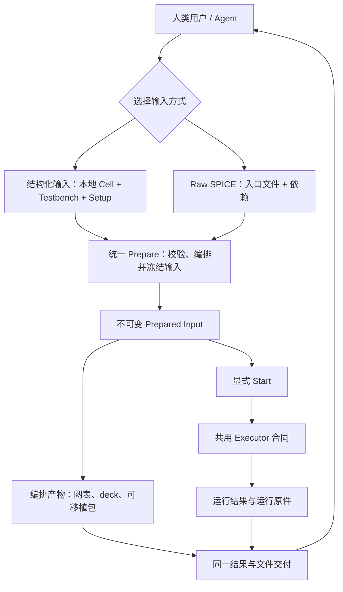
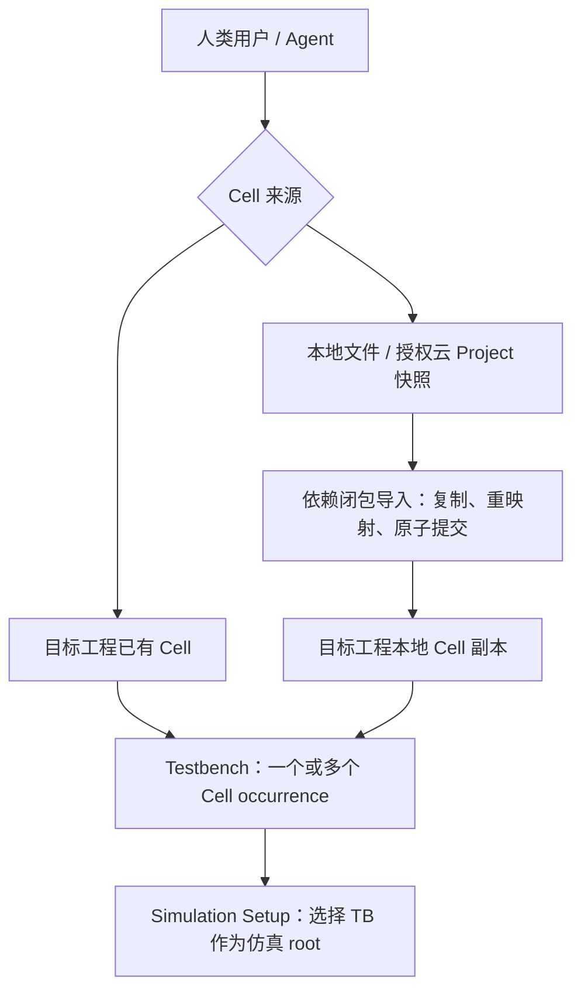
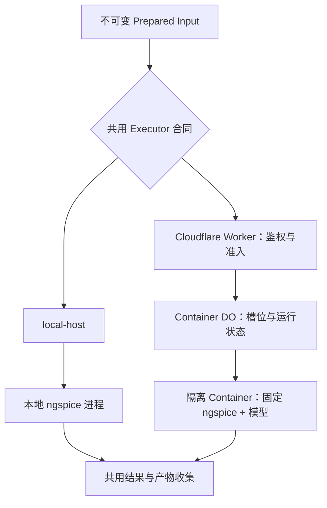

# Analog Canvas 仿真纵向闭环方案 v13

日期：2026-09-04。版本：v13。状态：当前完整远程交接与执行验收方案，供 Fable 实施及后续评审；已吸收 accepted F0 合同、release-only 部署和 digest-pinned hosted simulator 基线，v13 新增的受保护计算、严格 promotion、Profile 资格、失败后继续执行和 Coding Agent 交付验收仍待正式 amendment、实现与可重放实测关闭；新增工作尚未替换已接受 ADR/spec。

历史快照均独立保留并可由 [roadmap 索引](README.md#simulation-plan-history) 查阅。本文件只描述当前目标、合同、边界、owner 和退出条件，不再重复版本变迁；现行产品行为仍以已接受 spec 与 ADR 为准。

> **合入说明（2026-09-04）：** 本方案最初以 `origin/main@a86dac5c`（#570）为实现审查基线；在本分支合入前，#571–#594 中的 rawfile/result、执行隔离、单一模型库、operator-host 和部署修复已经继续进入 `main@35a05434`。因此本文保留完整目标、合同讨论、依赖图和验收边界，但其中对“当前缺口/已有能力”的逐项陈述是当时快照，执行前必须以最新 `main` 复核。第一阶段 MVP 的后续裁剪与未决项记录在 [Issue #585](https://github.com/cascode-ai/analog-canvas/issues/585)；它和本文都不覆盖 accepted spec/ADR，也不把已开始的工作误记为已完成。

## 0. 当前范围、决策状态与证据基线

目标：用户或 Agent 从本工程或有权读取的其他工程复用一个或多个 Cell 创建 Testbench，选择 OP/AC/TRAN 与观测量，或直接提交原始 SPICE，通过同一服务调用 ngspice，得到真实结果、频域/时间波形与 CSV，并能导出编辑输入、编排产物和运行原件。只有映射可靠的结果才定位回 Canvas，不能以无法回标为由阻止 raw 运行。

不做第二套电路协议、第二套 Net、第二个 Editor 实现、通用工作流引擎或大型仿真调度平台。

当前实现审查基线为 `origin/main` 的 `a86dac5c`（#570）。#559 已把 OP/AC/TRAN、structured/raw、simulation root、run lifecycle 与 result shape 等首版 F0 合同写入 accepted ADR 0055 / simulation spec；#563 已使 Production release-only，并从仓库退役 legacy staging；#570 已把 hosted 基线切到 digest-pinned `ghcr.io/arcadia-1/circuit-bench-sky130-ngspice@sha256:2da03dc7f1ead7ddc33f2f930a0487ae8618e51518009344584a98fca41a621d`，内含 ngspice 46 和 continuous/binned SKY130，Worker 默认 continuous TT。独立 public/noindex Preview、真实 Container、Run Metadata V1/environment fingerprint 与 signal/空输出失败分类也已落地。现有 runtime metadata 仍为 `observed`，尚未通过本方案的 Profile/Qualification Record、内部 simulator/model/startup identity build/startup fail-closed 校验或 D2 strict identity gate。Issue #560、#561、#564 仍只是对应 task card；执行前仍须从当时最新 main 复核事实，但不能用这句话掩盖当前已合入行为。

目标 owner：Fable。代码实施另开 `codex/` 分支；D1 的 release-only/staging retirement 已是当前行为，受保护 simulation execution、D2 strict promotion、v13 failure/export ownership 与 D3 Profile 资格仍须同步进正式 ADR/spec/deployment 后才成为规范。D3 最终 hosted Profile 必须在资格实验后关闭。本方案本身未交付这些新增产品代码或部署；本地对照实验只是资格证据。

### 已决定的 D1/D2 与已收敛边界、待选型的 D3

#### D1：Cloud gate channel

Analog Canvas 只维护 Preview 与 Production 两个 release channel。使用独立 `wrangler.preview.jsonc`、独立 Worker/DO/Container 和独立数据边界的 Preview 是唯一 cloud acceptance channel；不再建设 private staging，也不把 legacy `env.staging` 补成第二套仿真环境。普通 `main` merge 只部署 Preview；Production 只从明确 release/tag 或命名完整 SHA 推广。release-only 与仓库内 staging retirement 已由 [PR #563](https://github.com/cascode-ai/analog-canvas/pull/563) 落地，不得恢复。剩余 D1 工作是保护 simulation execution 并完成 Preview acceptance identity/data boundary；若仍有远端 legacy Worker，删除和核验属于部署卫生，不构成第三个 channel。

Preview 页面可以 public + `noindex`，但所有会唤醒 Container、消耗算力、接收作者文件或执行 raw `.control` 的入口必须要求明确准入。CI 使用受控 service identity；人类测试者使用授权身份。匿名访问页面不能获得 simulation execution 权限。Preview 不绑定或写入 production 私有 Project、账户、session、Agent session 或 Gallery namespace；公开 Gallery 的匿名只读代理可以保留，但不能成为仿真验收 fixture。

这是对现行 ADR 0057 中“Preview 无 access gate/no login 且 simulation route 必须响应”文字的有意修订，而不是对该文字的延伸解释。保留公开、`noindex` 的页面和只读内容；把会提交作者文件、执行 raw SPICE 或唤醒 Container 的计算入口改为受保护资源。F0 必须直接修订 ADR 0057 的对应条款和 deployment 文档；在修订合入前，现行 ADR 仍是仓库规范，不能把本段提前宣称为已实现行为。

#### D2：Promotion evidence 与 workflow

§8.4 是本方案内唯一 promotion 目标规则；F0 amendment 合入后才成为规范。本节只给摘要：F6 先新增并暴露只读 `buildSha`，让 hosted image 获得并验证所选 Profile 声明的 simulator release 与平台专属 binary digest，仿真运行身份复用现有 `metadata.environment.fingerprint`；Preview gate 再核对部署身份、Profile lock、运行环境与完整验收结论。目标 promotion 必须满足 §8.4 的 latest-completed required-run 规则；GitHub run 本身就是 receipt，不建立数据库或产品 receipt schema。Production 部署后仍执行自己的 identity、health、rollout 收敛与恢复验证。

这也是对 ADR 0057 仅要求候选 commit 背后存在 green Preview deploy 的加固性修订：同 SHA 的历史绿色记录、较新的失败运行或错误 runtime identity 都不能再满足 promotion。F0 必须用 §8.4 的单一规则替换该宽松表述；在修订合入前，不能把更强门禁描述成现行 accepted contract。

#### D3：SKY130 模型环境

当前 accepted/implemented hosted 候选是 #559/#570 选择的 digest-pinned benchmark image、ngspice 46 与 continuous TT default。这个方向是 v13 的 D3 qualification baseline，不再把 binned 当作尚待默认选型的同级候选；OCI digest 已锁定整体镜像字节，但仍不等于一个经过签署、能逐项解释 simulator/model/startup/能力范围的 Product Profile。

对 #551 的旧 binned 失败仍有一个值得重放的反证假设：固定 wrapper/model-card 源码中的 W/NF 与 startup/compatibility 事实提示，旧拒绝不一定只是“总宽超过 100 µm”。但尚未公开重放的本地 binned/hsa 观察不能推翻 accepted continuous baseline，也不能要求 hosted 路径改回 binned。只有 D3-E0/D3-P0 在同一 harness 下固定 deck、stdout/stderr、exit status、simulator/model/startup digest 后，它才可作为根因记录或未来 amendment 证据。

D3-P0 首先资格化当前 ngspice 46 + continuous TT image baseline：固定其 library binding、实际 binary/model/startup identity、器件/参数/偏置/温度支持域、数值和资源边界，并验证 #551/OTA 的正例。Corrected binned 仅可作为显式实验或根因对照；若证据支持改选，F0/产品 owner 必须先 amendment accepted environment decision，再由 F7 对新候选签署 Qualification Record。禁止任何自动 fallback、同 deck 混用或未经签署的候选替换。

D3 接受一个可命名、版本化的 deployment-side `SimulationEnvironmentProfile` manifest，但不引入用户持久化的 simulator profile、模型市场或新的 Project 电气 schema。其最小数值身份包括 simulator 版本/binary digest、model family/source/license/content digest、受控 startup digest、compatibility/effective scale/width basis、logical library binding、允许的 section，以及经过资格验证的器件和参数/偏置/温度范围。绝对容器路径不是产品身份；`.lib`/`.include` 及 section 的解析规则必须明确，但运行时路径只作为 prepared/run evidence。`SimulationSetup` 只引用 profileId 并保存本次 corner/temperature 选择，不能复制 manifest。

为避免一个巨型 metadata 对象，D3 冻结四层责任：

1. `SimulationEnvironmentProfile`：数值环境、加载语义与支持域；
2. `SimulationRunIdentity`：本次 profileId、corner、temperature、prepared deck hash 与实际 runtime fingerprint；
3. `QualificationRecord`：candidate/profile identity、simulator/model/startup digest、runtime fingerprint、fixture 集版本、分析类型、实测结果、基准值、数值容差、最终判定与 evidence reference；
4. `DeploymentPolicy`：Container image、CPU/RSS、timeout、并发、cold-start 与费用门槛。

诊断代码属于共用 Simulation API，不由每个 Profile 私有定义。Structured prepare 能以 Profile 证据确定越界时返回带实例/参数定位的 `MODEL_GEOMETRY_UNSUPPORTED`；模型未加载、类型错误、startup 不一致或 ngspice 原文不足以证明原因时返回更宽的 `MODEL_RESOLUTION_FAILED`/`MODEL_ENVIRONMENT_INVALID` 并保留 raw log，不能把所有 `could not find a valid modelname` 都解释成模型名缺失。

D3-P0 的 accountable owner 是 F6 environment owner：以当前 OCI digest、ngspice 46 与 continuous TT 为首个 qualification target，使用同一平台专属 binary digest、harness、deck、corner 与限制取得可重放证据；corrected binned 只在 D3-E0 固定公开来源/revision/许可证/size/digest 后作为明确对照，不影响默认路径。D3-E0 固定的 reference simulator identity 必须成为 F6 hosted lock 的输入；不同平台 binary digest 可以不同，但 release/compatibility contract 必须相同且各自记录。F0 owner 冻结 Profile 合同与资格标准；F7 integration/qualification owner 根据实测签署当前 baseline 的 Qualification Record，或判定它尚不可上线。首版只公开一个通过来源/许可、数值、能力与资源门槛的 Hosted SKY130 Core profile；若以后改选或增加 Profile，必须由 accepted amendment 和显式 setup 选择完成。禁止 binned/continuous 自动 fallback、同 deck 混用、nearest-bin、修改 W/L/NF/M、自动拆并联器件或手工扩大 model-card 边界。

### 已有基础，不应重做

| 层 | 已有能力 | 仍欠缺 |
| --- | --- | --- |
| 电路 | Project / Cell / formal terminal / instance / Net / Route / edit-engine | 人类 TB 创作能力与 setup 生命周期 |
| 项目管理 | 私有 Cloud Project CRUD、revision guard、现有人类项目/Cell 操作、本地 Project 文件 | 按需 Project/Cell picker、跨工程依赖闭包导入与本地实例化；不重建存储 |
| 层次符号 | 根据 Cell 接口生成 symbol，调整 pin side/offset/body，放置子 Cell | 原 top 首次实例化的 resolver/事务闭环；默认 symbol 生成/复核与接口变化规则；跨工程复制后使用同一派生逻辑 |
| 网表 | 同一 Logical-Net resolver、DesignNetlistIR、确定性 SPICE/Spectre printer、reviewed SKY130 binding | 指定仿真根、根实例化、完整结果映射 |
| 电源 | 原生独立 V/I 的 DC 参数；兼容性 pulse 电压源已保存并打印完整 low/high/delay/rise/fall/width，但 authoring 仍以 period/dutyCycle/initial 的时钟界面为主 | 将既有 pulse 两种表达收敛为一份正式模拟 PULSE 权威并兼容旧工程；补 AC、SIN 与 V/I 共用规则，不另造参数副本 |
| 编排 | `.include`/`.lib` 区分、raw deck 拼接、运行输入与环境 hash | 结构化编译与正式 raw 输入汇合、不可变 prepared input |
| 执行 | Worker route、Docker harness、local-host、60 秒默认/120 秒上限、Preview Worker 的 `standard-2` 单实例 Container；digest-pinned benchmark base image、ngspice 46、continuous TT default、observed 环境 metadata；signal-killed/无输出不再算完成 | Profile manifest/Qualification Record、内部 simulator/model/startup digest 的 build/startup 校验与 pinned metadata；正式 async run/result、鉴权与配额、busy guard、非 root/每作业隔离、进程树终止、原始数值收集与 rollout 收敛证据 |
| 结果 UI | OP 标注函数、AC 图形组件、未挂载的模拟面板原型；当前浏览器没有 ngspice rawfile/log parser | 轻量 task bar、按需设置与结果 drawer；OP/AC/TRAN 正式数值协议、stale 防护、CSV；若实施可选 F5-0，再按 sunset 合同删除其临时 parser/client |
| Agent | [PR #541](https://github.com/cascode-ai/analog-canvas/pull/541) 共用编辑 planner/controller；typed schema/client/MCP | 独立 simulation resource 与 parity 闭环 |
| 文件 | GUI Project/结构网表导出；Agent File Resource 的 project/svg/png/pdf | TB 设置保存、网表/仿真产物的共用下载、实际运行文件保留 |
| 发布 | 独立 Preview 配置/Worker/Container 已由 main 自动部署；Production 已 release-only，仓库内 legacy staging 已退役 | 保护 Preview simulation execution，清理/核验可能的远端 legacy 资源；按 D2 补齐 build identity、exact-SHA Preview gate、environment evidence 与 production recovery；按 D3 资格化当前 hosted Profile |

当前事实：模拟面板未挂载；OP state 无正式生产者；`SimulationRequest.analyses` 不驱动 deck；结构打印把每个 Cell 都包成 `.subckt`；当前 route 主要返回日志与 metadata，尚无正式 OP/AC/TRAN result。Preview 已配置 NGSPICE Container 并完成平台 probe，但 production 尚未绑定，且没有 shared Simulation Resource、结构化结果或最终 UI。不能把“云端进程跑过一次”或“有模块/有测试”记为纵向闭环完成。

## 1. 产品边界：建议冻结

1. DUT 是普通 Cell。Testbench 也是同一 Project 中的普通 Cell，可放多个不同 DUT/支持 Cell，也可多次放置同一 Cell；源、负载、连线仍由用户明确选择。跨工程 Cell 先导入成为目标工程本地定义。同工程直接复用，不复制 Cell。无需新建 Testbench 电气 schema。
2. Simulation 不建立第二套电路编辑协议、route page 或 controller，而是在同一 Editor 内进入可退出的轻量 task mode。DUT/TB 复用当前 Canvas、wire、snap、撤销、层次导航、保存与 Agent transaction；新增常驻 UI 仅限一条临时 task bar，其余能力按需出现。
3. 用户决定激励、负载、分析与观测意图；产品将结构化意图编译为合法 deck，也允许作者直接提交 SPICE。常用流程无需手写，不把“不必写”解释成“不许写”。
4. 首版结构化 OP + AC + TRAN，单 Testbench setup、由 D3 明确选择且具有可验证身份与清楚能力边界的 hosted ngspice/SKY130 environment contract；首期只暴露 D3 选定的最小 corner 集合。每次运行都把 corner 与温度的明确值写入运行身份。自带 SPICE 模型通过作业文件及依赖解析进入同一执行器，不要求只能使用预置库；不包含 Verilog-A 编译或二进制插件上传。
5. 首版同时提供 AC 频响和 TRAN 时间波形。DC sweep、PVT 矩阵、Monte Carlo、自动优化的专用 helper/GUI 延后；raw 可表达当前 ngspice 能执行的其他语法，不因此承诺专用图表和完整回标。
6. 不启用已有 dev-only Digital Simulation，不为新的入口复用其数字仿真语义。可抽取中立的 Net picking 交互，不能把数字运行状态当模拟协议。
7. 结果只读，绝不改 Net、器件参数或 Project 电气状态。编辑设置/源是显式编辑；执行与查看结果不是编辑事务。
8. raw SPICE 是正式公开输入，不是临时 debug 后门。允许 `.control` 与作业内 `.include`/`.lib`；不通过画板 parser 的语法子集限制模拟器。结构化与 raw 都必须经过同样的授权、作业隔离、资源约束与结果交付。
9. 同一次运行只采用结构化输入或 raw 输入之一。不同时拼入两套激励、分析或根调用，不静默覆盖作者文本；导出和运行使用可追溯的同一输入快照。
10. 结构化 DUT 必须通过正式 Cell Symbol 实例化。formal interface 决定 pin 身份与网表顺序，symbol presentation 只决定 body 与 pin 几何；不能把 SVG、截图或浮动 symbol 当作 DUT。
11. 同工程与跨工程 Cell 在进入目标 Project 后使用同一 place 流程。跨工程 source 只用于生成导入计划和本地副本，运行时不存在远程 Cell 引用。

一个 setup 选择一个 TB root，不等于 TB 只能有一个 DUT。工程 `topDocumentId` 是默认入口，不是永久的“禁止实例化”身份；仿真使用独立 `rootDocumentId`，选择 TB 不暗改工程 top。所有放置仍遵守接口有效、引用存在、层次无环。

### ADR 0055 应调整而非机械服从的地方

- “testbench 是作者的”保留，但删除“必须以手写 testbench 文本表达”的实现限定；也不反向禁止文本创作。
- “运行结果不改 Project”保留；“此功能不编辑任何 document / 永不需要 schema 变更”不再覆盖用户明确要求的 TB 编辑与 setup 保存。
- 可仿真判定应为“受支持原生 primitive，或在所选环境中确实可解析的模型/子电路”，不能要求理想电阻、电源等都有 PDK 模型。
- OP+AC+TRAN 已由 #559 的 accepted ADR 0055 amendment 与 simulation spec 冻结；v13 直接复用，不再把分析范围列为待修订决策。
- 冷启动、镜像上限、每次请求新磁盘、每次运行价格等说法，应由当前平台资料和实测替代；不把估计写成保证。

## 2. 产品主流程

### 2.1 端到端闭环



这张图只回答“用户如何从输入得到结果”。结构化与 raw 在 prepare 之前保持各自权威，从不可变 Prepared Input 开始共享执行、诊断、结果和文件交付。编排产物在 prepare 后直接进入交付，不要求 start；显式 start 后，运行原件和数值结果再进入同一交付服务。

### 2.2 Cell 复用与 Testbench 组合



跨工程箭头到本地副本即结束；运行时不再依赖源工程。同工程 Cell 直接实例化，不经过复制。`Project top` 仍是工程默认入口，`Simulation root` 只决定本次仿真。

### 2.3 当前 Project top → 合规 DUT Symbol → TB

```text
当前 Project top
→ 校验 formal interface
→ 读取可选 Cell symbol presentation；缺省时仅派生默认运行时 Symbol
→ 可选 Review Symbol；确认后才持久化 presentation
→ 新建/打开普通 TB Cell
→ 进入现有 placement cursor，用户放置真实 X_DUT
→ SimulationSetup.rootDocumentId = TB Cell
```

这条流程与 Virtuoso 的 schematic/symbol view 分工等价，但不导出独立 SVG：Cell definition 同时拥有 schematic implementation、formal interface 与 symbol presentation。TB 中的 `X_DUT` 使用 `binding.kind = subcircuit` 和本地 `childDocumentId` 绑定原 Cell，网表打印为真实子电路调用。Project top 身份保持不变；TB 只成为本次 Simulation root。

默认 Symbol 可以由 formal ports 确定性派生，用户无需每次手工绘制，且这一步不向 `presentation.cellSymbol` 写入默认值。用户要求精确 presentation 时，`Review Symbol` 使用直接以 Cell definition 为 target 的 preview/layout adapter，复用 `planSetCellSymbolPresentation`；只有确认后才持久化 presentation，不能先造 dummy caller instance 解锁现有 selection-based UI。

结构化入口的最小接口门禁必须明确而非笼统称为“冲突”：缺少 `netlist`/formal Cell interface 时阻止 `New TB with current top as DUT…` 并指向接口创建；合法的 zero-port interface 允许派生并放置零 pin Symbol，但提示它只能作为无外部端口的 Cell 使用；同名端口方向冲突沿用 `projectCellInterface`，投影为 conservative `passive` 并给 warning，不阻止 Symbol 生成。raw 入口不受这些结构化 Symbol 门禁限制。`Use active Cell as TB` 是否可运行由 prepare 对实际 root/依赖判断，不借 DUT Symbol 门禁替代。

接口变化继续服从现有强一致 Project transaction，而不是保存一份可漂移的 stale caller：rename 原子更新 caller pin，delete 把消失 pin 的连接脱到 Junction，schema 仍拒绝 unknown child pin。add/rename/delete/reorder/direction 都要统一 reconcile 运行时 Symbol、caller 与 route-follow；仍匹配的 presentation 被保留，新 pin 使用确定默认位置。同名端口组的 representative terminal 改变时，原 representative 的 pin placement 迁到新的 representative ID，不能因 `terminalId` 换位丢失布局。`interface-stale` 只可表示预览/prepare 所基于 revision 已过时或原子 reconcile 失败的操作诊断，不能成为另一份持久化接口状态。

### 2.4 统一 Add Cell 与跨工程 Import & Place

```text
Add Cell…
├─ Current Project → 选择 Cell → Place
└─ Saved Projects… → 搜索 Project/Cell
                     → Inspect/Preview closure
                     → Import & Place
                     → 目标 Project 本地 Cell → 同一个 Place
```

人类不需要理解两套放置器。当前工程 Cell 直接调用 `createHierarchyInstance / planPlaceCellInstance`；跨工程 Cell 先捕获已保存 source cloud revision，生成依赖闭包、ID/名称映射、symbol/interface、模型/global Net 影响和 diagnostics 的只读预览，再以一个目标 Project transaction 原子导入闭包并放置 root occurrence。目标使用 structure/document revision guard，提交后变 dirty，不自动 Cloud Save。

导入结果是目标拥有的普通本地 Cell；重复放置只新增 occurrence。只有显式“再次导入”才从源当前已保存 revision 创建新副本。不能打开/替换当前工程、只复制 symbol 图形、建立远程 `childDocumentId`，或让源后续变化静默更新目标。

部署拓扑不是产品主流程，移到 §8。逻辑分层不要求每个方框新增 package。优先在现有 `spice-run` 内分文件；低层 runner contract 不反向依赖 React、MCP 或完整编辑器。已有 `packages/simulation` 是数字引擎，不拿它承载 ngspice。

## 3. 唯一权威与生命周期

### 3.1 Project / Cell 复用层：补管理，不重造电路

**当前基础与缺口。** 云端已经是私有 Project CRUD，不是二十个固定槽：每份有完整 Project JSON、当前 revision、名称、预览；20 是数量上限。现有服务不是可按旧 revision 下载的历史仓库。Project 内已经可以有多个 Cell，`childDocumentId` 只引用本工程定义，schema 校验引用、接口和层次环。Shelf 与 Cell Manager 是当前人类界面事实；Simulation 流程不增加常驻 Project 面板，而是在 `Add Cell…` 时按需打开共用 Project/Cell picker。

现有 clipboard / Gallery 的“导入到画布”是单 Document composition；多 Document 工程会回退为打开工程，不是完整 Cell 复用。不能把它包装成新按钮就宣称依赖导入完成。也不应把 `childDocumentId` 改成远端 URL 后让 resolver 随时抓取另一个工程。

| 概念 | 本期含义 |
| --- | --- |
| Project | 可保存、可移植的电路集合和本地定义所有者；Cloud Project ID 只是云存储绑定，不与 Project 内部 ID 混用 |
| Cell definition | 现有普通 Cell、接口、符号 presentation 和内部实现；原先是 top 不妨碍复用 |
| Project top | 工程默认入口；仍保留现行普通打开/结构导出的默认行为 |
| Simulation root | 本次 setup 选择的 TB Cell；只决定这次提取、依赖、probe 与运行路径，不改 Project top |
| Instance occurrence | TB 根下的一次实际调用路径；同一定义被放两次不是同一个被测对象 |
| 导入来源 | 可选的原工程/Cell 标识与捕获快照 revision/hash，用于解释来源；不是运行时外部引用或第二份电气权威 |

**共享导入流程。** 同工程放置继续 `createHierarchyInstance / planPlaceCellInstance`。跨工程增加一个可复用的 plan/import 能力，由现有 Project transaction 提交，GUI、Agent 和文件入口不各写一套：

1. 选择有权读取的源 Project 和 Cell，捕获一次源快照；本地文件与已授权云项目归一为同一输入。不能把最新 revision 的标签当成可随时取回旧数据的保证。
2. 从选定 Cell 遍历全部可达子 Cell，收齐其 formal interface / pin order / symbol presentation、引用到的 external-subcircuit 定义及必要的源/模型依赖声明。只取该闭包，不导入源工程的无关 Cell、setup 或运行缓存；同一源定义在一次导入中只复制一次，保留重复调用关系，不 flatten。
3. 对目标工程分配新 ID 并完整重映射引用；保留接口顺序、参数、端口映射和符号位置。Cell 网表名按现有大小写规则检测碰撞，可用确定后缀改名并返回映射；不能因为同名就复用目标定义。外部模型/子电路同名而内容或来源不同，须显式解决，不能盲改原始模型文本。
4. 沿用当前 Net resolver。局部 Net 保持局部；global 名称仍按既有合同跨 Cell 生效。预览应列出导入会参与的 global 连接及已知冲突，不静默改名、隔离或增加短接。普通提示不阻止保存草稿；真实接口/引用冲突走现有校验，运行可执行性由 prepare 判断，不另起一套门禁。
5. 模型文件可取得且允许复制时随文件依赖流程处理；只有 SourceManifest/路径/hash 时标明缺少内容，不能假装已经自包含。Project 级 source、symbolLibrary lock 与 external definitions 不能被整个源 Project 覆盖；合并必要声明、校验依赖与锁兼容性，保留目标 top/setup/云保存绑定。目标副本不能依赖未来重读源 Cloud Project；prepare 必须从目标已声明依赖和所选环境解析模型。
6. 用现有 Project 原子事务导入整个闭包；“导入并放置”将新定义与目标实例一次提交，失败无半份工程。返回旧/新 ID、名称映射、导入根与 diagnostics，复用现有 revision guard / undo / redo；预览后目标改变须重新计划。
7. 导入后是目标拥有的普通本地 Cell。源工程后来编辑、改名、删除或无权限，不影响已复制的电路内容；目标修改也不回写源。首次导入后重复放置使用目标副本，主动再次导入视为新副本，首期不做内容去重、静默更新或冲突同步。

不是三层新服务：来源读取沿用 Project/File 服务，规划与提交沿用 edit-engine，符号/netlist 继续当前派生。来源标记如需保存，只补最小可选 provenance；没有来源标记也不影响副本合法性，不建库版本表或通用依赖管理器。

**合规 Cell Symbol View。** 现有 `projectCellInterface` 提供 formal pin 身份/顺序，`presentation.cellSymbol` 保存 body、pin side/offset 等可选图形意图，`createHierarchicalBlockSymbol` 负责派生运行时 SymbolDefinition。这三者构成一个 Cell 的 symbol view；不新增独立 symbol 文件，也不把渲染结果反向当权威。没有自定义 presentation 时只派生确定的默认运行时外形，不落盘默认 presentation；Review Symbol 确认后才编辑 presentation。首次放置前的 Review 需要一个直接面向 Cell definition 的 preview/layout adapter，复用现有 presentation planner，不能依赖 parent 中已有 instance。接口 add/rename/delete/reorder/direction 必须通过既有 Cell interface edit 和 Project transaction 原子 reconcile presentation、caller 与 route-follow；预览 revision 过时则拒绝重算，不保存 stale caller。

**原 top 的首次放置必须穿透完整路径。** 当前 schema/planner 没有统一禁止 top，但 `hierarchical-block.ts` 会跳过“未被引用且无 sourceBinding 的 top”，`project-transaction.ts` 又在操作前构建 symbol resolver，GUI 也据 resolver 过滤候选。因此仅让 UI 显示 top、或只测 planner 不够。应统一“接口合法且不成环即可作为 Cell master”的规则，在 resolver、事务、Insert picker 与 Agent place 的完整边界支持首次实例化；不能靠修改工程 top 或先加假实例解锁。现有层次用户文档中 top 的限制须同步处理。

**管理能力的最小范围。** 人类与 Agent 都必须能搜索工程、检查 Cell 的可复用接口/依赖/调用者，并执行放置或导入并放置；本地 Cell 改名、接口与调用关系仍由同一底层管理能力处理。Simulation 中只提供按需 `Add Cell…`：先显示当前工程 Cell，用户选择 `From Saved Project…` 时才加载 account roster 和远程 Cell。跨工程只在确认前显示 closure、名称/模型/global Net 影响和阻塞冲突摘要；不建立固定 Project dashboard。不要把文件夹、标签、团队权限、历史版本、云配额扩大变成本次前置条件。

**统一 Project management service。** 现有 Cloud Project CRUD 与完整 Project JSON 仍是存储事实，本期只在其上建立一个 GUI、Agent-client 与 MCP 共用的应用服务，不复制数据或另造工程协议。作用域必须分清：

- Project Resource 是 account-scoped：管理用户有权访问的私有工程 roster 与内容。
- Circuit API 是 project-scoped：编辑当前已打开 Project 的电气对象与 setup。
- Simulation Resource 消费选定的 Project snapshot/setup 或 raw files；它不拥有工程 CRUD。
- Gallery 是公开发布/浏览系统，不并入私有 Project Resource。

Project Resource 的最小语义如下，最终字段名在 F0 冻结：

| 操作 | 语义 |
| --- | --- |
| list/search | 返回授权工程摘要，可按名称过滤；不加载或切换 Editor |
| read | 按 `summary | cells | project` 读取当前云端内容并返回 revision；读取源 Cell 不改变当前工程，也不冒充历史版本读取 |
| create | 创建空的合法 Project，返回 ID 与 cloud revision；没有虚构的旧 revision 前置条件 |
| rename | 非当前工程按 project ID + expected cloud revision 改云端名称；当前工程走 typed Project rename 后显式 save-active |
| duplicate | 复制明确的已保存 cloud revision；若要包含当前未保存编辑，先完成 save-active |
| delete | 非当前工程按 expected cloud revision 删除；当前已绑定工程必须先走同一 dirty/unbind 生命周期，不能后台硬删 |
| save-active | 捕获当前权威 live Project 的 structure/document revision，并按 expected cloud revision 保存；不接受 Agent 提交整份任意 JSON 覆盖浏览器状态 |
| inspect/import-cell | 读取源 Cell 接口/依赖，调用 §3.1 的闭包 planner，以 expected structure/document revision 导入目标工程；可与现有 place 操作组合，不自动 Cloud Save |
| activate/open | 如首期提供，作为单独生命周期动作执行 dirty-replace guard；不能把已有 project-bound Circuit session 静默改绑 |

所有 mutation 使用服务端账户身份；不信任 Agent 传入 user ID。Cloud roster CRUD 使用 expected cloud revision，Circuit/Cell 编辑使用 expected structure/document revision，二者不能互换。save-active 是唯一同时跨越 Cloud revision 与当前 live Project revision 的保存桥：保存期间若 live Project 又发生编辑，只能确认所捕获版本已保存，较新的 live 状态仍保持 dirty。建议权限至少区分 `project.roster.read`、`project.content.read`、`project.manage`、`project.save` 与 `project.delete`，导入/放置另要求目标 Circuit edit 权限。现有 `project.download` / `project.import` 不应被重解释成这些 roster 操作。授权一次后，常规调用不逐步要求人工点击。

复用不是仿真专有功能。正常 Editor 和 Agent 都能使用同一个 Project/Cell 服务；Simulation 只消费结果，不拥有另一套 Project manager 或 Cell 注册表。

### 3.2 电路与运行信息的唯一权威

| 信息 | 唯一权威 | 不应存在哪里 |
| --- | --- | --- |
| 结构化 DUT/TB 拓扑、源连接、负载、源 DC/AC/TRAN 分量 | 当前 Project / Cell / Instance 参数 | Setup 内第二份器件清单、同时生效的 TB 备份文本 |
| 已导入 Cell 的实现与引用 | 目标 Project 内普通 Cell 定义 | 持续生效的源 Project 内容、私有远端 resolver |
| 私有工程 roster、内容与云 revision | 现有 Cloud Project 存储及共用 Project management service | React 私有列表、MCP 私有副本、Gallery 条目 |
| formal pin 名称与电气顺序 | 现有 Cell interface | symbol 坐标或肉眼排列顺序 |
| symbol 外形、端口位置 | 现有 Cell symbol presentation | 仿真 profile 私有图形 |
| 结构化分析、频率/时间、probes、TB root | SimulationSetup 的结构化输入 | 只存在于 React 状态的权威、MCP 专属配置 |
| raw 拓扑、激励与分析 | 本次选择的 SPICE 入口及文件内容 | 自动追加的结构化分析、未经作者确认的重编译结果 |
| 环境 Profile、corner、温度与依赖要求 | 同一 setup/request 的 profileId 与明确运行选择；raw 已写的设置不得被静默覆盖 | 完整 Profile manifest、机器路径或两份互相冲突的默认值 |
| 模型宿主路径、作业目录、容器规格 | 执行环境解析 | Project 中持久化的机器绝对路径 |
| simulator 向量名与电路对象映射 | 本次编译产物，使用现有 ObjectLocator / HierarchyFrame | 新的永久 Net ID、显示文本推断 |
| 数值、日志、运行身份 | 临时 SimulationResult | Net/Instance 持久化字段 |

### 3.3 保存建议

Testbench Cell 自然随现有 Project 保存。建议 Project 加一个可选 `SimulationSetup`，首版一个 setup 即可，共用环境选择，输入明确二选一：

- 结构化：TB root、OP/AC/TRAN 设置、观测引用；源的参数仍只存于 Instance。
- raw：entry、canonical manifest、用户编辑的 SPICE 文件字节及外部模型依赖声明。文件 hash 是从这些内容派生的完整性/身份标识，不是另一份权威；raw 不提取另一套 Net/Cell，也不与结构化设置同时驱动运行。

两者是一个 setup 的输入分支，不是两套电气模型或保存服务。没有 Project 电气输入的 Agent raw 请求也可直接 prepare/run，不强迫先造 TB Cell；它仍属于已授权账户/会话，不表示匿名执行。主动保存时才进入现有 Project 编辑/保存流程。结果、服务器路径、runId、运行缓存不进入 Project。

创作方式可有三种，但一次 prepare 仍只有两种输入权威：

1. **Structured Canvas TB**：Project / Cell / Instance 与 SimulationSetup 是权威；Agent 可只调用 typed edits 而不查看渲染画布，生成网表只是产物。
2. **Raw projectless workspace**：entry path、文件字节、依赖与每个文件 hash 是权威；不创建/导入 Canvas Project/Cell，默认没有 Canvas 回标。
3. **Canvas → raw takeover**：显式把结构化编译文件复制进 raw workspace；从此本次输入按 raw 处理，Canvas 后续修改不改写 raw，raw 修改也不回写 Canvas。

“转为文本编辑”是一次显式接管，不是双向同步。回到结构化方式须明确重新选择/配置并生成，不反向猜测任意 SPICE。持久化 SimulationSetup 的模式切换参与 Project undo/redo；会话级临时 workspace 的 copy/discard 只走自身 revision 与确认，不伪装成 Project 编辑。保留原 DUT/TB Cell 不代表它仍是该 raw 运行的权威。

raw prepare 还必须二选一地声明 `rawSource.kind = project-setup | workspace` 并携带对应的现有 Project structure/document revision 或 workspace revision，不能把两处文件混合，也不增加 inline bundle 第三来源。把 workspace 保存进 Project 是一次原子 checkpoint：写入所捕获 workspace revision，记录既有 Project revision 作为保存基线并保持 workspace 为当前工作副本；后续编辑重新变 dirty。会话结束/重载后由已保存 setup 恢复，或显式再 checkout 为 workspace。任一时刻只有选中的 source 驱动 prepare，不新增 setup 专属 revision 域。

小型作者文件随 setup 保存，避免刷新丢草稿。外部大模型库仅保存可验证的依赖身份与重挂载要求；既有 SourceManifest 的路径/hash 不是模型内容，不能宣称 JSON 已备份它。缺依赖不妨碍保存草稿，但运行前必须提示补齐；也可导出含可分发依赖的普通文件包。容量沿用现有文件/Project 边界，不额外建立 TB 存储系统。

这是一个明确的最小持久化扩展，而不是声称完全不改 schema。目前代码 schema 为 36；执行时按最新版本安排，不预先抢占下一版本。与 Cloud Save、project-protocol、Gallery 导入/保存、JSON 导出/重载一起验证；缺失 setup 的工程行为不变。不要为省一次 schema 变更再创造 sidecar 电路文件和第二套保存服务。

Setup 引用采取非阻塞编辑生命周期：删掉 TB、probe 对象或拆 Net 后，该 setup/probe 可成为 unresolved；保存仍允许，prepare/run 明确要求修复，不能阻止正常删除电路对象，也不能自动按同名猜一个新对象。复制、删除、undo/redo 的规则应在这一次扩展中闭环。

持久化 probe 必须明确锚点：优先保存 terminal/route/junction 等现有稳定对象的 locator 加 occurrence；必要时保存明确的 Base Net 对象引用，再在 prepare 中解析当前 Logical Net。只保存 `kind: net` 加当时的 Logical-Net representative 并不能解决 split/merge 后的身份问题。对象删除或拆分后无法唯一确定目标时，要求重选，不复制 probe 到所有新 Net。

### 3.4 Revision 域与跨域动作

系统只有三个可变 revision 域；prepared input 是不可变摘要，不是第四个可编辑 revision：

| 域 | 权威与 owner | 允许的跨域动作 |
| --- | --- | --- |
| Cloud Project revision | 账户级 Project storage / F1P | `save-active` 捕获一个明确 live Project revision 写入 Cloud；`inspect/import-cell` 只读源 Cloud snapshot，再由 F1R 对目标 Project 规划原子事务 |
| Project structure/document revision | 当前 Circuit Project / F1 与 edit-engine | 接收 Cell import、TB/setup typed edits；`checkpoint workspace → Project setup` 是 Project mutation，必须以 expected Project revision 提交 |
| Workspace revision | 会话级 simulation-input workspace / F4 | 文件 CAS、entry/dependency 修改；`checkout Project setup → workspace` 创建新的 workspace revision，不修改 Project |

`checkpoint workspace → Project setup` 由 F1 的 Project/setup transaction 拥有，F4 只提供被 hash 和 revision 固定的 workspace snapshot；GUI/MCP 只编排两者，不成为第四个 owner。反向 checkout 由 F4 创建 workspace并读取明确 Project snapshot。F2 的 prepare 从 Project 或 Workspace 中二选一地原子读取，生成 immutable prepared digest；它不写回任一 revision 域。

ObjectLocator/HierarchyFrame 当前定义在 derived。如果持久化 setup 必须消费它们，只下沉单一定义到合适的已有底层模块并迁移引用；禁止 model 反向依赖 derived，禁止复制另一套地址类型。

## 4. Agent 优先：helper 推荐，raw 正式开放

允许 Agent、React 和外部脚本自由生成/修改 SPICE；反对的是只有某个客户端拥有的隐藏设置和执行规则，不是字符串生成本身。两种输入共用后端资源与产物，不要求所有原生语法都有 helper 或 GUI 控件。

建议分两类 API。

### 4.1 电路编辑：继续现有 transaction

- 创建普通 TB Cell、放置本地 DUT/支持 Cell 实例（包括原 top）；允许多个不同 Cell 和重复 occurrence。
- 通过共用 Cell 导入 planner，从授权源快照复制完整依赖到目标 Project，然后普通实例化；同工程 place 不经跨工程复制。
- 放置/连接 V、I、R、C，更新正式参数。
- 调整 symbol body 与 pin side/offset；电气 pin order 不由图形位置改变。
- 选择/连接已有 Net；不通过屏幕坐标猜电气关系。

已有 `structureEdits` 能完成 Cell 接口/符号操作；给 Agent 增加小的 `place-cell` convenience command，内部只调用 `createHierarchyInstance` / `planPlaceCellInstance`。另提供同一 shared Cell import 操作与预览结果，复用现有 Project/File 读取运输和 Project 编辑权限：读源不等于可编辑源，导入只需要授权读源与写目标。不能把“选择云工程”做成仅 GUI 的私有能力，也不能把导入误接到替换当前 Project 的流程。

### 4.2 仿真：小的独立资源，不塞进 transact

建议的语义操作，名称供实现时冻结：

| 操作 | 含义 |
| --- | --- |
| capabilities | 已资格化的命名环境 Profile、其允许的 corner/temperature 与器件能力、结构化分析/probe、raw 接入、可解析输出格式和限额；不返回容器绝对路径或整份 Qualification Record |
| prepare | 接受 Project/Setup 或 raw 入口及文件，冻结输入、解析依赖、形成产物；结构化时编译与绑定，不运行 |
| start | 执行指定 prepared input，返回 runId；一个显式运行副作用 |
| read | 读取状态/终态结果，允许有限等待；结果丢失/过期明确返回 |
| cancel | 真正终止执行并释放槽，不只是关闭 UI 或取消 fetch |
| export | 按 prepared/run identity 选择可用 artifact，返回 File Resource handle/metadata；不在 Simulation Resource 复制文件字节传输 |

所有公开操作都遵守 §5.7：可预期失败返回 typed operation result，不穿透为导致 MCP host、Editor controller 或整个 session 退出的异常；这不等于吞掉错误、强迫所有响应使用 HTTP 200，或在原子状态未知时继续。合适的 HTTP/MCP 状态仍可保留，但 body/tool result 必须携带稳定诊断。

这些是同一 shared service 的 typed 操作，可先组织成少量资源方法，不需要七套微服务或独立调度器。复用现有 session/auth/claim；F0 至少区分 simulation input read/write、prepare、run、result read、cancel 与 artifact export 权限。Agent 的电路编辑授权不等于云上传/花费授权，但用户授予相应会话能力后，不为每次配置、prepare、run 或导出反复请求人工批准。raw 与 helper 在相同作用域内享有同等能力；workspace、preparedId、runId 和 artifact 都绑定会话所有者并遵守 revoke/expiry。

`configure` 不是 Simulation Resource 操作：持久化 Project 配置必须落入现有 controller 的 typed setup edit，参与 structure revision 检查、undo/redo 与保存，并要求 edit 权限。Accepted simulation spec 已列出 `export`；v13 将它冻结为委托操作：Simulation Resource 选择本次 prepared/run 的 artifact，现有 File Resource 拥有 Project、结构网表、编排包、运行原件及结果的授权与字节交付。agent-client/MCP 可以提供跨资源 convenience command，但只能编排这些权威操作，不能复制配置或下载实现；run/read 权限不能间接授权改配置或导出。

因此 Issue #561 中名为 `simulation.configure` 的外部 convenience 可以保留，accepted `simulation.export` 也继续存在，但任务卡必须明确委托关系：前者调用 F1 的 typed Circuit/Project edit，后者选择 artifact 后调用现有 File Resource；Simulation Resource 不保存第二份 setup，mutable raw workspace 也继续由文件资源承载。API 名称可以为用户顺手，资源 ownership 不能随名称漂移。

当前 Circuit API 固定四种操作且 service.handle 同步；`/files` 是现成的 sibling resource 先例。可以增加 `/api/agent/sessions/{sessionId}/simulation`，MCP tool 只包装同一个 agent-client 资源调用，不复制 builder 或结果 parser。

Agent relay 与客户端目前默认 30 秒，runner 上限 120 秒。因此采用短 start receipt + read/cancel，而非全面加长编辑 RPC。初版只需短期 run 状态与一个活动执行槽；不引入数据库历史、自动任务重试或持久化队列。requestId/runId 在同一会话中防重复启动；状态重启丢失必须返回明确结果，不能偷偷重跑收费任务。

`start(preparedId, digest)` 只执行那份尚未过期的不可变 prepared input，即使作者草稿后来改变也不偷偷替换；结果明确标记其输入身份和是否仍为 latest。只有名为“运行当前草稿”的 convenience action 才先比较 setup/workspace revision，变化时返回 `INPUT_CHANGED` 并要求重新 prepare。runId 的 read/cancel/export 绑定授权会话/Project owner；无 Project 电气输入的 raw run 绑定授权会话所有者。读取所有可达 TB/DUT Cell 都要经过权限检查，不能只检查请求 rootDocumentId。

### 4.3 raw 入口、无图创作与权限边界

- Agent 可以在没有 Canvas Project/Cell 电气输入的情况下创建 raw workspace，提交入口文件和依赖文件，支持用户自带的 SPICE 模型；使用公开输入合同，不依赖 React 私有状态，也不走结构网表导入/重建 Canvas 的前置门禁。
- raw 文件里的源、根调用、分析和 `.control` 是作者权威。系统不另加同功能 `.ac`/`.tran`、自动更改 `.end` 或修复拓扑；文件不可执行时保留 ngspice 原文及可获得的文件/行号，不伪造定位。helper 可显式生成/修改这些内容，但生成结果由作者提交。
- 环境库使用明确依赖及映射；不向自包含 raw 输入无条件追加默认 PDK/corner/温度。raw 选择 Hosted Profile 时，作者文本若覆盖该 Profile 的 startup/compatibility/scale 语义，prepare 必须指出冲突或明确将该作业降为不享受 Hosted qualification 的 custom run，不能静默覆盖后仍宣称符合 Profile。
- 支持的 native SPICE 语法不以 UI 控件为上限。未被本工具理解的语句可以交给沙箱内 ngspice；不等于允许访问宿主文件、外网或其他作业。
- 编辑原 Project 仍需 edit 权限与 revision guard；运行 raw 不自动回写 Project。Cloud 与 local-host 均明确权限/隔离边界，不能把本地任意文件访问藏在 helper 内。

无图 raw 的可变草稿复用 File Resource 的字节运输、长度和 SHA 校验，并增加明确的 `simulation-input` 文件集合语义，而不是新建 `/sim-files`。对 raw authoring，File Resource 拥有 workspace/文件/manifest 生命周期，并继续承担统一 artifact delivery；writer helper 是 agent-client/MCP 对这些文件 mutation 的便利包装，Simulation Resource 独占 prepare/start/read/cancel：

| 操作 | 最小语义 |
| --- | --- |
| create/discard workspace | 创建或删除会话级临时 workspace，返回 workspace ID、workspace revision、TTL 与数量/容量限额 |
| list/read file | 按规范化相对路径查看文件，返回长度、SHA 与 workspace revision |
| write/patch/remove file | 现有文件要求 expected SHA + expected workspace revision；新文件要求 ifAbsent；stale 时拒绝而不是覆盖 |
| set entry / add/remove dependency | 带 expected workspace revision 更新 manifest，明确入口与外部依赖身份；不猜主文件 |
| writer helper | 带 expected SHA/workspace revision 生成或追加 source、device/instance、analysis、probe/save 等常用 SPICE 片段 |

writer helper 是推荐的**单向文本作者**，不是持久化 hidden AST、第三种输入或私有网表 DSL。每次 helper 调用必须 CAS 校验后立即物化为可读 SPICE 文件，返回变更 diff 或完整字节、新 SHA 与 workspace revision；任何 helper 未覆盖的语法都可经 whole-file write/patch 表达。session revoke/expiry 清理临时 workspace，显式保存/导出不依赖其继续存活。

prepare 由 Simulation Resource 从选定的 project-setup revision 或 workspace revision 原子形成 F0 冻结的 RawInputBundle 与 canonical manifest；不接受绕过两种 source 的 inline bundle。digest 覆盖规范化路径、entry、全部文件 hash、dependency identity、environment 与 output contract，而不只是文本字节。它不接收 helper 调用历史。start 只执行指定 prepared input，绝不在执行时重新读取“最新草稿”。

结构化导出的文件进入 raw 必须经过显式 takeover。raw 文件接收不调用结构化 SPICE→Canvas parser，也不触发候选 Project 替换的人类批准；运行、导出和错误仍遵守会话权限、隔离与资源限额。首期 projectless 指“不依赖 Project 电气输入”，不自动承诺一个完全脱离浏览器授权会话的匿名 MCP bootstrap。

### 4.4 Account-scoped Project Resource

当前 Agent session 只管理已加载 Project；`search(scope: project)`、Cell structure edits 与 File Resource 都不能列出或管理账户的私有 Project roster。本方案增加一个 sibling Project Resource，包装 §3.1 的 shared service，不把云 CRUD 塞入 Circuit transaction 或 Simulation Resource。

MCP/agent-client 暴露少量 typed action：`capabilities`、`list/search`、`read`、`create`、`rename`、`duplicate`、`delete`、`save-active`、`inspect/import-cell`，以及经 dirty guard 的可选 `activate/open`。Agent 传递意图、对象 ID 与 expected revision，不提交未经规划的整份 Project JSON mutation。Cell 导入只传源/目标身份与选择，真正复制由共用闭包 planner + Project transaction 完成。

读取源工程不切换当前 UI；导入写目标而不编辑源；打开另一个工程不得静默丢弃脏状态或继续复用错误的 project-bound Circuit session。GUI 项目管理与 MCP 对相同输入得到相同授权、revision conflict、依赖预览、名称映射和错误。该资源不接管 Gallery，也不建立新的存储后端。

### Parity 的验收，不止是 API 名称相似

对同一 fixture 通过 GUI action 和 Agent/MCP action 施加同样意图后，检查：

1. 相同的规范化电路/Setup、formal pin order、源参数；Cell 导入闭包、引用与名称处理相同（各次生成的新 ID 用返回映射比较），同工程与跨工程入口共享实现。
2. 相同环境下生成相同 deck（运输 requestId 不计入电气内容）。
3. 同样无效输入得到相同 error code、字段路径和对象定位。
4. 同样结果解析、单位、极性、stale 判定及导出数据。
5. MCP 实际能完成 create TB → configure → run → read → export，而不是只给未来留一个类型。
6. GUI 文本模式与 Agent 提交相同 raw 文件，得到相同 prepared 内容、依赖解析、诊断和产物；不因为来源不同而增加白名单或逐步审批。
7. helper 未覆盖的合法 SPICE 可以运行；没有对应专用 GUI 控件、不能回标或结果格式暂不解析，不等于无权运行/下载原始产物。
8. Agent 可在已授权 session 中、不使用或修改其绑定 Project 作为电气输入，用 writer helper 与 patch 写出同一组 raw 文件；helper 结果可见、可导出，Project/structure revision 全程不变。相同规范化 manifest、文件、依赖、环境和输出约定得到相同 digest；stale SHA/workspace revision 不覆盖文本。
9. GUI 与 Agent 对同一账户的 Project list/read/create/rename/duplicate/delete/save 与 Cell inspect/import 共享服务；read 不暗中 activate，inactive mutation 的 revision conflict 与删除权限一致。

## 5. 编排器：当前缺口与最小处理

### 5.1 分析根和实际顶层执行

`analyzeDesignNetlist` 当前以 `project.topDocumentId` 为唯一根。增加明确的只读 `rootDocumentId` 选项，遍历该根可达层次，不修改工程 top。同工程 DUT 只实例化、不复制；跨工程导入完成后也只解析目标本地副本。根选择必须贯通提取、诊断筛选、依赖收集、occurrence/probe 绑定及输入身份，不能只有 printer 换根而其他消费者仍按工程 top 工作。

当前 printer 输出所有 `.subckt` 定义，只有定义不会执行 DUT。保留结构 exporter 的这个契约；编排器额外生成且只生成一次 Testbench 根实例。首版建议 TB root 没有外部 formal pins，所有源/负载在 TB 内；如允许外部 pins，必须另有明确根绑定，不能自动接地或悬空后仍声称正确。

任一可复用 DUT 的 symbol 直接从现有 formal interface/presentation 派生并放入 TB；原 top 首次放置遵循 §3.1 的 resolver/事务修复。所谓“symbol 导出”首先是内部复用；跨工程传递的是定义与实现闭包，不能只复制图形。单独 symbol 文件格式不是本次前置条件。

### 5.2 激励源

现有 V/I 只有正式 DC 字段。增加 descriptor-backed AC magnitude/phase，使用现有参数编辑、单位处理与 printer 专门打印合法 `DC ... AC ... ...`，不是把 `ac=...` 当作任意参数附在卡片上。

DC 偏置、AC 小信号、TRAN 波形是同一个源的不同分析分量，不应该放三个彼此不知情的源或保留 setup override。模拟 V/I 源首期支持 PULSE 与 SIN，正式参数存于 Instance 并由 descriptor、helper、GUI、printer 共同消费：

- PULSE：低/高值、延迟、上升/下降时间、脉宽、周期；不得仅用 0/1、period、dutyCycle 代替模拟参数。
- SIN：偏置、幅度、频率及明确的可选延迟/阻尼/相位。
- PWL 首期可经 raw 输入，专用表格编辑/helper 后续扩充，不再造一种运行方式。

已有 pulse 电压源不强删，现有电路与符号外观不变；其时钟便捷参数必须由一个规范化入口转成同一模拟波形参数，不能让两份参数同时成为权威。模拟电流源与电压源的波形语法共用参数结构，但数值单位和电流正方向保持各自定义。变更覆盖结构导出，不只在仿真 UI 拼合法文本。

VDD/GND/Label 是网络与参考节点标记，不提供电源能量。VDD 标记不等于电压源，Ground 不等于电源激励。DUT 内真实偏置元件保留；TB 只包含用户明确添加的外部激励/负载。全局 Net/implicit bulk 继续用当前 resolver，不能在编排器里再写一套“自动补 VDD/B=S”。

### 5.3 TRAN 的最小正式合同

ngspice 的分析名是 `tran`。首期设置为终止时间 `tstop`、建议输出/计算步长 `tstep`、可选最大积分步长 `tmax`、可选输出保存起点 `tstart`；界面给出单位和明确默认值，校验有限数值、正步长及时间区间。

`.tran tstep tstop <tstart <tmax>> <uic>` 中，`tstart` 不是从该时刻才开始求解，积分仍从零开始；`tstep` 也不能被解释成结果必定等间隔。保留求解器返回的实际时间轴。实现以 §11 固定的 ngspice 47 手册及可重建 reference 运行验证可选参数的打印，不靠空占位猜语法。

默认先求瞬态初始工作点，不静默加入 `UIC`。跳过初始工作点和显式初值属于高级意图；首期可通过 raw 表达，不能把收敛失败自动“修复”为另一初始条件。

UI 波形抽样只影响显示，不偷偷放宽积分步长或删掉 CSV/原始结果。若提供等间隔 CSV 重采样，应明确标为派生输出并保留原始数据。长时间、小步长、多 probe 受公开资源上限约束；超限返回明确诊断，不能默默改变用户要求。

### 5.4 两种输入，共用 prepare 与执行边界

`Project snapshot + Setup + Environment capabilities`

→ shared prepare/validation

→ 现有 `DesignNetlistIR` + occurrence-aware binding map

→ shared deck assembly（环境库、结构定义、一次根调用、analysis、save、end）

→ immutable prepared input → runner

这是结构化路径：共用现有 IR/printer，不为仿真重新提取网表。源/分析/probe 的正式字段覆盖 OP、AC、TRAN；缺少的专用 helper 不是 raw 输入的禁令。

raw 路径为：`SPICE entry + files + 明确环境/输出约定 → 文件与依赖接收 → immutable prepared input → 同一 runner`。输入接收不是另一个网表 printer；不先导入 Canvas、不按结构 parser 的支持集合过滤语法，也不自动注入根实例、源、分析或 `.control`。

线上客户端都不是信任边界。服务端复用输入 schema、权限和文件依赖校验，在 prepare 时验证/完成结构化编译或接收 raw；环境路径解析是执行层职责。优先传递现有 IR 和必要绑定元数据而非全画布几何，但不把“IR 来自 helper”当作安全证明。最终执行隔离对两种输入一视同仁，不以客户端语法白名单代替沙箱。

Prepared input 固定所选模式、输入文件路径与内容 hash、入口、完整依赖身份、environmentProfileId、corner/temperature、startup/output contract；结构化时还包含参与 Project 层次/Setup 身份与编译映射。raw 没有 Canvas revision 时由这些内容生成输入身份；改一个 include 文件、Profile 选择或受控 startup 身份也会使旧输入过期。

执行时可以按已声明映射解析环境路径，但不能临时重读修改后的作者文件或更换模型版本。记录提交源文件、编排文件和最终执行文件各自 hash；源 hash、prepared digest 与 `deckSha256` 职责不同，不要求三个值相同。改变电气输入或环境选择必须重新 prepare，不能在 start 内偷偷重新编译。

`netlist` 在结构化模式中是产物，在 raw 模式中是输入；明确接管后才改变角色，不让两者同时成为本次运行的权威。

### 5.5 Probe 与结果映射

- 电压：Net 相对地或明确另一 Net 的差分电压。
- 首版电流：明确支持的支路，例如电压源电流；保存单位与正方向。
- Net 不是单一电流支路；画布电流辅助箭头是图形注释，不能自动当作 ngspice 电流探针。
- MOS/X 子电路端口电流只有经具体模型绑定验证后才暴露；不能默认所有实例都支持 `i(instance)`。
- 复用 ObjectLocator + HierarchyFrame，区分 X1/DUT/n 与 X2/DUT/n。禁止只用 Cell definition 或显示 Net 名映射。
- 映射在编译时产生，保留 root wrapper 前缀和最终打印名称；不从结果文本猜 ID。
- 旧 Logical-Net representative 不作为跨 revision 永久身份。每次 prepare 重新解析 probe，引用失效要指出具体项。
- raw 默认不承诺 Canvas 映射。由编译产物转为 raw 后，相关文本/依赖改变即使沿用原名称也不能继续信任旧绑定；只有被证明仍有效的映射才允许回标。
- 映射完整、部分可用、不可用只影响回标范围。可解析的 raw OP/AC/TRAN 数据仍可进表格、波形和 CSV；其他输出作为原始产物下载。

### 5.6 检查与错误

复用现有 diagnostics envelope/对象定位。仿真侧补足必要的 stage、code、setup 字段定位与 raw log，不复制第三套 ERC。无电路对象的环境/队列错误指向 run/setup，不能伪造成器件故障。

分清三种事：

- 确定无法表达/执行：结构化路径的非法接口映射、层次循环、无效分析参数、被删除的 probe；两种路径已确认缺少的必需模型/文件、不可用执行环境。阻止对应 run，指出修复对象。可恢复的作者草稿仍能保存/导出。
- 工程提示：普通 ERC、无 AC 激励可能全零等。按具体规则提示，不因为任何 warning 就禁止运行；无关 Cell 不影响当前根的准备。
- 执行结果：收敛失败、超时、资源忙、取消、输出缺失、环境未配置。明确不同 code，保留 ngspice 原文。

模型解析至少区分：startup/compatibility/scale 或实际 fingerprint 与声明 Profile 不符的 `MODEL_ENVIRONMENT_INVALID`；在正确 Profile 语义下已证明 W/L/NF 越界的 `MODEL_GEOMETRY_UNSUPPORTED`；未定义或未解析到模型的 `MODEL_NOT_DEFINED`；无法仅凭 ngspice 原文进一步证明原因的 `MODEL_RESOLUTION_FAILED`。这组 code 属于共用 Simulation API，不由每个 Profile 各自定义；raw log 始终保留。

raw 中本工具不认识的合法语法不等于“不支持执行”。文件/行号诊断与 setup 字段/对象诊断共用 envelope；无法静态判断的电气语法交给 ngspice 报告。公开限额、真正缺依赖与权限拒绝仍明确返回，不把一般 ERC warning 或无法回标升级为门禁。

视觉 overlap、标签位置绝不能作为运行电气门禁。Check and Save 可复用诊断显示，但不承担“看起来正确所以可仿真”的判断。

### 5.7 失败边界与可继续性

Simulation 的失败默认只终止当前 operation 或 run，不把整个 Editor、Project、Agent/MCP session 或 release channel 推入一个全局 `ERROR` 状态。内部实现可以抛出 invariant/programmer exception，但 shared service、HTTP/agent-client、MCP 和 Editor controller 的公开边界必须把可预期的输入、权限、revision、资源、执行和解析失败归一为 typed result；调用方不应解析 human message、ngspice 排版或 JavaScript exception 才知道怎样继续。未预期异常在最外层转换为稳定的 `INTERNAL_ERROR` 与 correlation ID，保留服务端证据、不暴露 stack，也不留下半提交的 Project/workspace。原子 mutation 失败必须回滚本次 mutation，不能以“继续执行”为由保留未知状态；异步 `start` 若已经被接受，则不能假装回滚，而必须保证不会产生不可寻址或计费状态未知的 orphan run，并可由同一 requestId 找回同一 runId。

这是对现有 diagnostics envelope 与 Simulation API 的增量合同，不建立 `SimulationDiagnosticEnvelope`、Error Service 或持久化错误库。当前 envelope 尚无完整的 simulation domain、stage、recovery 或 correlationId；F0 必须在同一共用协议上补齐 code/stage/recovery/correlationId 以及可获得的 locator/source 位置。阻塞诊断至少提供稳定 code、stage、severity 和机器可读 recovery disposition：`fix-input | reprepare | retry-same-request | retry-after | reauthorize | not-retryable`。`retry-after` 可附等待时间，未预期异常附 correlation ID；已经形成的文件由包含该诊断的 prepare/run/result response 通过既有 File Resource artifact refs 交付，不把文件生命周期塞进 diagnostic envelope。这些都是 operation/run response metadata，不进入 Project 或 SimulationSetup。human message 只负责解释，不能成为 Agent 的分支条件；raw/setup/run 错误没有 Canvas 对象时不得伪造 ObjectLocator。

| 失败作用域 | 典型情况 | 允许影响 | 必须保留的继续能力 |
| --- | --- | --- | --- |
| operation | invalid/stale input、prepare 检查、CAS/revision 冲突、start 接受前的 busy/quota | 当前调用失败；不创建 run 或局部写入 | 草稿、Project、workspace 与 session 保持可用；按 disposition 修正、重新 prepare 或重试 |
| run | ngspice/模型/收敛、signal/OOM、timeout、cancel、输出/解析失败 | 仅该 run 进入稳定终态并释放槽位 | prepared input、session、编辑能力及已有日志、运行原件和有效部分结果仍可读/导出 |
| session | revoke、expiry 或明确 owner/授权失效 | 对应 session 及其临时资源不再可访问 | 已保存 Project、已导出文件和其他会话不受影响；重新授权建立新 session，不偷接旧授权 |
| release | Profile/runtime identity 失配、隔离失败、rollout 未收敛、required gate 失败 | 阻止 simulation capability/promotion，必要时 fail closed | Editor、Gallery、Project 编辑/保存及与 simulation 无关的文件导出继续工作 |

Draft snapshot、不可变 Prepared artifact 与 Run 是资源关系，不是一个覆盖整个 Simulation session 的线性全局状态机；run lifecycle phase 与数值结果 outcome 也保持正交：

```text
draft snapshot --prepare success--> immutable prepared artifact
       │                                 │
       └─ prepare failure                ├─ start rejection → no run; prepared remains usable
          → operation diagnostics        └─ start accepted → addressable run
                                             ├─ accepted / running
                                             └─ terminal: completed / partial / failed / timed-out / cancelled

existing prepared artifacts remain valid by their own digest when a newer draft or prepare fails
```

`read` 只能观察状态，有限等待到期或瞬时 transport failure 不得改写真实 run outcome。对仍有 owner-validated acceptance record 的 addressable run，`read` 发现 executor/registry 状态不可恢复时，由 F6 一次性把 lifecycle 收敛为 terminal `failed` + reason `RUN_STATE_LOST`；它不是 F3 的数值 outcome，后续 read 稳定返回同一结论，也不偷偷重跑。acceptance record 不存在、已过期或调用方无权访问时，返回 `RUN_NOT_FOUND` / `RUN_EXPIRED` / `PERMISSION_DENIED` operation diagnostic，不构造或泄露 run result。artifact 过期只改变可读取性，不反向改写已确定的 run outcome。有限 wait 上限由 F0 冻结，F3 只根据仍存在的执行证据判断数值是否有效。`partial` 只表示在正确输入与环境身份下，一部分数值已被证明有效但未满足全部请求；必须逐 analysis/probe 列出可用数据、缺失项和阻止 completed 的诊断。dropped input、错误 Profile/startup 或实际执行电路已改变时只能 failed，不能包装为 partial success。

`start` 的副作用以授权 session 内的 requestId + prepared identity 幂等：相同 requestId/同一输入在响应丢失后重试返回同一 runId；同一 requestId 换输入返回 conflict；SDK/relay 不自动重新 start 或重复计费。`read` 是只读可重试；`cancel` 幂等并真正终止进程树、释放槽位，重复 cancel 或对已终态 run cancel 返回已有终态，不制造第二个结果。未授权调用不能借 requestId/read 泄露 run。

prepare/run 失败不得删除或改写 Project、SimulationSetup、raw workspace 或作者文件。Prepared input、最终执行输入、stdout/stderr、rawfile、已生成输出和 typed diagnostics 按公开 TTL/容量尽可能先收集后清理 scratch；失败、timeout 与 cancel 使用同一 artifact 交付路径。资源未形成或已过期时明确返回，不伪造空文件，也不因为 run 失败阻止用户导出 run 前已经存在的 TB Project、结构网表或 prepared 包。

## 6. 结果、文件产物与可追溯性

### 6.1 同一数值与运行结果

沿用并增量扩展现有 SimulationResult 的 outcome/diagnostics/log/duration/metadata，增加正式数值数据，不另造 GUI 私有结果协议。

- OP：每个 probe 的标量与单位。
- AC：frequencyHz 与每个 probe 的 complex real/imag 数组；幅相从同一数据派生。
- TRAN：实际 `timeSeconds` 与各 probe 的实数数组、单位、方向；不假设时间点等间隔。不同 plot 可有各自时间轴，不为拼表强行重采样。
- 不把电压幅值直接叫增益。选择明确的输入/输出后才计算 Vout/Vin；否则标明电压幅值/dBV。相位单位与 wrap/unwrap 是确定的显示选择。
- 数值数组长度、analysis ID、probe ID、非有限值、空 rawfile、遗漏输出、部分完成都验证。退出码 0 不代表所需结果齐全。
- CSV 从正式结果数据导出，包含单位，AC 保留 real/imag、TRAN 保留真实时间点；图表和 CSV 不能走两条解析路径。
- 原始日志用于解释；数值读取 rawfile/正式输出，不从 console 排版抓数。结构化路径初版固定 ASCII rawfile 模式，覆盖多 plot、real/complex，再考虑 binary。
- ngspice 官方 batch 路径支持 `-b -r` 与 `.save`；具体参数组合按 §11 固定版 47 的可重建 reference 测试，不依靠滚动在线手册的偶然变化。raw `.control` 可以自行安排分析/写文件，不能假设追加 `-r` 就必定得到期望的 plot。

raw 的输出约定独立于电气语句：可以明确选择已有输出文件或请求解析支持的 rawfile；helper 可替作者生成 `write` 等语句，但必须成为其确认的输入，执行器不偷偷重写控制脚本。结构化与 raw 共用 parser；暂不支持的 binary/其他格式照常保留下载，并标明解析能力缺口，不因 parser 缺能力禁止执行。

区分进程执行结果与结果可用性：已要求的 plot/向量缺失不得伪报数值成功；作者只要求运行脚本/导出文件时，也不能因未生成标准 OP/AC/TRAN plot 报成 SPICE 执行失败。执行成功但不可解析、部分结果和真正计算失败必须在同一结果中明确表达，具体字段在 F0/F3 冻结。

已有 metadata V1 继续复用。输入身份必须覆盖整个参与层次、Setup 与编译内容，不能只看当前 document.revision；修改 DUT 子 Cell 同样使运行输入过期。环境含实际 simulator/model 身份；当前 observed 不是 pinned。不同 OS binary hash 本来就可能不同，不要求 Windows reference 与 Linux hosted fingerprint 相同；两者必须声明相同的 ngspice release/compatibility contract、分别记录平台专属 binary digest，并在同样输入下满足已声明的数值容差。Hosted 只有在 build/startup 都验证实际 identity 匹配所选 Profile 后才能报告 pinned。

运行时捕获不可变输入。完成后如果当前电路/Setup 已变，保留结果但标注 stale，默认不贴到当前画布；不得静默改绑。同一 Cell 的多个 occurrence 的 OP 值不同，没有选定路径时不能贴一个“通用值”。首版可保守地在参与 document revision 变动时失效，后续再优化纯几何变更误失效，不为此先造 revision 系统。

raw 结果以输入文件/依赖/环境身份判断是否仍对应当前文本；不借用无关 Canvas revision。作者文件改变后旧结果仍可下载，标明原输入，不自动转成新输入的结果。

### 6.2 中间产物是正式交付，不依赖成功运行

| 产物 | 内容与用途 | 可用时点 |
| --- | --- | --- |
| 可编辑 TB Project | 普通 Project 的 TB、DUT/全部可达依赖 Cell、接口、符号与 setup；raw 草稿也走同一保存合同 | 保存/导出时，不要求 prepare 或 run 成功 |
| 结构网表 | TB/DUT 的 `.subckt`、连接和电气端口顺序；仍不混入分析和环境机器路径 | 结构导出完成后，不要求执行环境已上线 |
| 源文件/可移植仿真包 | 作者 raw 原件，或编排好的入口 deck、结构网表、明确的模型依赖清单；有多文件时普通 ZIP | prepare/产物生成后，不要求先 start 或跑通 |
| 实际运行原件 | 那次真正交给 ngspice 的入口及作业输入文件、启动约定、log/raw/CSV 与 metadata；附实际文件 hash | 执行边界已形成原件后；失败运行也应可下载已有产物 |

最小 GUI 默认导出完整 `.icproj.json`，不另做 TB 文件格式。若提供仅 TB 导出，必须裁取全部可达依赖及相关设置，不能只把当前 document 裸存出来。切换仿真根不修改原 Project top；导出选择仍明确标明 TB root。

结构化网表继续复用 GUI 的 `analyzeDesignNetlist → planDesignNetlistExport → printDesignNetlist` 与相同 diagnostics。raw 源导出按原文件交付，不经过结构 printer，不承诺其能被当前结构导入器无损导回画板。警告的确认/返回规则由 shared service 统一，不存在 Agent 专属 printer。

模型缺失时，仍允许导出源文件和带明确依赖缺口的包，但不标为“可直接运行”。包未附模型时给出版本/hash、`.include`/`.lib` 类型与 section、安装/路径映射要求；只有内容可取得且允许分发的依赖才随包携带，并保留 notices。已经导入过的模型若只有 SourceManifest，不应伪造或假定还能恢复其字节。

### 6.3 原件、可移植包与同一文件服务

- 精确运行输入在进程启动前从执行边界冻结副本并短期保留，核对既有 `deckSha256`；不得事后从当前 Project、raw 编辑器或可能被脚本改写的作业文件重新生成。运行输出另行收集。当前实现只有 hash、local-host 会删除临时目录，这必须作为实现缺口补齐。
- 可移植包可以重写容器模型路径为相对路径，但它与原件分别计算 hash。若原件包含不宜公开的环境路径，应提供明确标识的脱敏/portable 派生件，不能修改后仍声称与 `deckSha256` 相同。
- Prepared 产物与 run 产物引用对应不可变输入。短期保留期限、容量和过期诊断对 GUI/Agent 一致；不引入长期历史数据库，不把临时 runId 放进 Project。
- 扩展现有 File Resource 的下载产物选择/来源（Project、prepared input 或 run），沿用 MCP `export_file` 的本地文件落盘、长度与 SHA-256 校验。仿真服务负责生成/登记产物，文件服务负责同一份字节的交付；不新增 `/sim-files` 协议。
- 补齐网表/源文件/运行产物的权限归类，不能落入当前“非 Project 下载等于 visual.download”的分支。权限一次明确授权，正常导出不复用候选 Project 替换的人类批准流程。
- raw 上传可复用现有文件字节运输/校验，但不能借用“结构 SPICE 导入画板”的强制解析和替换批准路径。接收作业文件不等于导入/替换用户工程。
- 当前 File Resource 上限为 1,500,000 bytes，stage 最多 24 文件且使用 base64。先支持有明确限额的小包与外部模型依赖清单；若实际闭环需要大模型/大结果，演进同一文件通道的容量/流式交付，而不是另建存储协议。结果被截断必须明确，不假装完整导出。

## 7. 人类界面：同一 Editor、按需展开

Simulation 是现有 Editor 的临时 task mode，不切换 route、不重建 App，也不另造三栏/多 boxing dashboard。进入前后的 Project、active document、未保存状态、Canvas controller、camera、selection 与层次导航保持连续。退出 task mode 只收起仿真 UI，不自动取消运行。

普通 Editor 只增加一个 `Simulation…` 命令。进入后唯一新增的常驻面是紧凑 task bar：

```text
[TB: tb_ota_ac ▾] [Add Cell…] [AC · Hosted env ▾] [Probes: 2]         [Prepare]

                              原有 Canvas

现有 status bar：Not prepared / Prepared abc123 / Running / Complete
```

- **TB。** `TB ▾` 明确区分三个动作：`Use active Cell as TB` 直接把当前 Cell 作为仿真 root；`Open existing TB…` 选择已有 TB/setup；`New TB with current top as DUT…` 才按 §2.3 校验/生成 current top 的 symbol、创建新 TB，并进入现有 placement cursor。用户点击放置 X_DUT，不猜坐标、电源、激励或负载。
- **Cell。** `Add Cell…` 默认只列当前 Project Cell；选择后进入同一 placement cursor。`From Saved Project…` 才动态打开 Project/Cell picker，执行 §2.4 的 Inspect → Import & Place。多个 DUT/支持 Cell 重复同一动作。
- **设置。** `AC · Hosted env ▾` 打开小 popover，只显示当前 analysis 必需字段；切换 OP/AC/TRAN 才显示相应参数，environment/timeout/limit 放在 Advanced。具体环境与 corner 由 D3 冻结并从 capabilities 获取。源 DC/AC/PULSE/SIN 参数仍在选中器件的现有 Properties/Selection Shelf 中，不复制到全局 setup。
- **Probe。** `Probes: 2` 进入 Canvas pick mode；点击 Net/terminal 追加 locator，Esc 退出。点数量才打开短列表进行删除、命名或检查，不常驻 probe panel。
- **Prepare / Start / Cancel。** 初态只有 Prepare。成功后同一主按钮明确变为 Start，`Prepared abc123` 是可点击入口，可在运行前打开 drawer 的 Files 视图检查编排文件；任何参与输入变化后显示 Prepare again。Start 永不隐式重新 prepare。Running 时主按钮变为 `Cancel…`，只有用户确认该显式动作才终止任务。
- **Raw。** `Advanced → Raw SPICE…` 才打开单一文件编辑 dialog；文件列表也在同一 dialog 内按需展开。结构化接管为 raw 仍遵守 §3.3，Agent headless raw 不依赖该 UI。
- **诊断。** 复用现有 diagnostics envelope；只有具备可靠 occurrence/Canvas locator 的诊断才允许点选定位。原始网表或执行错误打开对应文件/行或 Log，不伪造 Canvas 回标，也不建立另一块常驻错误区。环境不可用显示在 task bar/status 与对应 popover，不能破坏普通 Editor。
- **退出。** task bar 的关闭只返回普通 Editor。首次进入后，轻量 run-session controller 由 Editor session/composition 层持有；即使 task UI 被收起或卸载，它也继续读取运行状态并更新现有 status bar。关闭不取消任务，只有显式 `Cancel…` 才终止任务。

Prepare 成功后，点击 `Prepared abc123` 可在运行前查看编排文件，但结果内容不预占 Canvas。运行完成或失败只更新 task bar/status chip，不自动打开或重新打开 UI；用户点击 Results、prepared 状态或 status chip 时，才出现可折叠底部 drawer：

```text
Results · Complete · input abc123                               [收起] [关闭]
[Summary] [Plot] [OP] [Log] [Files]

                         当前选择的一个结果视图
```

drawer 一次只展示一个 tab；Summary、Plot、OP、Log、Files 不同时铺成宫格。旧结果在输入变化后保留下载但标 Stale，默认不回贴当前 Canvas。CSV、结构网表、prepared 包与实际运行原件继续由同一 File Resource 交付。

### 7.1 按需加载边界

1. 打开 `/editor`：不加载新的 ngspice Simulation task/result JS，不请求 capabilities/Project roster，也不接触 container。Editor 样式仍按现有契约静态加载；已有 dev-only Digital 组件的 JS 应移入自身 lazy boundary，生产禁用规则不变，不为 chunk 指标动态注入 CSS。
2. 首次点击 `Simulation…`：动态加载最小 task UI、simulation client 与轻量 run-session controller，然后读取 capabilities；该请求不启动 executor。controller 随后由 Editor session/composition 层保留，task view 关闭后仍可维护 run 状态，但不会在初始 `/editor` 加载。
3. 点击 `From Saved Project…`：才加载 Project picker chunk 并调用 account-scoped Project Resource list/search/read-cells。当前工程 Cell 放置不访问 roster。
4. 点击 `Raw SPICE…`：才加载 raw 文件编辑/helper UI；Agent raw resource 与人类 UI 解耦。
5. 点击 Prepare：才编译、解析依赖并冻结 immutable prepared input；不创建 run，不唤醒 container。
6. 点击 Start：服务端核对权限与 digest 后创建 run，只有此处允许首次触发 executor/container。
7. 结果到达只更新轻量状态与已有 Summary 数据，不自动挂载 drawer 或图表。首次打开 Plot/OP 时才加载对应 renderer；浏览器消费 F3 共享 parser 产生的正式结构化结果，不再实现第二套 rawfile parser。Log/Files 不为图表提前加载。

Parity 不要求 raw 中每种语法都有表单；常用分析可全程图形完成，进阶文本入口与 Agent raw 使用相同服务。未上线的执行环境不应禁用本地工程保存和可生成的网表导出。

## 8. Cloudflare：执行、云端验收与生产边界

截至 2026-09-03 的官方资料支持 Docker/Linux 原生计算：Worker 做控制，DO 管容器实例，Container 内运行 ngspice。镜像目标必须是 OCI `linux/amd64`；Deployment Policy、构建和验收必须显式锁定它，不能依赖 GitHub runner 默认值。Node 当前观测字符串 `linux/x64` 必须规范化映射到该 OCI 平台，而不是作为第二种平台身份。它不是把 ngspice 二进制放进 V8 isolate。

### 8.1 执行拓扑



Cloud 与 local-host 实现同一 executor/result 合同，但运行环境身份可以不同。Worker、DO 与 Container 是云执行内部结构，不是用户必须理解的额外编排步骤。

### 8.2 当前 substrate 与最小策略

1. 当前 Preview 已配置 `standard-2`、`max_instances: 1`。继续保持一个执行槽、每槽一个 ngspice；占用时返回 busy/Retry-After，不先建设通用队列。实例数限制不等于进程数限制，harness 仍需 busy guard。
2. 当前默认 timeout 为 60 秒、上限 120 秒。Issue #565 的实测表明旧 1 GiB 实例加载 SKY130 corner 会 OOM，而重启后的 `standard-2` 可完成模型运行；后续规格只按固定 benchmark、peak RSS、cold/warm 时间和结果体积调整，不按 CPU 比例猜测。
3. start/read/cancel 是短期作业句柄，不需要持久化结果平台。繁忙执行必须保护免于 idle sleep；timeout/cancel 必须终止进程树并释放槽，不能只取消浏览器 fetch。
4. 当前 Preview route 可用于平台探针，但正式执行仍须接入授权、配额、每作业 cwd/scratch、输入输出上限与隔离。页面公开与计算接口匿名开放是两件事：公开 Preview 不授予 simulation execution；CI service identity 与授权测试者必须经过同一 executor 安全边界，不建立 Preview 专属执行协议。
5. 环境必须有可验证 lock。数值 Profile 锁定 ngspice release、平台专属 binary digest、模型来源/content hash、受控 startup config 及 compatibility/effective-scale/width-basis；Deployment Policy 锁定基础/runtime image、资源与隔离。F6 可以选择 digest-pinned artifact、固定 Debian snapshot + 精确 package，或可复现源码构建，计划不限定安装技术；无论采用哪种方式，image build 与 process startup 都必须核对实际 simulator identity，失配时 fail closed。实际 runtime 必须同时报告 profileId 和 opaque fingerprint；在首个 Profile 通过 qualification 且 hosted identity 校验成功前只能报告 observed metadata，不能宣称产品环境已经 pinned。

### 当前部署事实与剩余缺口

- main 已有独立 `wrangler.preview.jsonc`、Preview Worker/DO/Container、真实 Cloudflare smoke 和 channel 标识；不再把“wrangler 尚无 Container”列为缺口。
- Preview 与 production 使用独立配置和数据边界；Preview 不写 production 私有数据。#563 已使 Production release-only，并从仓库配置、gate 与 workflow 退役 legacy `env.staging`；若远端仍留有旧 Worker，只做明确清理与核验，不恢复为 channel。
- #566 已把 signal death 或完全无输出分类为失败；这只是当前同步 route 的修复，不代替 F3 的正式 rawfile/result contract。
- 仍欠缺 async Simulation Resource、structured/raw prepared input、正式 OP/AC/TRAN parser/result、鉴权/限额/隔离、实际 cancel、完整 artifact 留存、受保护 simulation execution、D2 strict identity/promotion mechanics，以及 D3 signed Profile/Qualification 与其后的完整 promotion。
- no binding/启动失败仍是环境不可用，不影响原 Editor/Gallery 或文件导出；capabilities 不应为了探测配置唤醒 Container，Digital 保持关闭。

### 8.3 Cloud acceptance 的不变量

localhost、单元测试和本地 Docker 不能证明 Cloudflare 的 Worker routing、binding、Durable Object、Container image、冷启动、实际模型路径和平台限额正确。作为唯一 cloud acceptance channel 的 Preview 必须满足：

- 使用真实 Worker、DO、Container 和确定性 fixture，不把 503 或无 binding 当作通过；
- 与 production 私有数据隔离，不能写 production Gallery、Project、账户或 session；
- 计算入口有明确准入、滥用控制与资源边界；CI 使用 service identity，只有授权测试者可执行，匿名访问公开页面不能唤醒 Container 或提交 raw SPICE；
- workflow concurrency 串行化正常部署；F6 先注入并由只读 endpoint 暴露 `buildSha`，验收再在前后读取并要求匹配 expected full SHA，以捕获错误部署、历史版本或 out-of-band 覆盖；Cloudflare deployment/version ID 只有在实测证明必要且稳定时才补一个；
- 通道不可用时允许普通产品继续明确保持 production simulation disabled，但不得启用或更新未完成云验收的 production simulation。

自动验收至少覆盖：

1. Worker shell、capabilities、DO binding/migration、Container health、cold/warm start、实际实例规格、声明 profileId 与 `metadata.environment.fingerprint`；实际 ngspice release、Linux binary digest、model/startup digest 必须匹配该 Profile/Qualification Record，缺少、篡改或失配时 fail closed。
2. 电阻分压 OP、RC AC、RC TRAN，以及 D3 选定 continuous Profile 中的普通 NFET/PFET、#551 OTA/宽管正例和该 Profile 确实声明的 unsupported device/parameter 负例；数值、单位、轴和容差与相同 Profile 的固定 ngspice reference 对照，不能只看 HTTP 200 或进程退出码。Binned 对照只属于候选/根因实验，未被选中时不成为 hosted product gate。
3. structured 与 raw 各走一次当时已实现的正式 `prepare → start → read → artifact`；完整 API 尚未到位时，现有 `/api/simulate` 只能作为 platform probe。
4. input/prepared/result identity、CSV/运行原件、环境 metadata 与失败时仍可取得的诊断 artifact。
5. unauthorized、invalid environment、busy、signal/OOM、必需 vector 缺失、空/截断输出、timeout、cancel、oversize、path traversal 与作业隔离。
6. GUI/MCP 就绪后分别完成自动 smoke，但复用同一 API、结果和 fixture；不能建立 UI 专属通过路径。

F5-0 可以在这里提供早期人类可见探针，但它的 direct POST 和临时 log parser 不进入正式验收协议，也不能把 platform probe 记作 F5、Agent parity 或 structured no-code flow 已完成。

### 8.4 已决定的 Cloud gate/promotion 目标合同与待资格关闭的 D3

D1 当前已实现：Analog Canvas 只维护 Preview 与 Production 两个 release channel；Preview 是唯一 cloud acceptance channel，普通 `main` merge 只更新 Preview，Production 由明确 release/tag 或命名完整 SHA 推广；仓库内 legacy `env.staging`、Worker-side gate 与 workflow job 已退役。v13 仍提议把 simulation execution 与公开 `noindex` 页面分开保护，并清理/核验可能的云端残留 Worker；不建设第三套环境。

D2 在本方案内的唯一目标规则如下；F0 amendment 合入 ADR 0057/workflow 前，现行规范仍只是“目标 SHA 背后存在一个 green Preview deploy”。对完整候选 SHA `S`，v13 目标要求普通 Production promotion 仅在这些条件全部成立时允许：F6 已把 `S` 注入 Preview runtime 并由只读 identity endpoint 暴露为 `buildSha`；required Preview workflow 在完整验收前后均确认 `buildSha === S`；在 GitHub 上针对 `S` 的所有已完成 required Preview runs 中，按完成时间最新的一次 conclusion 为 success；模型资格 gate 不只是记录 profileId 与现有 `metadata.environment.fingerprint`，还必须验证实际 simulator release、平台专属 binary digest、model/startup digest 与已签署 Profile/Qualification Record 一致。较新的 failed/cancelled/timed_out run、Profile lock 失配或仅 observed 而未 pinned 的 hosted runtime 都阻止普通 promotion，直到更新的成功验收完成；in-progress run 不构成 receipt。Production checkout/deploy 同一 `S`，上线后再次验证 build identity、Profile/runtime identity 与 health。

GitHub required run 本身是 promotion receipt；它已经保存 run ID、workflow revision、时间、日志与 conclusion，只有 GitHub 原生记录缺少的运行时身份可放入小型 output/artifact。该 receipt 不进入 Project、SimulationSetup、SimulationResult 或 File Resource，也不产生第四套 metadata 服务；产品 API 的短期 `start receipt/runId` 是一次仿真作业句柄，与发布 receipt 无关。本方案不要求 build-once、完整 Worker bundle 字节相同、巨型 manifest/fixture hash 清单或固定人工审批频率；若选择重建，锁定依赖与运行时身份检查必须证明实际环境仍符合合同。

Cloudflare Container rollout 不是 Worker 与 image 的原子切换：Worker 可先激活，旧/新 image 可能并存，普通 Worker rollback 也不等于 Container target 已回退。因此 production simulation 首次启用或更新时，流程必须在公开流量启用前确认实际 runtime fingerprint/image/model 已收敛，并提供 Container 独立恢复；具体 rollout 命令由 F6 实测决定。正常 promotion 不提供静默 bypass；生产事故恢复继续使用仓库既有 incident exception、已知 rollback target、重新验证与书面记录。

D3 的分层合同和资格顺序已经确定；current target 是 #570 digest-pinned ngspice 46 + continuous TT baseline。D3-E0/D3-P0 必须补齐公开可重建来源/许可、内部 simulator/model/startup identity、能力/数值/资源证据，F7 再对这个 target 签署 Qualification Record 或判定尚不可上线。Binned 只作明确根因/候选实验；没有 accepted amendment 不得替换默认。Qualification Record 完成前，Preview 的现有 platform probe 不能被描述为正式产品 Profile，模型相关 F7 gate 与 production simulation 上线仍未完成。

production deploy 后仍需自己的轻量 health 和恢复验证，云 acceptance 不替代 production 路由检查。production 不能承担第一次发现 cloud binding、Container、模型或正式结果协议错误的职责。

### 必要隔离，不是“过度保护”

ngspice 控制语言能够执行 shell，原始 deck 是执行输入，不能当普通文本对待。当前 Docker 默认 root，execFile 没有每次运行 cwd，临时 deck 文件夹不构成沙箱。

上线最低限度：非 root、无用户/平台 secret 进入 guest、预置模型只读、每次独立 cwd/scratch、网络默认关闭、输入/输出/进程/时间有限额，不同不可信 job 间 reset/destroy 环境。作业包的相对路径、遍历/符号链接、解包大小及输出收集同样校验；local-host 不能只有临时目录就宣称隔离。

raw `.control` 是正式能力，因此不能以“禁止所有控制语言”通过隔离验收。即使语句能在 guest 内启动工具，影响也必须限定在该作业环境，不能访问宿主/平台凭据、其他用户数据或未授权网络；终止覆盖子进程树。隔离未就绪的 executor 明确报告该能力暂不可用，而不是假称已完成 raw 闭环。结构化输入同样不可信，不能仅信 GUI/helper。

### 费用应怎样理解

官方当前计费：CPU 按活跃使用量，RAM/disk 按容器运行期间分配量；睡眠后停止这部分费用。Workers、DO、日志和流量另计。小电路可行，但模型加载、冷启动和空闲保温可能比求解本身更占用资源。不要承诺“每次固定多少钱/每月固定可跑多少次”，先记录 CPU time、awake time、peak RSS、结果字节数。

参考：

- https://developers.cloudflare.com/containers/
- https://developers.cloudflare.com/containers/concepts/architecture/
- https://developers.cloudflare.com/containers/platform/limits/
- https://developers.cloudflare.com/containers/configuration/scaling-and-routing/
- https://developers.cloudflare.com/containers/platform/pricing/
- https://developers.cloudflare.com/containers/guides/outbound-traffic/
- https://developers.cloudflare.com/containers/reference/container-class/
- https://developers.cloudflare.com/containers/guides/image-management/
- https://developers.cloudflare.com/containers/configuration/rollouts/
- https://developers.cloudflare.com/workers/wrangler/environments/
- https://developers.cloudflare.com/durable-objects/reference/environments/
- https://developers.cloudflare.com/workers/versions-and-deployments/preview-urls/
- https://developers.cloudflare.com/workers/configuration/cloudflare-access/

平台可行性已经查证；账户是否开通、实际延迟/成本/可容纳电路规模，必须通过部署和负载测量确认。本次没有部署或实测云端。

## 9. Fable 的实施工作包

所有项初始状态 pending；退出条件达成才标完成。每包一个主要所有权/验证边界，不因“骨架已经写好”提前关闭。以下 `Accountable DRI` 是可问责角色，`Owned surfaces` 只是代码/文档边界，两者不得混写。除已经点名的交接负责人外，F0 建立 task card 时必须把角色绑定到一位明确接受的执行者；复制 `model/edit/devices` 之类目录名不算完成 owner 指派。

### 9.0 Coding Agent 执行与交付验收合同

本节的 Coding Agent 指负责实现工作包的开发执行者，不是产品中的 Agent/MCP。产品 Agent 能力由 F4 定义；本节定义 Coding Agent 何时可以声称工作完成、失败后如何继续，以及 F7 如何验收整个纵向闭环。它服从仓库根 `AGENTS.md` 的现行工作、测试和 mainline delivery 规则，不复制另一份 gate policy。状态与证据只存在于 task card、提交、PR、required workflow 和 CI artifact 中，不进入产品 schema，也不建立验收服务或数据库。

#### 开工前冻结

每个必选工作包在修改代码前必须由 task card 冻结：

| 字段 | 必要内容 |
| --- | --- |
| 输入基线 | 完整 base SHA、已知基线失败及证据 |
| 目标与边界 | 要改变的可观察行为、不做什么、owned surfaces |
| 合同依赖 | 依赖的 spec/ADR/Profile/其他工作包及其 revision |
| 验收标准 | focused contract test、仓库真实 gate、该包可独立完成的真实场景，以及是否参与最终纵向旅程 |
| Acceptance authority | Coding Agent 交付什么证据，由哪位 accountable DRI/required gate 判定 accepted |
| 阻塞条件 | 哪些本工作包权限外的产品决定或外部状态可以形成 blocked，而不是继续猜测 |

验收标准必须在实现前确定；实现后不能为了适配当前代码而删减退出条件、降低容差、改写 fixture 或只挑容易通过的测试。范围或 accepted contract 发生实质变化时，先更新并重新接受 task card，再继续实现。每个工作包只承担自己的退出条件与风险相称验证；F1/F2 等上游包不因 F4/F6 尚未存在而被要求提前跑完整云旅程，但也不能把“下游未完成”当作跳过自身合同测试的理由。

#### 状态与迭代

```text
DEFINED → IN_PROGRESS → READY_FOR_ACCEPTANCE → ACCEPTED
              ↑                 │
              └─ NEEDS_ITERATION┘

真实的外部/产品阻塞 → BLOCKED_WITH_EVIDENCE → 条件变化后回到 IN_PROGRESS
```

- `READY_FOR_ACCEPTANCE` 只表示 Coding Agent 已完成实现、自审和预先冻结的验证；不是自行宣布 `ACCEPTED`。
- 普通工作包至少需要 task card 指定的 required CI 与 accountable DRI 接受；最终纵向交付由 F7 required Preview workflow 与 F7 DRI 接受。
- 任一 mandatory gate、退出条件或真实场景失败都进入 `NEEDS_ITERATION`。Coding Agent 必须在授权范围内继续定位、修复并重跑，不得以“核心完成”“多数通过”“后续补 E2E”关闭任务。
- `BLOCKED_WITH_EVIDENCE` 只用于执行者无法在本工作包权限内解决的未决产品决定、外部基础设施或上游合同阻塞。必须附完整复现、最后候选 SHA、已尝试的安全检查、影响和最小待决问题；它不等于完成。
- 产生验收证据后再修改候选代码，旧证据对受影响范围失效。不能把不同 SHA 上分别通过的片段拼成一次完整通过，也不能靠无解释地重复 flake 直到绿色来抹去失败。
- 测试与 accepted contract 冲突时先判定合同；不得只改 expected/golden 使当前实现变绿。与改动无关的基线失败要用相同基线证明，但 required gate 仍失败时 Coding Agent 无权自行豁免 mainline 规则。

#### 最终 Coding Agent 真实 Project 旅程

F7 必须要求负责最终集成的 Coding Agent 在同一个完整候选 SHA 上，亲自通过正式公开产品入口跑通一个命名、可重建的 Project。首版使用 ADR 0055 指定的 `sky130-ota-5t`。D3-E0 固定其上游 netlist/model/reference deck、期望值与 digest；F7 负责构建/导入带 formal Cell interface 和依赖身份的非个人 Saved Project fixture，并在隔离的 Preview acceptance namespace 执行旅程。固定源 fixture 只经既有 Project/File 公共入口读取；目标 Project 使用 run-scoped identity，通过公共 Project API 创建和清理，避免残留工程造成名称/revision 冲突。不得直接写数据库、借用 production 私有工程，也不得在看到结果后临时换一个更容易的 Project。

```text
建立授权 Preview session
→ Project Resource 找到并读取固定 Saved Project
→ inspect DUT Cell、formal interface 与依赖闭包
→ 创建或打开目标 Project / TB Cell
→ 正式 import-cell / place-cell 导入并放置 DUT
→ Circuit/Project edits 连接激励、偏置、负载和 probe
→ 选择已签署 Profile，配置 OTA OP + AC
→ 保存并重载目标 Project，确认 DUT/TB/Setup 不丢失
→ prepare，查看并导出 prepared deck 与 dependency manifest
→ start → read 到 F3 定义的正式终态
→ 校验 occurrence 映射、关键数值、单位和容差
→ 导出 Project、CSV、deck、log、rawfile 与 run artifacts
```

该主旅程由 Coding Agent 从候选 SHA 启动 tracked journey harness，通过正式 MCP/agent-client 公共边界执行，并审查 required Preview run 保存的同一调用轨迹和结果 artifact；不能只引用一个别人触发的绿色 conclusion 作为“亲自跑通”。产品以 Agent-first 为目标，F7 原有 GUI smoke 继续证明人类入口。不得调用内部 planner/parser、数据库、direct Worker `/api/simulate`、临时脚本拼结果，或在 structured 路径失败后换 raw 冒充通过。harness 可以按已冻结输入准备 fixture 和做断言，但不能代替或绕开公开调用轨迹。OTA 主旅程至少覆盖 OP+AC；TRAN 继续由 F7 的 RC/inverter 或合适 OTA fixture 独立覆盖，不为满足“一个旅程”强迫 OTA 承担不合适的分析。

同一旅程必须包含一次恢复演练：先提交一个确定失效的 probe 或非法 AC 参数，要求 prepare 返回 §5.7 的 typed、可定位、可恢复诊断，且适用的 Project/Setup/session、已有可导出产物以及存在时的 workspace 仍可用；Coding Agent 根据 code/locator/recovery 修正输入后，在同一 session 重新 prepare，并最终 start/read/export 成功。这是 Failure & Continuation Contract 的 operation-scope 黑盒验收，不是故意制造一个可忽略的 warning。

如果旅程暴露实现缺陷，工作进入 `NEEDS_ITERATION`，修复后在新的完整候选 SHA 上从旅程起点重跑；如果暴露未决产品定义或真实外部平台阻塞，则提交 `BLOCKED_WITH_EVIDENCE`，不能把部分步骤当作 accepted。最终 F7 证据至少包括 task card revision、base/candidate/build SHA、source Project revision/digest、import/ID map、目标 Project/TB/Setup revision、脱敏的公开 MCP 调用与恢复轨迹、prepared/deck/manifest hash、Profile/runtime identity、runId/outcome、数值/单位/参考容差、导出 artifact hash、实际 gates、发现问题及修复后的重跑结果。Delivery evidence 复用 PR、required Preview workflow 与其 CI artifacts；workflow run/conclusion 本身仍是 §8.4 唯一 promotion receipt，不建立第二套 receipt 或产品历史库。

### F0：冻结最小产品契约并正式化 D1/D2/D3

Accountable DRI：Fable（计划交接/编排负责人；若转交，继任者必须在 task card 显式接受）。Owned surfaces：ADR 0055、simulation spec、现有 hierarchy/project 合同及相关 architecture/user/deployment 文档；不写另一份并行总规范。

冻结 Cell / 工程 top / 仿真 root 的区分、多 DUT、本地定义复用与跨工程复制边界；冻结 formal interface + optional Cell symbol presentation + derived runtime Symbol + hierarchy instance 的 DUT Symbol 合同，并审查现行 top 不实例化限制的修复边界，具体实现归 F1R。明确缺失 formal interface 阻塞 DUT Symbol、zero-port 合法但提示、direction conflict 投影 passive 且 warning 的规则；明确默认 runtime Symbol 不写 presentation，Review 才持久化。冻结接口变化继续走原子 caller/presentation/route reconcile，`interface-stale` 只表示过期操作诊断，不是可持久化状态。冻结统一 Add Cell 的 direct Place / closure Import & Place 分支，以及 account-scoped Project Resource 与 project-scoped Circuit API 的分工、最小操作/权限/revision guard；保留 Cloud Project 当前存储/配额边界，不承诺历史版本回取。

冻结 OP+AC+TRAN、普通 TB Cell、结构化/raw 互斥输入、setup/作者文件保存、源参数权威、probe 范围、async run receipt、结果不修改电路、Digital 不公开。明确 structured Canvas、raw projectless 与显式 takeover 的权威关系；冻结 `rawSource.kind = project-setup | workspace`、多文件 workspace revision/CAS、writer helper 立即物化文本、prepare 原子捕获 canonical manifest 的合同。补清原生 primitive / 模型依赖、raw 启动/输出约定、workspace/prepare/run/result/cancel 权限、File Resource 导出和容量边界；不以 helper 语法子集作为 raw 门禁。冻结同一 Editor task bar、按需 popover/dialog、结果 drawer 与 §7.1 加载边界；不预建固定多栏 dashboard。

F0 还必须把 §0 的决策状态转成正式合同：

- D1 保留 #563 已接受的 release-only 与 staging retirement，只对 ADR 0057 做最小 amendment：公开 Preview 页面与受保护 simulation execution 分开；核对 simulation spec/deployment 的数据边界，不重新引入 staging。
- D2 对 ADR 0057 的宽松 green-preview 证据做显式 amendment，并把 §8.4 的唯一规则写入 deployment/workflow contract tests：F6 先注入/暴露 `buildSha` 并验证 hosted simulator/Profile lock，gate 再核对 full SHA、GitHub required run receipt、现有 `metadata.environment.fingerprint` 与已签署 Profile/Qualification Record 的一致性、exact-SHA promotion 与恢复；不新增产品 schema。
- D3 把四层合同写入 simulation spec/ADR/deployment：deployment-side Profile manifest、每次 Run Identity、CI Qualification Record 与 F6 Deployment Policy。F0 只冻结 Profile schema、资格标准、候选身份和 owner；D3-P0 交付 startup/候选证据，F7 才选择首个 Profile并签署实际 Qualification Record。
- Failure & Continuation Contract：在现有 diagnostics/Simulation API 上增量冻结 expected/unexpected 分界、operation/run/session/release 作用域、生命周期 phase 与结果 outcome、机器可读 recovery、start/cancel 幂等、partial 有效性和 artifact 保留；ADR 0015/相关 spec 若无法表达 simulation stage 或无 Canvas 对象的定位，由 F0 做最小 amendment，不复制另一套 envelope。
- 审计 #559 已接受的基础合同而不重做 OP/AC/TRAN、structured/raw、root 与 run lifecycle 决策；收敛 simulation spec 内“无需 schema 变化”与 optional `SimulationSetup` 的旧段落，并冻结 accepted `export` 通过 File Resource 交付 artifact 的委托关系。

当前 Preview 的电阻分压和模型运行只作为已经取得的平台证据；它们不自动证明受保护执行、D2 strict gate、structured/raw、GUI/MCP、signed SKY130 Profile 或正式结果闭环。D2 mechanics、F1/F1R/F1P/F2、F3 parser 和 F6 runtime hardening 可以立即并行；首个 D3 Profile 未通过 qualification 时不得宣称模型相关 F7 gate、F6 promotion 或 production simulation 上线完成。

退出：#559 已接受的基础合同被保留，v13 新增的受保护执行、D2 strict gate、D3 四层/Profile 资格、Failure & Continuation、artifact export 委托和 Project/Cell 边界在现行 spec/ADR/deployment 文档中形成最小 amendment；`docs/specs/simulation.md` 不再同时保留“无需 schema 变化”与 optional `SimulationSetup` 的冲突叙述，也不把部署绝对路径当产品身份；open PR/Issue 的边界被吸收或重新定性。共用 spec/API schema 能让 GUI/MCP 对同一预期失败得到相同 code/stage/recovery，明确 terminal/read/cancel/partial 与资源保留语义；不需要 exception/message parsing，也没有全局 `ERROR` 或私有 Simulation error store。F0/编排负责人已经为所有必选工作包 F1、F1R、F1P、F2、F3、F4、F5、F6、F7、D3-E0、D3-P0 创建并在本文链接独立 task card，或链接同等边界且已被具体执行者接受的现有任务；每张均在开工前记录 base SHA、accountable owner、owned paths、依赖、退出条件、验收标准、acceptance authority 和阻塞边界。只有实际选择实施 F5-0 时才要求其独立卡。没有改变 DUT/Net、覆盖 raw 文本、复制 setup owner、文件运输或云验收协议的隐含路径；不为 sweep/优化预建通用工作流。F0 可在合同与 handoff 完成后关闭，不等待 F7 的最终 Qualification Record。

### D3-E0：可重建的仿真权威资料

Accountable DRI：qualification/reference owner，由 F0 建卡时绑定具体执行者；F3 与 F6 是消费者。Owned surfaces：tracked simulation authority manifest、bootstrap/verify 入口、小型 reference decks/goldens 与许可证据。该目标不把模型大包或 simulator binary 提交进仓库，而是让 clean checkout 能从固定网络来源确定性重建资格资料。

交付 tracked bootstrap/verify procedure：按 manifest 的官方网络 URL/full commit 或 OCI digest 获取资料，逐项校验 size/digest、license source 与 startup evidence，确定性取得当前 hosted ngspice 46 + continuous baseline 及最小 reference 输入，并运行 reference decks。仓库保存小型 manifest、脚本、可分发期望值和许可记录；大型模型、手册、镜像和二进制只进入实现者选择的 ignored/cache，路径不是合同。允许复用已校验 cache，普通开发/CI 不要求每次联网；qualification rebuild 必须能从 clean checkout 仅凭 tracked manifest 重建或拉取同一身份。来源/hash 不匹配必须 fail closed，不能靠某台机器手工拷贝才能验收。Binned 对照若进入 D3-P0，也必须先补齐同等级来源、许可和 digest。

退出：在声明的工具与网络条件下，clean checkout 可重建 pack、核对 simulator/model/startup digest，并运行 D3-P0/F7 所需最小 reference harness；manifest 覆盖 URL/full commit、size/SHA 与 license/NOTICE 来源，失败能指出具体 artifact，而不是退化成未经验证的本地文件。Reference 所固定的 ngspice release/compatibility contract 被显式交给 F6，作为 hosted simulator lock 的输入。

### D3-P0：受控 startup 与候选 Profile 比较

Accountable DRI：F6 runtime/release owner，由 F0 建卡时绑定具体执行者。Owned surfaces：`containers/ngspice`、hosted runtime identity/health、受控 startup 与 candidate comparison harness。依赖 F0 冻结的 Profile/startup/资格合同，以及 D3-E0 可重建 authority pack；不依赖 F4/F5 UI。

交付仓库拥有、版本化、被 hash、在解析 deck 前确定生效的 Profile/startup contract，缺失或篡改必须 fail closed。在同一资格平台上使用当前 OCI baseline 的 ngspice 46 binary/digest、continuous model tree、harness、deck、corner、限制与数值比较方法，记录模型来源/许可/digest、实际 library binding、compatibility/effective scale、器件参数解释、CPU/RSS、cold/warm 和 fixture 结果。Binned 只可作为 D3-E0 已固定身份的显式根因对照。D3-P0 不自行签署产品 Profile，也不允许静默 fallback 或几何改写。

退出：当前 ngspice 46 + continuous baseline 的 startup/library/runtime identity contract test 通过，内部 simulator/model/startup evidence 与 OCI digest 可关联，能力与资源范围可由 F7 在 clean checkout 重放；失败或额外候选被明确记录，不伪装为产品支持。其结果只阻塞 model-backed acceptance 与 production simulation，不阻塞 F1/F2/F3 的非模型合同工作。

### F1：可保存的 Testbench 意图与源能力

Accountable DRI：simulation model/protocol owner，由 F0 建卡时绑定具体执行者。Owned surfaces：`packages/model`、`project-protocol`、`edit-engine`、`devices`；必要的 Agent authoring/schema 与 printer。

新增单一 setup 的结构化/raw 输入保存合同；补正式 AC magnitude/phase 与 V/I 的 SIN，并把既有 pulse 电压源已经保存/打印的模拟 PULSE 字段与 period/dutyCycle/initial 便捷入口收敛为一份规范参数权威。该项是带旧工程兼容风险的迁移，不是从零新增 PULSE。复用 Cell symbol / create/place helpers。由 setup 明确保存 `rootDocumentId`，创建/选择 TB 时才把普通 TB Cell 设为 Simulation root，不修改 Project top。定义 setup/probe 对象删除、clone、模式接管、undo/redo、保存重载；作者文件内容不能只在 React，外部模型缺失必须可见。补协议版本和 Gallery 兼容测试，不抢占版本号。

退出：普通电路与 TB 使用同一个编辑/保存路径；正式源参数完整打印，不靠临时字符串补 AC/TRAN；原 pulse 行为保持，时钟便捷参数不成为第二权威；源和 setup 参数没有双存；raw 草稿保存/重载内容一致；改 symbol pin 位置不改 pin order。

### F1R：Cell 复用与完整依赖导入

Accountable DRI：hierarchy/editing owner，由 F0 建卡时绑定具体执行者。Owned surfaces：现有 Project model 的必要引用、hierarchy planner / project transaction / symbol resolver；依赖 F0 的复用合同。与 F1 分开交付，Cell 导入不依赖仿真 setup 字段。

建立共用 Cell 导入 planner，收集可达定义、external-subcircuit/模型依赖声明，完成 ID/名称映射与原子 Import & Place；同工程直接 Place。实现 §2.3 的 formal interface → optional presentation → derived default/reviewed Cell Symbol → hierarchy instance 流程，修复原 top 首次 placement 的 resolver/事务/Insert picker/Agent 链。增加直接以 Cell definition 为 target 的 preview/layout adapter，复用 `planSetCellSymbolPresentation`，禁止 dummy instance；缺省 default Symbol 只在运行时派生。接口变化沿用/补齐强一致 Project transaction：覆盖 add/rename/delete/reorder/direction、caller pin/route-follow、同名组 representative terminal 变化时的 presentation 迁移；不建立持久化 caller-stale 状态。保留既有引用/接口/无环检查。普通 Cell 复制如需提供也复用这一能力，不扩展 clipboard 成第二个工程模型。

退出：当前 Project top 即使从未被引用且没有 sourceBinding，也能从合规 formal interface 派生/复核 Symbol，并在一个普通 TB parent 中首次放置为真实 subcircuit instance；Project top 不变。F1R 不创建 setup 或决定 Simulation root，F1/F5 选择 TB 后写入 `SimulationSetup.rootDocumentId`，F2 只消费该 root。缺失 formal interface、zero-port 与 direction conflict 分别按 F0 规则处理；默认派生不污染 Project，Review 可在首次 instance 存在前保存。接口 add/rename/delete/reorder/direction、route-follow 与同名组 representative 变化均不留下 unknown pin、悬空 presentation 或半更新 caller。源 Project 的原 top 及其嵌套/共享子 Cell 可导入并放入 TB；依赖只复制一次、重复实例仍引用同一定义；保存重载、undo/redo、目标 revision 冲突与中途失败不留下半份状态；源编辑/删除不影响副本；本地接口/presentation/外部依赖不丢失，全局 Net 规则不被暗改。当前 `.icproj.json` 在现有容量内可独立重开；缺模型内容明确记录，不伪称包自包含。

验证以 Project transaction/resolver 集成测试为主，而非只测 planner 返回值。覆盖原 top 尚未被任何实例引用时的首次放置、ID/大小写名称冲突、两源工程重复子 Cell 名、层次环拒绝、依赖缺口、来源独立及一次操作完整 undo/redo。GUI/Agent 接入分别由 F5/F4 承担，不在本包搭新存储服务。

### F1P：Project management shared service 与 Agent resource

Accountable DRI：Project storage/API owner，由 F0 建卡时绑定具体执行者。Owned surfaces：worker/project storage + agent-adapter/client/mcp；依赖 F0 的权限与 session 边界，Cell 导入调用 F1R。它不依赖仿真 executor。

从现有私有 Cloud Project CRUD 抽取/形成共用 Project management service；GUI 与 account-scoped Project Resource 共用 list/search/read/create/rename/duplicate/delete/save-active。Cell inspect/import 读取授权源快照并调用 F1R planner；可选 activate/open 走 dirty-replace guard 和明确 session 生命周期。Cloud CRUD 的 expected cloud revision、Circuit/Cell transaction 的 expected structure/document revision、save-active 的双 revision 桥、账户身份与错误 envelope 在 transport 之外统一。

退出：Agent 在一次授权后可管理 Project roster、读取任意授权工程的 Cell 接口/依赖并导入当前目标；read 不改变当前 UI，import 保留 undo/history 且不自动云保存，save-active 不接受任意整 Project 覆盖。非当前 mutation 冲突不丢数据；当前工程 rename 明确保存、duplicate 只复制指定已保存 revision、delete 先走 dirty/unbind；保存途中产生的新编辑仍为 dirty。delete 有独立权限。GUI/MCP 对相同请求返回相同 revision/错误；Gallery、工程存储格式和 20 份配额未被复制或重建。

### F2：prepare/compiler、映射与编排产物

Accountable DRI：simulation compiler/netlist owner，由 F0 建卡时绑定具体执行者。Owned surfaces：netlist/spice-run prepare/compiler 与映射产物；依赖 F1 的最小字段冻结，根选择合同在 F0 冻结。可先用本工程 fixture 推进，不等待跨工程导入 UI。

结构化路径实现只读 rootDocumentId、一次根实例、OP/AC/TRAN 编译、save/probe、occurrence map；raw 路径按 F0 冻结的合同接收 immutable RawInputBundle，不拥有或依赖 F4 的可变 workspace 实现。bundle 含 entry、canonical manifest、多文件 hash、依赖、环境与输出约定，不走 Canvas parser，也不含 helper 调用历史或 hidden graph。两者汇入不可变输入/产物合同，覆盖文件/环境/启动及输出身份；复用 registry、netlist extraction、resolver、diagnostics。

编译侧生成结构网表、源文件和可移植包，不负责另写一套下载传输；运行原件的形成/保留属于 F3，File Resource 交付属于 F4。

退出：同一输入产生确定产物；多个不同 DUT/支持 Cell 与两次相同 DUT occurrence 不串线；提取、检查、依赖和映射使用同一仿真 root，不用修改 Project top；不存在仅定义 .subckt 而未运行 root 的空成功；raw 不被重复加源/分析/根实例；helper 与 whole-file patch 形成相同 canonical manifest、文件、依赖、环境和输出约定时得到相同 prepared digest，任一 include 内容变化都会改变 digest；旧 prepared input 不被当成最新草稿。prepare 的检查或编译失败原子返回 §5.7 typed diagnostics，不删除/改写 Project、Setup、workspace 或上一次有效 prepared input；修正后可重新 prepare。未启动、执行环境暂不可用或本次 prepare 失败时仍能导出此前已经形成的产物，并明确依赖缺口。

### F3：正式结果与 run 完成语义

Accountable DRI：simulation result/parser owner，由 F0 建卡时绑定具体执行者。Owned surfaces：spice-run/result parser 与正式结果合同；依赖 F2。local-host 与 hosted executor 都消费这一合同，F3 不拥有 Cloudflare binding、实例规格或 promotion。

结构化 ASCII rawfile 收集/共享 parser；OP/AC/TRAN 正式结果、单位、频率/时间轴、每 analysis/probe 的 complete/partial/unavailable、有界 run terminal outcome 与 artifact 引用；raw `.control` 按明确输出约定收集，不强改脚本，不把未支持格式当执行禁令。生命周期 phase 与结果 outcome 分开，删除临时目录前保留实际执行文件及现有输出，提供有容量/有效期的产物引用。

F3 是唯一回答“这次 run 的现有执行证据是否形成有效数值结果”的层。进程正常退出只是必要条件；signal/OOM、timeout、cancel、空或被截断输出、必需 plot/vector 缺失及 parser failure 都必须有稳定分类。F6 产生并固化 `RUN_STATE_LOST` lifecycle reason，F3 只据此把数值标为 unavailable，不能从缺少 rawfile 反向猜 registry state。Worker、GUI 和 MCP 不得分别从 exit code 或 console 文本再推导一套完成语义；dropped input/Profile mismatch 不能降格为 partial/completed。当前浏览器没有 ngspice parser，若可选 F5-0 曾引入临时 parser，则在 F3 到位后退役。

退出：固定 ngspice 的直接参考与应用三种分析结果在明确容差内一致；TRAN 时间轴不被等距化；signal/空输出/必需 vector 缺失不进入 completed；completed/partial/failed/timed-out/cancelled 的派生与 terminal 性明确，partial 列出已验证数据和缺失项；`RUN_STATE_LOST` 作为 failed reason 而非并列数值 outcome。脚本没有标准 plot 时按声明的 raw 输出约定处理，不伪报进程成功为数值成功或进程失败。local 与 hosted 共用 parser/result；任一终态先收集已有证据，失败、partial、timeout、cancel 与 parser failure 仍经同一 File Resource 下载已有诊断 artifact。executor 的 registry、busy、进程树终止、资源和 rollout 属于 F6，候选是否通过整体验收属于 F7。

### F4：Agent API / MCP parity

Accountable DRI：Agent integration owner，由 F0 建卡时绑定具体执行者。Owned surfaces：agent-adapter/client/mcp/relay；依赖 F1-F3、F1R 的共享导入能力及 F1P 的 Project Resource，transport schema 可早冻结。

新增 simulation named resource，真正拥有的操作只有 `capabilities / prepare / start / read / cancel`，并复用 session permissions/request IDs。电路与持久化 setup 配置仍走 typed Circuit/Project transaction；Project roster/Cell 读取与管理走 F1P，Cell 依赖导入/放置调用 F1R；产物导出走 File Resource。MCP 可提供 `simulation.configure`、`simulation.export` 这类 convenience，但只做跨资源编排，不在 Simulation Resource 复制 setup、revision、权限或文件传输。真正 MCP 流程覆盖授权源 Cell 获取、多 DUT TB 创建、配置、prepare、start、read/cancel/export，以及完全不导入 Canvas 的 raw workspace 创作与提交；一次授权后无需每步批准。

扩展现有 File Resource/agent-client/MCP 的可变 `simulation-input` workspace、结构网表、编排包、实际运行文件和结果下载，修正非视觉产物权限；提供 create/discard、list/read、CAS write/patch/remove、set-entry、dependency add/remove 与常用 SPICE writer helpers。helper 每次物化文本并返回 SHA/workspace revision；whole-file 编辑始终可用。prepare 将单个明确 workspace revision 原子交给 F2 成为 RawInputBundle。raw 字节接收不沿用候选 Project 替换的结构解析门禁。容量不足明确报错/提供依赖清单，不另建仿真文件协议。

退出：Agent 既能用 structured edits 无需手写完成三分析闭环，也能在已授权 session 中从空 workspace 经 helper/patch 写出 `dut.spi + tb.cir`、prepare/start/read/export，且不使用或修改绑定 Project 作为电气输入；也能提交手写 `.control` 与自带依赖运行。stale CAS 不覆盖文件，第二会话不能读写/prepare/start/export，session revoke/expiry 后权限立即失效并按合同清理临时 workspace。30 秒编辑 RPC 不被 120 秒仿真拖死；错误与 shared service 一致，预期失败不杀死 MCP host/session。同一 session 能完成“非法 probe/分析 → typed diagnostic → 修正 → reprepare → start/read/export”；start 响应丢失后以同 requestId 只得到一个 runId/一次计费，同 requestId 换输入返回 conflict，重复 cancel 幂等，第二会话不能借 requestId/read 泄露资源，`INTERNAL_ERROR` 只暴露 correlation ID。GUI/MCP 获得相同产物字节/hash；没有“只有 React 才能完成”的设置、Project 管理或导出路径，也没有第二份 setup owner、workspace owner 或 artifact transport。

### F5-0：Cloud vertical probe（可选过渡切片，不是 F5 退出）

Accountable DRI：temporary editor-probe owner，仅在选择实施 F5-0 时由 task card 指派。Owned surfaces：apps/editor 的隔离 adapter；它不是正式 UI 的前置条件。它可以复用现有未挂载 panel，完成 current document design export → 作者 testbench 文本 → 当前 `/api/simulate` → log/临时 OP 显示；不改 Project schema、不保存结果、不定义正式资源或结果合同。

边界必须写在实现和任务卡里：若实施 F5-0，direct POST 集中在一个可替换 client，临时 OP/log parse 集中在一个 adapter；F3 到位后删除该浏览器 parser，F4 到位后删除 editor 的 direct POST，F1/F5 到位后由保存的 SimulationSetup、task bar/drawer 和 typed result 替代手写-only 流程。也可以完全跳过 F5-0，继续使用 CI/API platform probe 等待正式 F3/F4。

退出只证明“当前 Canvas export 可经真实云 route 得到一次可见响应”。完成 F5-0 不能宣称 F5、structured no-code flow、Agent parity、正式 OP result 或 production readiness 已完成；临时代码没有 sunset 测试与替换 owner 时不得进入长期产品路径。

### F5：人类 Simulation task UI

Accountable DRI：simulation editor UX owner，由 F0 建卡时绑定具体执行者。Owned surfaces：apps/editor 的 Simulation task mode、按需 UI 与结果呈现；依赖 F2-F4 API 稳定，不复制 App.tsx 或建立新 route。

在现有 Editor shell 上增加一个 `Simulation…` 命令和可退出 task mode。只常驻 §7 的一条 task bar；TB、Add Cell、analysis/environment、probe、raw editor 和 diagnostics 分别按需使用现有 popover/dialog/selection/Canvas 能力。结果仅由用户动作挂载一个可折叠底部 drawer，tab 单视图切换；运行完成只更新 status，不自动重新打开已关闭的 UI。实现 §7.1 的动态加载；capabilities/prepare/start 不能用一次试跑混在一起。

`Use active Cell as TB`、`Open existing TB…` 与 `New TB with current top as DUT…` 是三个不混淆的动作；最后一个调用 F1R 的 Symbol/first-placement 合同，并由 F1/F5 保存 setup 的 TB root。`Add Cell…` 对当前工程直接 place，只有 `From Saved Project…` 才调用 F1P/F1R 的 inspect/import。任务条主按钮明确经历 Prepare → Start → Running/Cancel；`Prepared abc123` 可在运行前打开 Files，编辑使 prepared input stale。轻量 run-session controller 在首次进入后由 Editor session/composition 层持有，关闭 task view 不取消或丢失 run 状态；仅显式 Cancel 结束运行。

退出：用户从当前 top 生成/复核合规 Symbol，创建 TB 并以 placement cursor 放置真实 X_DUT；也可从两个保存工程按需导入 Cell 组成同一 TB、重复放置且知道它们是本地副本。用户无需手写网表即可完成常用 OP/AC/TRAN；设置不常驻占据 Canvas，结果未打开时不占空间，raw 人类编辑按需出现。prepare/start/read/run 失败只更新 task bar/status/drawer，不卸载、锁死或污染 Editor；Project/Setup/raw 文件仍可编辑、保存和导出，界面根据 recovery disposition 只提供有限的 Fix/Reprepare/Retry/Reauthorize 动作。关闭 task view 不取消 run，失败不自动弹回 drawer，controller 的未预期异常被边界隔离，普通 Editor/Gallery/File flow 继续。输入变化后旧结果不误贴，无映射 raw 仍能查看/导出数值；DUT/TB/Setup/作者文件保存重载；既有绘图、Selection Shelf 与快捷键不退化。Editor 初始加载不请求新的 ngspice task/result JS、仿真服务或项目 roster；dev-only Digital JS 有独立 lazy boundary、静态 CSS 契约不变；Prepare 不唤醒 container，生产 Digital 仍禁用。浏览器只消费 F3 的结构化结果，不另写 rawfile parser。

### F6：Cloud execution substrate 与 promotion mechanics

Accountable DRI：runtime/release owner，由 F0 建卡时绑定具体执行者。Owned surfaces：worker/containers/deploy workflow、hosted simulator lock、runtime identity、Preview/Production promotion 与恢复。D1/D2 与 D3 分层边界已决定，相关 mechanics 可以立即推进；最终首个 hosted Profile 仍待 qualification。F6 复用现有 Preview 作为唯一验收面，不新建 staging，并实现受保护计算、候选身份、promotion 与恢复边界，不替产品讨论签署电气能力。

F6 负责真实 binding/DO/Container、让 hosted image 获得所选 Profile 声明的 ngspice release 与 `linux/amd64` binary、在 image build 和 process startup 核对 version/digest、安装并在解析 deck 前确定加载声明 Profile 的受控 startup config、实际实例规格、单槽/busy、timeout/process-tree kill、非 root 与每作业隔离、输入输出上限、cold/warm、health、runtime fingerprint、rollout convergence 和独立 Container recovery。获取方式可以是 digest-pinned artifact、固定 Debian snapshot + 精确 package 或可复现源码构建；计划只冻结输出身份与 fail-closed 行为，不指定 Docker 实现。Deployment Policy 同时锁定基础/runtime image 与 OCI `linux/amd64`，构建/部署不得依赖 runner 默认架构，验收将实际 `linux/x64` 观测规范化后核对；startup bytes、实际 compatibility/effective-scale/width-basis 必须可验证，语义配置与线程/KLU 等资源选项分开。当前 Preview 的 Worker、Container、`standard-2` 与 platform probe 是可复用基础，不重建第二套 route 或 executor。Preview 的 simulation execution 加入 CI service identity、授权测试者准入和配额；公开 raw `.control` 与 structured 输入都按不可信作业处理，不能靠只允许 helper 来规避隔离。release-only Production 稳定后退役 legacy `env.staging`、gate、workflow job 与残留 Worker。

F6 不拥有 run 的数值完成语义和 parser（F3），不拥有 GUI/MCP 闭环（F4/F5），不签署某个 Profile 是否通过（F7），也不决定其电气支持范围（D3/F0）。它按 §8.4 注入完整 build SHA、提供只读 build identity，让 runtime metadata 暴露实际 simulator/model/startup 身份，并让 Preview gate 把现有 `metadata.environment.fingerprint` 解析回已签署 Profile/Qualification Record 做一致性验证；只记录一个 opaque fingerprint 不足以 promotion。promotion 资格完全复用 §8.4，不在 F6 另定义一套规则。GitHub run 是 receipt；F6 只在必要时附小型 machine-readable output，不建立 receipt 数据库或产品协议。

退出：Preview 能以受控身份重复运行真实 Container；鉴权/配额、busy、timeout/cancel、进程树、作业隔离和 artifact 留存可验证；实际 runtime 规格、OCI platform、warm/cold、peak RSS、TRAN 输出体积和费用有证据。相同声明输入的 clean/repeated image build 及 Preview startup 均证明实际 ngspice release、Linux binary digest、model/startup digest 匹配所选 Profile；任何失配使 build/health/运行 fail closed，只有验证成功后 metadata 才可报告 `reproducibility: pinned`。§8.4 的 build/Profile/runtime identity、exact-SHA promotion 与 post-deploy identity/health verifier 合同测试全部通过，rollout 未收敛时不会公开启用新 simulation，Container target 可独立恢复。F6 交付可执行的 promotion/recovery mechanics，但不以一次实际 Production simulation promotion 作为自己的前置退出条件；候选的 required Preview receipt、实际 promotion 和上线后证据由 F7/release 流程完成。关掉 simulation 不影响 Editor、Gallery 或本地文件导出。

### F7：垂直验收与上线

Accountable DRI：F7 integration/qualification owner，由 F0 建卡时绑定具体执行者。Owned surfaces：required Preview workflow、Qualification Record、完整垂直验收与 release handoff。完整上线验收依赖 F0、F1/F1R/F1P、F2-F6、D3-E0 与 D3-P0；D3 Profile 资格切片在 F3、D3-E0、D3-P0 就绪后即可先行，不等待 GUI/MCP。

F7 针对一个完整 SHA 候选，在 Preview 执行平台、数值、协议、隔离、GUI/MCP 与跨工程完整矩阵，消费 F3 的正式结果和 F6 的 substrate，并产出 required Preview workflow 的完整验收 conclusion；workflow 再按 §8.4 机械判定该 run 是否构成 promotion receipt。除分项矩阵外，F7 必须由负责最终集成的 Coding Agent 按 §9.0 在同一候选 SHA 上完成命名 Project 的连续公开调用旅程；分散测试全部通过但该旅程未完成，不能进入 `READY_FOR_ACCEPTANCE`。F7 不实现第二个 runner、parser、smoke API 或 receipt schema。localhost/local Docker 只作为更早的开发证据；production 不承担首次发现云绑定、Container、模型或结果协议错误的职责。

至少使用：

1. 电阻分压 OP：节点电压、源电流的符号与单位。
2. RC AC：复数输出、频率轴、幅相及 CSV；差分/比值语义正确。
3. RC 阶跃 TRAN：PULSE/SIN 参数打印、实际时间轴、初始条件与直接 ngspice 对照；适用的理想 RC 阶跃另与解析解比对，记录比较时刻/容差。
4. D3 Profile 的模型与启动语义：以 current ngspice 46 + continuous TT Profile 跑普通 NFET/PFET、Issue #551 的 `l=3,w=200,nf=20` 宽管与五管 OTA 正例；用缺失模型、unsupported device/参数、未声明 section、缺失或篡改 startup 验证 `MODEL_RESOLUTION_FAILED` / `MODEL_GEOMETRY_UNSUPPORTED` / `MODEL_ENVIRONMENT_INVALID` 的真实边界，不虚构 continuous 不具有的 binned geometry 负例。同一合法器件的 `m=1/2` 与 `nf` 对照必须符合所选 Profile 声明。每增加一个公开 section 都要有独立 NFET/PFET 数值哨兵；不得改 W/L/NF/M、切换模型族或选 nearest bin。Binned 纠正实验只在候选比较 slice 中运行，不是未选择 Profile 的产品 gate。随后用同一 Profile、corner、温度、激励与负载运行 OTA OP+AC，以及 inverter 或合适 OTA TB 的脉冲 TRAN，与直接 ngspice 对照。
5. 模拟电压/电流源：DC、AC、TRAN 分量共存，电流方向和单位正确；已有 pulse 工程保存/导出不退化。
6. 多 DUT 与独立 root：两个源 Project 的原 top 导入同一 TB，含嵌套与共享依赖；同一本地 DUT 放置 X1/X2，结果与 probe 按 occurrence 区分。Project 默认 top 不变，未参与 Cell 不改变本次依赖/检查，修改参与子 Cell 会使 prepare 失效。
7. raw 不经 Canvas 导入：合法 `.control`、PWL/其他 helper 未覆盖语句、作业内 `.include`/`.lib` 和自带模型可执行；不自动追加重复分析；数值可解析与只能下载原件两种结果均明确。
8. 模式接管、raw 文件/依赖编辑、参与 DUT 修改：旧 prepare 不被偷偷更新，stale 正确；无/部分映射不阻止运行，不把旧绑定误贴到新图。
9. 执行前导出 TB Project 与结构/编排文件；保存重载恢复全部可达 Cell/Setup/作者文本；未附模型的依赖缺口明确；执行原件 hash 一致，portable 改路径后使用独立 hash；失败任务也能下载已有文件。
10. Profile/startup identity 不匹配、模型未定义、真实 geometry 越界、probe 消失、AC/TRAN 配置非法、收敛失败、dropped-input、signal/OOM、空/截断/必需 vector 缺失、未支持格式输出、busy、timeout、cancel、产物过期、资源超限与路径越界；并确认诊断分类、云端实际实例规格、cold/warm 行为和 rollout 后 runtime identity。每个负例按 §5.7 声明 scope 并证明相应继续性：operation failure 不留下半 mutation/run/计费副作用，授权仍有效时可在同 session 修正/reprepare/retry；run failure 稳定终止并释放槽位，保留已有 input/log/raw/有效 partial artifact，可显式发起下一 run但不自动重跑；session revoke/expiry/owner mismatch 必须阻止旧 session 且不泄露资源，保存的 Project/导出文件和其他会话不受影响，可重新授权；release identity/隔离/rollout/gate failure 使 simulation/promotion fail closed，但 Editor、Gallery、Project 与非 simulation 文件能力继续，修复后由新部署和 required Preview evidence 重新开放。artifact expiry 只影响读取，不改写 run outcome。
11. GUI typed 三分析闭环、GUI 文本模式、真正 MCP helper/raw 两条闭环及相同文件交付；GUI/MCP 对相同源快照的 Cell 导入、放置和诊断一致；schema/Gallery、原 Editor 与 dev-only Digital 边界回归。
12. Cell 导入生命周期：ID/大小写网表名碰撞、引用重映射、formal pin order/符号 presentation、external-subcircuit/模型依赖、global 名称影响；失败原子回滚、保存重载及 undo/redo。源工程编辑/删除后副本仍完整，同名不误合并；从本地文件执行 Cell 导入不替换目标工程，原有“打开整个 Project”的行为不变。
13. 原工程 top 没有 sourceBinding 且尚未被引用时，首次同工程 place 与跨工程导入并 place 均通过完整事务；循环调用仍被拒绝。跨工程无源读取权限、目标 revision 改变与超过现有容量时返回明确错误，不丢用户现有工作。
14. Project Resource：Agent list/search/read 两个授权私有工程而不切换 UI；Cloud CRUD、Cell import 与 save-active 分别使用正确 revision 域；当前工程 rename/duplicate/delete 的 dirty/binding 规则与 GUI 一致。从非当前源工程 inspect/import Cell 后，目标依赖闭包、undo/history 和 GUI 操作一致，且不会自动 Cloud Save；保存途中产生的新编辑仍为 dirty。
15. Headless raw：Agent 在已授权 session 中从空 workspace 用 helper 创建 `dut.spi` 与 `tb.cir`，设置入口后 prepare/start/read/export；绑定 Project 不作为电气输入且 structure revision 不变，不走结构 parser 或 Project replace approval。修改 include 后旧 prepared 明确不再是 latest，但仍只能按自己的 immutable digest 显式运行；stale CAS 不覆盖草稿。相同 canonical manifest、文件、依赖、环境和输出约定得到相同 digest；第二会话及已撤销/过期会话不能访问 workspace/run/artifact。
16. Current top → TB：一个从未被引用、没有 sourceBinding 的 Project top 经 formal interface 派生默认运行时 Symbol，且不写默认 presentation；用户可在没有 dummy instance 时直接按 Cell definition Review 并保存 presentation，再在新 TB 以真实 hierarchy instance 首次放置。缺失 interface 阻塞、zero-port 提示但允许、direction conflict passive+warning；Project top 不变，F1/F5 保存的 Simulation root 指向 TB，F2 消费相同 root，pin order 与结构网表一致。接口 add/rename/delete/reorder/direction、route-follow、同名组 representative 变化后 caller/presentation 仍原子一致，不持久化 stale caller。
17. 极简 UI 与加载：普通 Editor 首屏没有新的 ngspice task/result JS 或 capabilities/roster/container 请求；dev-only Digital JS 有独立 lazy boundary，静态 CSS 保持既有加载契约。点击 Simulation 只出现 task bar，设置/外部 Project/raw/probe 按需打开；Prepare 不启动 executor，Start 才可唤醒 container，Running 可由显式 Cancel 终止。隐藏 task view 后 controller 继续维护状态，结果到达只更新 status；用户点击 prepared/Results/status 才打开单视图 drawer，Plot/OP 才按需加载 renderer。若 F5-0 曾实施，production editor graph 的负向 gate 必须同时证明不存在浏览器私有 raw/log parser，也不存在 direct `/api/simulate` client/POST；若跳过 F5-0，则证明两类临时代码从未进入 production path。worker route 与其测试可合法保留该字符串。
18. Cloud promotion：不能写 production 私有数据且 execution 受保护的 Preview 运行自动平台/OP/AC/TRAN、D3 Profile、raw 和失败门禁，GUI 与 MCP 各完成一条自动 smoke，并完整执行 §8.4 的唯一 promotion 规则；模型 gate 验证声明 profileId、现有 `metadata.environment.fingerprint`、实际 simulator release/Linux binary digest 与 model/startup digest 均匹配已签署 Profile/Qualification Record，不把“已记录 observed 值”误作 pinned。Production 部署后确认自己的 build/Profile/runtime identity、Container rollout 与 health，并保留独立 Worker/Container recovery。本方案不要求固定人工 review 频率。
19. Coding Agent 交付旅程：负责最终集成的 Coding Agent 通过正式 MCP/agent-client，从固定 `sky130-ota-5t` Saved Project 的 DUT inspect/import/place 开始，完成 TB、OP+AC、prepare/start/read、数值对照、保存重载与全部产物导出；中途制造一次可恢复输入错误，并在同一 session 修正后完成。整条证据来自同一候选 SHA，不调用内部 planner、数据库、direct simulation route 或 raw fallback。TRAN 继续由第 3、4、5 项的独立 fixture 验收，不为凑齐旅程而给 OTA 强加不合适的 transient 场景。

每个数值验收记录 simulator、模型、corner、analysis、基准值与绝对/相对容差；不能只检查退出码或 snapshot 图。不要用简化模型冒充 foundry 电气正确性。

若矩阵或命名 Project 旅程暴露实现缺陷，候选进入 `NEEDS_ITERATION`；Coding Agent 修复后必须在新的完整候选 SHA 上从相应旅程起点重跑，不能把不同 SHA 的局部通过拼成一次验收。只有超出执行者权限的未决产品决定、真实外部平台或上游合同阻塞才能进入 `BLOCKED_WITH_EVIDENCE`。未完成步骤、只拿到 partial result 或仅提出后续 issue 均不能替代 `ACCEPTED`。

执行 repo 当前 gate policy：先 focused unit/contract，真实 diff gate plan，preflight，再选定 affected/full；主线遵守 required CI 与 merge 流程。完成度记录在相应提交/PR，不能只在本文件打勾。

### 顺序

```text
F0
├─ formalize accepted D1 / D2 / D3 contracts + qualification criteria
├─ create/accept F1 / F1R / F1P / F2 / F3 / F4 / F5 / F6 / F7 / D3-E0 / D3-P0 task cards
├─ F1 / F1R / F1P → F2 → F3
├─ D3-E0 authority rebuild → D3-P0 controlled startup/candidate experiment
├─ F6 Preview auth/runtime + D2 identity/promotion mechanics
└─ F5-0 optional cloud probe（非关键路径、必须退役）

F3 + D3-E0 + D3-P0
→ F7 Profile qualification/selection slice
→ signed Qualification Record
├─ selected profileId → F6 installs and verifies selected Profile in Preview
└─ no-qualified-candidate → stop model-backed release and return to F0/D3 backlog

F3 + hardened Preview + verified hosted Profile
→ Preview API/numeric gate
→ F4 Agent/MCP + F5 human UI
→ Preview GUI/MCP vertical gate
→ Coding Agent named Project journey in required Preview workflow
   ├─ implementation failure → NEEDS_ITERATION → new exact SHA, rerun from journey start
   ├─ true external/product blocker → BLOCKED_WITH_EVIDENCE
   └─ success + required checks → READY_FOR_ACCEPTANCE
       ├─ required Preview workflow success → §8.4 唯一 promotion receipt / eligibility
       └─ F7 DRI reviews the same evidence → delivery task ACCEPTED

owner initiates release/tag for eligible SHA
→ Production workflow mechanically verifies §8.4 receipt
→ exact-SHA Production promotion
```

`ACCEPTED` 是 Coding Agent 的 task/delivery 状态，不进入 §8.4 的机械 predicate；promotion receipt 只由 required Preview workflow 产生。团队流程可以要求 task accepted 后才由 owner 发起 release，但 Production workflow 不查询另一套 Agent acceptance 数据库。若未来产品决定把人工 acceptance 变成机械 promotion gate，必须显式 amendment §8.4，不能靠本流程图暗加条件。

F1R 在 F0 后独立推进 Cell Symbol、首次 top placement 与 Cell closure import 核心；F1P 在 F0 后形成 Project shared service，并在 F4/F5 接入前与 F1R 汇合。F2/F3 可先使用本工程 fixture，不依赖人类 UI。多 DUT/跨工程验收进入 F7，但不重建云端存储平台。

F6 的 Preview 鉴权/runtime hardening、build identity 与 exact-SHA workflow gate 可立即并行；D3 只阻塞模型 Profile 相关 acceptance 与最终 production simulation 上线。D3-E0/D3-P0 可独立先行；F7 资格切片的明确中间交付是 signed Qualification Record 与一个 selected profileId（或 `no-qualified-candidate`），F6 随后把所选 Profile 锁入 Preview，F7 再执行完整 hosted/GUI/MCP/release 验收。这样 F6 不签署电气资格，F7 也不实现 runtime，二者不构成循环依赖。F3 结果合同就绪后形成自动数值/API gate，F4/F5 完成后再加入 MCP/GUI 云闭环；F5-0 可更早用于观察链路，但没有任何正式完成度含义。F2 的源/编排文件导出不等待 F3 跑通；F4 的 transport/workspace 可在 F0 的 RawInputBundle 合同冻结后并行，最终 simulation 接入仍依赖 F2/F3。先得到 Agent 可运行且在 Preview 验证的 OP 垂直切片，再扩展 AC、TRAN、raw 输出与本方案的 task UI；三分析、两种输入、中间产物、Current top→TB、按需 UI 与 cloud acceptance 均是首期退出条件，不能在仅 localhost 或 platform probe 完成时宣称闭环完成。

### 当前 GitHub 承接关系

| 条目 | 在本方案中的定位 |
| --- | --- |
| [PR #559](https://github.com/cascode-ai/analog-canvas/pull/559) | 已合入 `889249a5`；accepted F0 baseline，冻结 OP/AC/TRAN、structured/raw、root、setup、run lifecycle 与 result shape。v13 新增 failure/resource ownership、D2/D3 差异仍需最小 amendment |
| [Issue #560](https://github.com/cascode-ai/analog-canvas/issues/560) | F1 task card，方向与本方案一致 |
| [Issue #561](https://github.com/cascode-ai/analog-canvas/issues/561) | F4 task card；按 §4.2/F4 明确并加固 configure/export 的真实 resource ownership |
| [Issue #564](https://github.com/cascode-ai/analog-canvas/issues/564) | 只对应可选 F5-0，不是正式 F5 退出 |
| [Issue #551](https://github.com/cascode-ai/analog-canvas/issues/551) | 已由 #570 的 continuous benchmark baseline 关闭；保留为宽管/OTA qualification fixture 和旧模型失败根因证据，不把未重放的 binned 假设当产品结论 |
| [Issue #565](https://github.com/cascode-ai/analog-canvas/issues/565) / [PR #566](https://github.com/cascode-ai/analog-canvas/pull/566) | F3/F6 的运行失败与资源证据；具体误判已修，仍需完整 result/runtime gate |
| [PR #563](https://github.com/cascode-ai/analog-canvas/pull/563) | 已合入 `66a3d01b`；release-only 与仓库内 staging retirement 已实现，但不代表 v13 D2 的 latest-completed、`buildSha`、Profile identity gate 已实现 |
| [PR #570](https://github.com/cascode-ai/analog-canvas/pull/570) | 已合入 `a86dac5c`；digest-pinned benchmark image、ngspice 46 与 continuous default 是当前 D3 baseline，尚不是 signed Profile/Qualification Record |
| [Issue #555](https://github.com/cascode-ai/analog-canvas/issues/555) | 手动 Production 触发与事故恢复安全；正常 promotion 不绕过 D2，事故恢复沿现有 incident exception 留证，不重新打开 D1 |

所有必选 F1-F7、D3-E0、D3-P0 都必须各自具有明确 owner 和退出条件的 task card，或链接同等边界且已被具体执行者接受的现有任务；这是 F0 的退出门禁。现有 #560/#561 只能分别承接 F1/F4，#564 仍只承接可选 F5-0，不能替代正式 F5。尤其 F1R/F1P 不是 F4/F5 的内部实现细节；若只执行 #560/#561/#564，多 Cell、跨 Project DUT、Agent Project management、可重建模型资格、hosted runtime lock、正式人类 UI 和最终 release handoff 都会从交付中消失。

## 10. 不纳入首版

- 新 Net/contact 协议、第二套 Cell 模型、独立 Testbench 文件格式或独立 symbol 图形文件；Cell Symbol 继续由 formal interface + presentation 派生。
- 跨工程 live library 引用、自动跟随最新版本、远程 resolver、库版本/更新/删除同步。首期是本地副本复用，不冒充共享库；真有实时共享需求再冻结版本固定、更新与离线合同。
- 重建 Cloud Project 存储、层层文件夹/标签/团队管理、长期工程历史与泛化 Library/Cell/View 平台。account-scoped Project Resource 与基础 roster CRUD/Cell 读取在本期范围内，但只包装现有存储与事务；20 份配额仍是独立产品策略。
- 任意 SPICE 与图形的自动无损双向同步；原始文本创作、保存、执行与导出本身在首期范围内。writer helper 不形成隐藏 AST 或第三种持久化输入。
- 通用 simulator 插件平台、Spectre executor、Verilog-A 上传与编译。
- PDK/model marketplace、把完整 Profile 或 Qualification Record持久化进 Project/Gallery、向普通 UI 暴露 `ngbehavior`/`wnflag`；Setup 只引用命名 Profile 与本次运行选择。
- binned/continuous 自动 fallback 或同 deck 混用、nearest-bin/extrapolation、自动修改 W/L/NF/M、将宽管拆成并联实例、手工扩大 model card 边界。这些都会改变模型或电路语义，不能作为兼容修复。
- DC sweep/PVT/Monte Carlo 的专用 GUI/helper、批量优化与自动电路修改；不因此限制 raw 使用环境已支持的原生语法。
- 长期运行历史数据库、队列编排、集群自动扩缩容、自动 fallback 到用户本地。
- 第二个 Editor App、Simulation 专用 route、常驻三栏/多宫格 dashboard；首版只增加同一 Editor 内的临时 task bar、按需交互与结果 drawer。
- 同时长期维护 Preview 与 private staging 两套正式云验收通道、每个 PR 一套 Cloudflare Worker/DO/Container、复制 production 私有数据到验收环境或跨环境共享 production Durable Object namespace。Preview 是唯一 acceptance channel，legacy staging 必须退役。
- 自建 promotion receipt 数据库/产品 schema、完整 bundle build-once 前置条件、Worker/manifest/fixture/suite/model 的重复分列 hash，以及未由证据需要驱动的固定审批频率或 TTL。GitHub required Preview run 是 receipt，运行时身份只做最小附件。
- 任意器件电流回标与自创通用公式语言；raw 可使用 ngspice 已有表达式，但没有模型/映射验证的能力不得宣称支持 Canvas 回标。

这些是明确延后，不通过空接口或假实现提前“支持”，也不把“没有专用 UI/helper”误作原始网表运行禁令。

## 11. 远程执行权威与实现入口

### 11.1 权威层级与约束强度

| 资料层 | 在本计划中的作用 | 约束边界 |
| --- | --- | --- |
| accepted spec / ADR / deployment contract | 当前产品合同 | 与 v13 冲突时仍以已接受合同为准；差异必须由 F0 形成正式 amendment |
| v13 roadmap | 目标边界、依赖图与退出条件 | 是执行方案，不自动成为现行 API、schema 或部署行为 |
| 固定版本的 ngspice / SKY130 上游来源 | 外部语法、模型内容、运行身份与数值基准 | 下载制品固定 URL、exact size/SHA-256；Git source 固定 canonical repository/full commit；两者均记录许可证来源 |
| reference deck、fixture 与 benchmark | 可重放验收证据 | 证明声明的能力与容差，不反向规定产品内部架构 |
| 仓库代码、测试与 workflow | 当前实现证据和改造起点 | 可以重构；只要保留已接受合同、外部行为和门禁结果 |
| Issue / PR | 交接、评审和 delivery record | 未合入内容不构成现行权威 |

外部资料、reference deck 与 fixture 只约束可观察语义、数值结果、环境身份和验收结果，不规定内部 API、目录布局、parser/library、脚本语言、Docker 获取方法或模块拆分。执行者可采用任何满足合同与证据门禁的等价实现。

D3-E0 必须把下面的网络来源转成 tracked manifest + bootstrap + verify procedure：clean checkout 将下载制品按固定 URL 和 exact size/SHA 获取、将 Git source 按 canonical repository/full commit 获取，均核对许可证来源，再供 reference harness 使用；大型上游资料不提交进仓库，也不能要求执行者访问某台机器的 ignored 目录。SourceForge `/download` 是官方逻辑入口，bootstrap 可跟随其官方镜像解析或使用相同 release 的官方 source checkout，但不得把临时镜像主机写成产品身份，最终 artifact digest 必须一致。网络不可用、内容漂移或身份不符时 fail closed，并指出具体 artifact。

### 11.2 固定网络来源

#### ngspice

| Artifact | 官方网络来源 | 固定身份 | 角色 |
| --- | --- | --- | --- |
| current hosted OCI image | [GitHub Container package](https://github.com/Arcadia-1/circuit-bench/pkgs/container/circuit-bench-sky130-ngspice) | `ghcr.io/arcadia-1/circuit-bench-sky130-ngspice@sha256:2da03dc7f1ead7ddc33f2f930a0487ae8618e51518009344584a98fca41a621d` | 当前 hosted baseline；ngspice 46 + continuous/binned model tree。OCI digest 固定整体字节，内部来源/许可/component digest 仍由 D3-E0 清单化 |
| ngspice 46 manual | [versioned PDF](https://ngspice.sourceforge.io/docs/ngspice-46-manual.pdf) | 2,660,636 bytes；SHA-256 `B5BC7C4F3AAC00E670B01B1D1AB64EC87055A491014AF1DE828764BF98FAF766` | 当前 hosted release 的语法/行为参考；实际 execution identity 仍由 OCI 中 Linux binary digest 证明 |
| ngspice 47 release | [SourceForge release landing](https://sourceforge.net/projects/ngspice/files/ng-spice-rework/47/) | release `47` | 较新上游 release 与跨版本交叉参考；不是当前 hosted identity |
| ngspice 47 manual | [versioned PDF](https://ngspice.sourceforge.io/docs/ngspice-47-manual.pdf) | 2,717,143 bytes；SHA-256 `6BE9AD36BE99DC3234DC44464CCE6A38BA2E98266539DDA5BAE3212752E036CA` | 较新语法与行为交叉参考 |
| ngspice 47 source | [official tarball](https://sourceforge.net/projects/ngspice/files/ng-spice-rework/47/ngspice-47.tar.gz/download) | 13,105,136 bytes；SHA-256 `894E649651F1838A14095E5A5439E7D3AA63E87EDE14D283173FDA4FCDEF675F` | 源码级交叉检查与未来 Profile amendment 输入 |
| ngspice 47 release notes | [official release notes](https://sourceforge.net/projects/ngspice/files/ng-spice-rework/47/ReleaseNotes.txt/download) | 1,445 bytes；SHA-256 `58997C0D7D2DC48223D05760519B96040ECE56F4A295D5E05668EF5682C7730A` | 版本差异证据 |
| ngspice 47 Windows x64 reference | [official archive](https://sourceforge.net/projects/ngspice/files/ng-spice-rework/47/ngspice-47_64.7z/download) | 13,814,879 bytes；archive SHA-256 `59225971BD68CDD1199443649AA4615A9E6D684933F205AB49006A3942518F5A`；其中 `ngspice_con.exe` 7,641,600 bytes、SHA-256 `22D5CAE2BD32B2E39157A8D27BF457122F68285B72A9EBEFDF41551B628233AB` | 跨版本 reference oracle；不是当前 hosted Linux binary |

当前已有 digest-pinned hosted `linux/amd64` OCI image，continuous model bytes 也被该整体 digest 间接固定；但尚未形成 signed Profile/Qualification Record，也没有在 build/startup 把内部 ngspice 46 binary、continuous model tree、startup/library binding 的实际 identity 与公开来源/许可/content digest 全部 fail-closed 对齐。D3-E0/F6 应在不更换当前 baseline 的前提下补齐这些证据；不同平台 binary digest 可以不同，qualification 的 release/compatibility contract 必须一致。

#### SKY130 / OpenPDKs / Ciel

| Artifact | 固定网络来源 | 固定身份 | 角色 |
| --- | --- | --- | --- |
| OpenPDKs | [source revision](https://github.com/fossi-foundation/open-pdks/tree/1689ac3f2dc763876eaf967227c7dfe831b031ae) | commit `1689ac3f2dc763876eaf967227c7dfe831b031ae` | PDK 构建与集成来源 |
| SkyWater PDK | [source revision](https://github.com/google/skywater-pdk/tree/7198cf647113f56041e02abf3eb623692820c5e1) | commit `7198cf647113f56041e02abf3eb623692820c5e1` | 工艺源数据来源 |
| SKY130 primitive library | [source revision](https://github.com/google/skywater-pdk-libs-sky130_fd_pr/tree/f62031a1be9aefe902d6d54cddd6f59b57627436) | commit `f62031a1be9aefe902d6d54cddd6f59b57627436` | core primitive/model 来源 |
| Ciel/OpenPDKs runtime release | [release tag](https://github.com/fossi-foundation/ciel-releases/releases/tag/sky130-1689ac3f2dc763876eaf967227c7dfe831b031ae) | tag `sky130-1689ac3f2dc763876eaf967227c7dfe831b031ae` | 可重建 runtime pack 入口 |
| Ciel common pack | [release asset](https://github.com/fossi-foundation/ciel-releases/releases/download/sky130-1689ac3f2dc763876eaf967227c7dfe831b031ae/common.tar.zst) | 6,593,210 bytes；SHA-256 `92E3DEED352B9A1AA53D47BC8F3DE75E40DEC013809C109D36ED4E8D13F74036` | runtime 公共文件 |
| Ciel SKY130 primitive pack | [release asset](https://github.com/fossi-foundation/ciel-releases/releases/download/sky130-1689ac3f2dc763876eaf967227c7dfe831b031ae/sky130_fd_pr.tar.zst) | 14,147,208 bytes；SHA-256 `79AC105AA2710ACF358572AA3762B065BCDD9ED408DC64F3C32D9FB71CDD287E` | runtime model pack |
| top-level model loader | [`models/all.spice`](https://github.com/google/skywater-pdk-libs-sky130_fd_pr/blob/f62031a1be9aefe902d6d54cddd6f59b57627436/models/all.spice) | primitive commit 内固定内容 | `.option scale=1.0u` 等加载事实 |
| NFET TT model cards | [fixed source](https://github.com/google/skywater-pdk-libs-sky130_fd_pr/blob/f62031a1be9aefe902d6d54cddd6f59b57627436/cells/nfet_01v8/sky130_fd_pr__nfet_01v8__tt.pm3.spice) | primitive commit 内固定内容 | D3 W/L/NF/card 边界证据 |
| PFET TT model cards | [fixed source](https://github.com/google/skywater-pdk-libs-sky130_fd_pr/blob/f62031a1be9aefe902d6d54cddd6f59b57627436/cells/pfet_01v8/sky130_fd_pr__pfet_01v8__tt.pm3.spice) | primitive commit 内固定内容 | D3 W/L/NF/card 边界证据 |

[analog-design-bench revision `33d5ff178704dcb3f2e40e2ae45070451ea9b72f`](https://github.com/Arcadia-1/analog-design-bench/tree/33d5ff178704dcb3f2e40e2ae45070451ea9b72f) 只作为产品级 benchmark/fixture 来源，不是 ngspice 语法、SKY130 模型或产品 API 权威。

固定上游源码能够支持 `ngbehavior=hsa`、`scale=1.0u`、W/NF 选择和 TT card 范围等静态事实；“native startup 失败而受控 hsa startup 完成 OP”仍只是待重放的本地观察。只有 D3-E0/D3-P0 发布可从上述网络来源重建的 deck、命令、stdout/stderr、退出码及 simulator/model/startup digest 后，F7 才能把它升级为资格证据。

### 11.3 ngspice 主题导航

当前 hosted 数值资格以 selected ngspice 46 Profile 的 Linux/reference identity 重放；ngspice 47 只作较新上游交叉参考，除非未来 accepted Profile amendment 明确改选。以下官方/上游手册页面用于快速定位，不替代 versioned PDF、OCI/source digest 与实际 qualification evidence：

- [ngspice control language tutorial](https://ngspice.sourceforge.io/ngspice-control-language-tutorial.html)
- [ngspice tutorial](https://ngspice.sourceforge.io/ngspice-tutorial.html)
- [model binning](https://nmg.gitlab.io/ngspice-manual/circuitelementsandmodels/generaloptionsandinformation/modelbinning.html)
- [device multiplier `M`](https://nmg.gitlab.io/ngspice-manual/circuitelementsandmodels/generaloptionsandinformation/parallelingdeviceswithmultiplierm.html)
- [`.lib`](https://nmg.gitlab.io/ngspice-manual/circuitdescription/lib.html)
- [`.include`](https://nmg.gitlab.io/ngspice-manual/circuitdescription/include.html)
- [TRAN analysis](https://nmg.gitlab.io/ngspice-manual/analysesandoutputcontrol_batchmode/analyses/tran_transientanalysis.html)

### 11.4 仓库实现证据与起点

下列链接是当前实现证据和执行起点，不是不可变的模块边界。执行者可以合并、移动或替换实现，只要 accepted contract、外部行为、迁移边界和测试门禁保持成立。

- 产品合同：[ADR 0055](../adr/0055-simulation-is-part-of-the-product.md)、[simulation spec](../specs/simulation.md)、[ADR 0057](../adr/0057-release-channels-preview-and-production.md)、[deployment guide](../deployment.md)
- runner / netlist：[spice-run](../../packages/spice-run/src/index.ts)、[extract](../../packages/netlist/src/extract.ts)、[printers](../../packages/netlist/src/printers.ts)、[IR](../../packages/netlist/src/ir.ts)
- sources / model：[voltage source](../../packages/devices/src/descriptors/voltage-source.ts)、[current source](../../packages/devices/src/descriptors/current-source.ts)、[pulse source](../../packages/devices/src/descriptors/pulse-voltage-source.ts)、[Project schema](../../packages/model/src/schema/project.ts)、[Instance schema](../../packages/model/src/schema/instance.ts)
- hierarchy / symbol：[hierarchy planner](../../packages/edit-engine/src/hierarchy-planner.ts)、[Project transaction](../../packages/edit-engine/src/project-transaction.ts)、[hierarchical block](../../packages/symbols/src/hierarchical-block.ts)、[symbol resolver](../../packages/symbols/src/resolver.ts)、[Cell interface projection](../../packages/model/src/cell-interface-projection.ts)
- Project / editor：[component insert](../../apps/editor/src/features/component-insert/insert-component-dialog.tsx)、[placement](../../apps/editor/src/features/component-insert/use-component-placement.ts)、[Cell manager](../../apps/editor/src/features/hierarchy/cell-manager-dialog.tsx)、[Project lifecycle](../../apps/editor/src/document/use-project-file-lifecycle.ts)、[Cloud Projects](../../apps/editor/src/features/editor-shell/cloud-projects.ts)
- Agent / MCP：[Agent schema](../../packages/agent-adapter/src/schema.ts)、[service](../../packages/agent-adapter/src/service.ts)、[file resource](../../packages/agent-adapter/src/file-resource.ts)、[session client](../../packages/agent-client/src/session-client.ts)、[MCP tools](../../apps/mcp-server/src/tools.ts)、[MCP file operations](../../apps/mcp-server/src/file-operations.ts)
- cloud / local execution：[Worker simulation route](../../worker/simulation.ts)、[Agent session runtime](../../worker/agent-session-runtime.ts)、[ngspice image](../../containers/ngspice/Dockerfile)、[container entrypoint](../../containers/ngspice/entrypoint.mjs)、[local host](../../apps/local-host/src/simulate.ts)
- deployment：[production config](../../wrangler.jsonc)、[Preview config](../../wrangler.preview.jsonc)、[Cloudflare workflow](../../.github/workflows/cloudflare.yml)、[Preview workflow](../../.github/workflows/deploy-preview.yml)

本文是 roadmap 层的当前完整讨论方案，不是 accepted product contract，也没有修改产品代码或部署。#559 的基础仿真合同、#563 的 release-only/staging retirement 和 #570 的 digest-pinned hosted baseline 已是当前事实；仍待正式化的是受保护 Preview compute、D2 strict identity/receipt、Failure & Continuation、export ownership 细节和 D3 signed Profile/Qualification。open PR/Issue 不因被引用而自动成为已接受 API/schema/deployment 合同。
