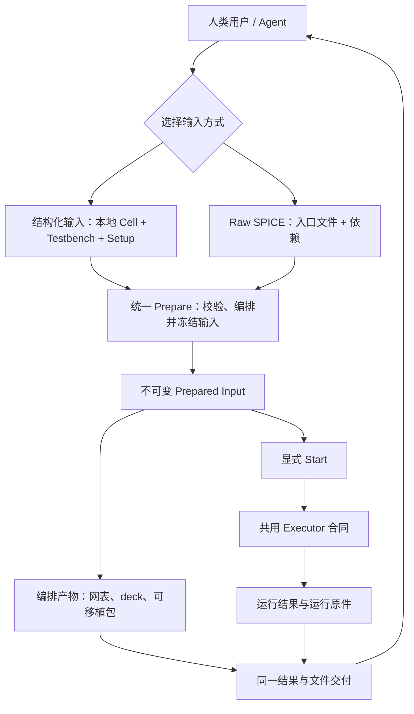
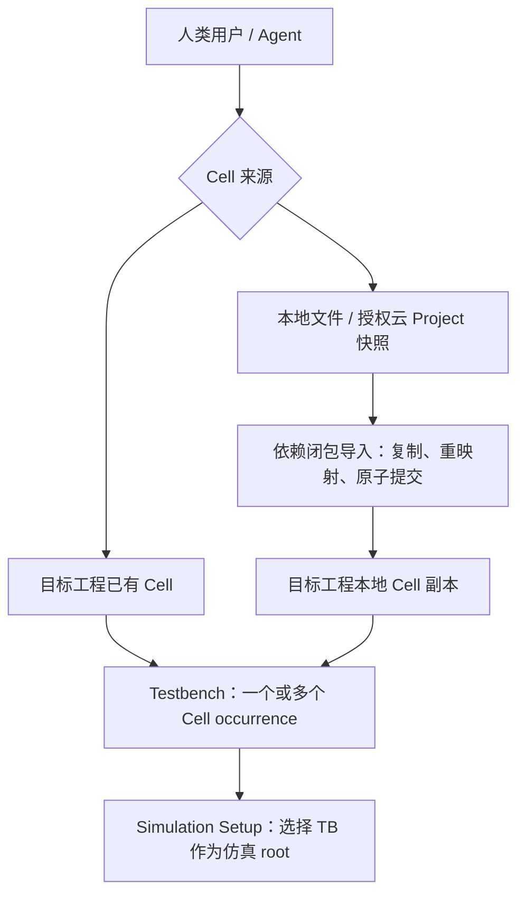
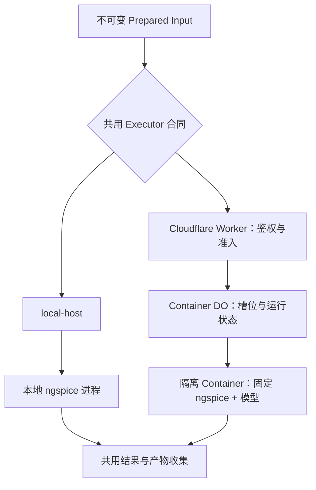

# Analog Canvas 仿真纵向闭环方案 v4

日期：2026-09-04。版本：v4。状态：讨论方案，供 Fable 交接及后续实施评审；所列新增工作尚未实现，尚未替换已接受 ADR。

本文是 v4 讨论方案。[v1 原文](simulation-vertical-integration-plan.md)、[v2 原文](simulation-vertical-integration-plan-v2.md) 与 [v3 原文](simulation-vertical-integration-plan-v3.md) 独立保留、不覆盖；当前讨论以 v4 为准，已接受的产品行为仍以现行 spec 和 ADR 为准。

### 保留 v2 的决定

| 方面 | v2 决定 |
| --- | --- |
| 分析范围 | 首期结构化能力包括 OP、AC、TRAN；共用执行与结果协议，不启用 Digital Simulation |
| 中间产物 | 正式导出可编辑 TB Project、结构网表、可移植仿真包和实际运行原件；编译产物无需先运行即可下载 |
| Agent 创作自由 | helper/MCP 是推荐入口，不是唯一入口；Agent、React 客户端和脚本均可提交原始 SPICE 与依赖文件 |
| 统一边界 | 两种输入形式，一次运行一份权威；共用 prepare、执行、诊断、结果和文件交付，不要求所有语法都有 GUI/helper |

### v3 相对 v2 的补充

| 方面 | v3 决定 |
| --- | --- |
| Cell 复用 | 补中间管理与组合层：同工程直接实例化，跨工程导入完整依赖后本地实例化；不引入远程实时引用 |
| 三种身份 | 可复用 Cell、工程默认 top、仿真 root 分开；原先的 top 也可被 TB 引用，不能只改下拉列表 |
| 多 DUT | 一个 setup 指定一个 TB root，不限制 TB 中 DUT/支持 Cell 的种类与实例数；同一 Cell 的多次调用按 occurrence 区分 |
| 轻量管理 | 复用现有 Shelf、Cell Manager、Project 保存与事务；“20 份”是云端配额，不是电路组织模型 |
| 生命周期 | 完整依赖复制、ID/名称处理、来源独立、原子撤销、保存重载与 GUI/Agent parity 纳入首期验收 |

v1 的归档提交 `9c1960b6`、v2 的归档提交 `96d9f9d1`、v3 的归档提交 `3eeb9481` 及原文均保留。

### v4 相对 v3 的修订

| 方面 | v4 修订 |
| --- | --- |
| 产品主流程 | 只表达输入、prepare、执行与结果，不混入 Cell 导入和云部署内部节点 |
| Cell 复用 | 单独表达同工程直接实例化与跨工程复制后本地实例化，避免误读为运行时远程引用 |
| 执行部署 | Worker / Durable Object / Container / local-host 移到 Cloudflare 章节单独表达 |
| 产品范围 | 不改变 v3 的 Cell、TB、OP/AC/TRAN、raw、Agent parity、导出和工作包决定 |

v4 只修正信息架构与图示层次，不表示对应实现已经交付。

## 0. 交接范围与基线

目标：用户或 Agent 从本工程或有权读取的其他工程复用一个或多个 Cell 创建 Testbench，选择 OP/AC/TRAN 与观测量，或直接提交原始 SPICE，通过同一服务调用 ngspice，得到真实结果、频域/时间波形与 CSV，并能导出编辑输入、编排产物和运行原件。只有映射可靠的结果才定位回 Canvas，不能以无法回标为由阻止 raw 运行。

不做第二套电路协议、第二套 Net、第二个 Editor 实现、通用工作流引擎或大型仿真调度平台。

v1 代码审查基线为 main 的 `85cf2c5d`（#543）；审查时工作树中涉及的仿真、网表、器件、Agent、容器代码与该基线无差异。代码与平台状态均记录编写时的事实。执行前重新读取最新 main，不沿用本方案中的版本号作为分支管理指令。

v2 补充讨论时检查的主工作树为 `42f31aa5`。v3 的 Project / Cell / 云端管理定向审查基线为 main `a469fa68`（#548）；本文在既有文档分支新增，不因此宣称对其他仿真模块完成了最新 main 全量审计。下列“当前”能力是相应审查记录，实施前重新确认是否已被其他工作改变。

目标 owner：Fable。代码实施另开 `codex/` 分支；本文件是已归档的 v4 讨论方案，不算已接受产品契约。

### 已有基础，不应重做

| 层 | 已有能力 | 仍欠缺 |
| --- | --- | --- |
| 电路 | Project / Cell / formal terminal / instance / Net / Route / edit-engine | TB 工作区入口与 setup 生命周期 |
| 项目管理 | 私有 Cloud Project CRUD、revision guard、Shelf、Cell Manager、本地 Project 文件 | 可搜索的 Cell 选择入口、跨工程依赖闭包导入与本地实例化；不重建存储 |
| 层次符号 | 根据 Cell 接口生成 symbol，调整 pin side/offset/body，放置子 Cell | 原 top 首次实例化的 resolver/事务闭环；跨工程复制接口与 presentation 后使用同一派生逻辑 |
| 网表 | 同一 Logical-Net resolver、DesignNetlistIR、确定性 SPICE/Spectre printer、reviewed SKY130 binding | 指定仿真根、根实例化、完整结果映射 |
| 电源 | 原生独立 V/I 的 DC 参数，另有偏数字时钟参数界面的 pulse 电压源 | 正式 AC、模拟 PULSE/SIN 参数与打印规则 |
| 编排 | `.include`/`.lib` 区分、raw deck 拼接、运行输入与环境 hash | 结构化编译与正式 raw 输入汇合、不可变 prepared input |
| 执行 | Worker route、Docker harness、local-host、超时、日志分类 | 真正 Cloudflare 配置、隔离/限额、原始数据收集 |
| 结果 UI | OP 标注函数、AC 图形组件、模拟面板原型 | OP/AC/TRAN 数值协议、实际挂载、stale 防护、CSV |
| Agent | #541 共用编辑 planner/controller；typed schema/client/MCP | 独立 simulation resource 与 parity 闭环 |
| 文件 | GUI Project/结构网表导出；Agent File Resource 的 project/svg/png/pdf | TB 设置保存、网表/仿真产物的共用下载、实际运行文件保留 |

当前事实：模拟面板未挂载；OP state 无生产者；`SimulationRequest.analyses` 不驱动 deck；结构打印把每个 Cell 都包成 `.subckt`；运行只返回日志；wrangler 未配置 NGSPICE 容器。不能把“有模块/有测试”记为纵向闭环完成。

## 1. 产品边界：建议冻结

1. DUT 是普通 Cell。Testbench 也是同一 Project 中的普通 Cell，可放多个不同 DUT/支持 Cell，也可多次放置同一 Cell；源、负载、连线仍由用户明确选择。跨工程 Cell 先导入成为目标工程本地定义。同工程直接复用，不复制 Cell。无需新建 Testbench 电气 schema。
2. Simulation 是工作区/任务模式，不是另一个电路编辑器。DUT/TB 共用当前画布、选择、wire、snap、撤销、层次导航、保存与 Agent transaction。
3. 用户决定激励、负载、分析与观测意图；产品将结构化意图编译为合法 deck，也允许作者直接提交 SPICE。常用流程无需手写，不把“不必写”解释成“不许写”。
4. 首版结构化 OP + AC + TRAN，单 Testbench setup、固定发布的 ngspice/SKY130 环境；先 TT。温度使用明确值/明确默认值并写入运行身份。自带 SPICE 模型通过作业文件及依赖解析进入同一执行器，不要求只能使用预置库；不包含 Verilog-A 编译或二进制插件上传。
5. 首版同时提供 AC 频响和 TRAN 时间波形。DC sweep、PVT 矩阵、Monte Carlo、自动优化的专用 helper/GUI 延后；raw 可表达当前 ngspice 能执行的其他语法，不因此承诺专用图表和完整回标。
6. 不启用已有 dev-only Digital Simulation，不为新的入口复用其数字仿真语义。可抽取中立的 Net picking 交互，不能把数字运行状态当模拟协议。
7. 结果只读，绝不改 Net、器件参数或 Project 电气状态。编辑设置/源是显式编辑；执行与查看结果不是编辑事务。
8. raw SPICE 是正式公开输入，不是临时 debug 后门。允许 `.control` 与作业内 `.include`/`.lib`；不通过画板 parser 的语法子集限制模拟器。结构化与 raw 都必须经过同样的授权、作业隔离、资源约束与结果交付。
9. 同一次运行只采用结构化输入或 raw 输入之一。不同时拼入两套激励、分析或根调用，不静默覆盖作者文本；导出和运行使用可追溯的同一输入快照。

一个 setup 选择一个 TB root，不等于 TB 只能有一个 DUT。工程 `topDocumentId` 是默认入口，不是永久的“禁止实例化”身份；仿真使用独立 `rootDocumentId`，选择 TB 不暗改工程 top。所有放置仍遵守接口有效、引用存在、层次无环。

### ADR 0055 应调整而非机械服从的地方

- “testbench 是作者的”保留，但删除“必须以手写 testbench 文本表达”的实现限定；也不反向禁止文本创作。
- “运行结果不改 Project”保留；“此功能不编辑任何 document / 永不需要 schema 变更”不再覆盖用户明确要求的 TB 编辑与 setup 保存。
- 可仿真判定应为“受支持原生 primitive，或在所选环境中确实可解析的模型/子电路”，不能要求理想电阻、电源等都有 PDK 模型。
- 冷启动、镜像上限、每次请求新磁盘、每次运行价格等说法，应由当前平台资料和实测替代；不把估计写成保证。

## 2. 产品主流程

### 2.1 端到端闭环

这张图只回答“用户如何从输入得到结果”。结构化与 raw 在 prepare 之前保持各自权威，从不可变 Prepared Input 开始共享执行、诊断、结果和文件交付。编排产物在 prepare 后直接进入交付，不要求 start；显式 start 后，运行原件和数值结果再进入同一交付服务。

### 2.2 Cell 复用与 Testbench 组合

跨工程箭头到本地副本即结束；运行时不再依赖源工程。同工程 Cell 直接实例化，不经过复制。`Project top` 仍是工程默认入口，`Simulation root` 只决定本次仿真。

部署拓扑不是产品主流程，移到 §8。逻辑分层不要求每个方框新增 package。优先在现有 `spice-run` 内分文件；低层 runner contract 不反向依赖 React、MCP 或完整编辑器。已有 `packages/simulation` 是数字引擎，不拿它承载 ngspice。

## 3. 唯一权威与生命周期

### 3.1 Project / Cell 复用层：补管理，不重造电路

**当前基础与缺口。** 云端已经是私有 Project CRUD，不是二十个固定槽：每份有完整 Project JSON、当前 revision、名称、预览；20 是数量上限。现有服务不是可按旧 revision 下载的历史仓库。Project 内已经可以有多个 Cell，`childDocumentId` 只引用本工程定义，schema 校验引用、接口和层次环。Shelf 管工程、Cell Manager 管工程内定义与调用者，继续扩展这两个入口。

现有 clipboard / Gallery 的“导入到画布”是单 Document composition；多 Document 工程会回退为打开工程，不是完整 Cell 复用。不能把它包装成新按钮就宣称依赖导入完成。也不应把 `childDocumentId` 改成远端 URL 后让 resolver 随时抓取另一个工程。

| 概念 | 本期含义 |
| --- | --- |
| Project | 可保存、可移植的电路集合和本地定义所有者；Cloud Project ID 只是云存储绑定，不与 Project 内部 ID 混用 |
| Cell definition | 现有普通 Cell、接口、符号 presentation 和内部实现；原先是 top 不妨碍复用 |
| Project top | 工程默认入口；仍保留现行普通打开/结构导出的默认行为 |
| Simulation root | 本次 setup 选择的 TB Cell；只决定这次提取、依赖、probe 与运行路径，不改 Project top |
| Instance occurrence | TB 根下的一次实际调用路径；同一定义被放两次不是同一个被测对象 |
| 导入来源 | 可选的原工程/Cell 标识与捕获快照 revision/hash，用于解释来源；不是运行时外部引用或第二份电气权威 |

**共享导入流程。** 同工程放置继续 `createHierarchyInstance / planPlaceCellInstance`。跨工程增加一个可复用的 plan/import 能力，由现有 Project transaction 提交，GUI、Agent 和文件入口不各写一套：

1. 选择有权读取的源 Project 和 Cell，捕获一次源快照；本地文件与已授权云项目归一为同一输入。不能把最新 revision 的标签当成可随时取回旧数据的保证。
2. 从选定 Cell 遍历全部可达子 Cell，收齐其 formal interface / pin order / symbol presentation、引用到的 external-subcircuit 定义及必要的源/模型依赖声明。只取该闭包，不导入源工程的无关 Cell、setup 或运行缓存；同一源定义在一次导入中只复制一次，保留重复调用关系，不 flatten。
3. 对目标工程分配新 ID 并完整重映射引用；保留接口顺序、参数、端口映射和符号位置。Cell 网表名按现有大小写规则检测碰撞，可用确定后缀改名并返回映射；不能因为同名就复用目标定义。外部模型/子电路同名而内容或来源不同，须显式解决，不能盲改原始模型文本。
4. 沿用当前 Net resolver。局部 Net 保持局部；global 名称仍按既有合同跨 Cell 生效。预览应列出导入会参与的 global 连接及已知冲突，不静默改名、隔离或增加短接。普通提示不阻止保存草稿；真实接口/引用冲突走现有校验，运行可执行性由 prepare 判断，不另起一套门禁。
5. 模型文件可取得且允许复制时随文件依赖流程处理；只有 SourceManifest/路径/hash 时标明缺少内容，不能假装已经自包含。Project 级 source、symbolLibrary lock 与 external definitions 不能被整个源 Project 覆盖；合并必要声明、校验依赖与锁兼容性，保留目标 top/setup/云保存绑定。目标副本不能依赖未来重读源 Cloud Project；prepare 必须从目标已声明依赖和所选环境解析模型。
6. 用现有 Project 原子事务导入整个闭包；“导入并放置”将新定义与目标实例一次提交，失败无半份工程。返回旧/新 ID、名称映射、导入根与 diagnostics，复用现有 revision guard / undo / redo；预览后目标改变须重新计划。
7. 导入后是目标拥有的普通本地 Cell。源工程后来编辑、改名、删除或无权限，不影响已复制的电路内容；目标修改也不回写源。首次导入后重复放置使用目标副本，主动再次导入视为新副本，首期不做内容去重、静默更新或冲突同步。

不是三层新服务：来源读取沿用 Project/File 服务，规划与提交沿用 edit-engine，符号/netlist 继续当前派生。来源标记如需保存，只补最小可选 provenance；没有来源标记也不影响副本合法性，不建库版本表或通用依赖管理器。

**原 top 的首次放置必须穿透完整路径。** 当前 schema/planner 没有统一禁止 top，但 `hierarchical-block.ts` 会跳过“未被引用且无 sourceBinding 的 top”，`project-transaction.ts` 又在操作前构建 symbol resolver，GUI 也据 resolver 过滤候选。因此仅让 UI 显示 top、或只测 planner 不够。应统一“接口合法且不成环即可作为 Cell master”的规则，在现有 resolver/事务派生边界支持首次实例化；不能靠修改工程 top 或先加假实例解锁。现有层次用户文档中 top 的限制须在实施时同步处理。

**管理 UI 的最小范围。** 在 Shelf / 现有工程选择中提供项目搜索；进入 Cell 列表后显示可复用接口、依赖、调用者，并可“放置”或“导入并放置”。Cell Manager 继续负责本地 Cell 改名、接口与调用关系。当前已有工程改名与保存不重做；列表直接改名、另存副本可作为后续便捷项，不阻塞仿真。不要把文件夹、标签、团队权限、历史版本、云配额扩大变成本次前置条件。

复用不是仿真专有功能。正常 Editor 也能使用同一个 Cell 入口；Simulation 只提供默认选择与 TB 向导，不拥有另一套 Cell 注册表。

### 3.2 电路与运行信息的唯一权威

| 信息 | 唯一权威 | 不应存在哪里 |
| --- | --- | --- |
| 结构化 DUT/TB 拓扑、源连接、负载、源 DC/AC/TRAN 分量 | 当前 Project / Cell / Instance 参数 | Setup 内第二份器件清单、同时生效的 TB 备份文本 |
| 已导入 Cell 的实现与引用 | 目标 Project 内普通 Cell 定义 | 持续生效的源 Project 内容、私有远端 resolver |
| formal pin 名称与电气顺序 | 现有 Cell interface | symbol 坐标或肉眼排列顺序 |
| symbol 外形、端口位置 | 现有 Cell symbol presentation | 仿真 profile 私有图形 |
| 结构化分析、频率/时间、probes、TB root | SimulationSetup 的结构化输入 | 只存在于 React 状态的权威、MCP 专属配置 |
| raw 拓扑、激励与分析 | 本次选择的 SPICE 入口及文件内容 | 自动追加的结构化分析、未经作者确认的重编译结果 |
| 环境选择、corner、温度与依赖要求 | 同一 setup/request 的明确选择；raw 已写的设置不得被静默覆盖 | 两份互相冲突的默认值 |
| 模型宿主路径、作业目录、容器规格 | 执行环境解析 | Project 中持久化的机器绝对路径 |
| simulator 向量名与电路对象映射 | 本次编译产物，使用现有 ObjectLocator / HierarchyFrame | 新的永久 Net ID、显示文本推断 |
| 数值、日志、运行身份 | 临时 SimulationResult | Net/Instance 持久化字段 |

### 3.3 保存建议

Testbench Cell 自然随现有 Project 保存。建议 Project 加一个可选 `SimulationSetup`，首版一个 setup 即可，共用环境选择，输入明确二选一：

- 结构化：TB root、OP/AC/TRAN 设置、观测引用；源的参数仍只存于 Instance。
- raw：入口相对路径及用户编辑的 SPICE 文件内容、外部模型依赖声明。它是文本输入，不提取另一套 Net/Cell，也不与结构化设置同时驱动运行。

两者是一个 setup 的输入分支，不是两套电气模型或保存服务。没有 Project 的 Agent raw 请求也可直接 prepare/run，不强迫先造 TB Cell；主动保存时才进入现有 Project 编辑/保存流程。结果、服务器路径、runId、运行缓存不进入 Project。

“转为文本编辑”是一次显式接管：复制已生成文件作为 raw 输入，后续图形修改不再改写它；回到结构化方式须明确重新选择/配置并生成，不反向猜测任意 SPICE。模式切换参与 undo/redo。保留原 DUT/TB Cell 不代表它仍是该 raw 运行的权威。

小型作者文件随 setup 保存，避免刷新丢草稿。外部大模型库仅保存可验证的依赖身份与重挂载要求；既有 SourceManifest 的路径/hash 不是模型内容，不能宣称 JSON 已备份它。缺依赖不妨碍保存草稿，但运行前必须提示补齐；也可导出含可分发依赖的普通文件包。容量沿用现有文件/Project 边界，不额外建立 TB 存储系统。

这是一个明确的最小持久化扩展，而不是声称完全不改 schema。目前代码 schema 为 36；执行时按最新版本安排，不预先抢占下一版本。与 Cloud Save、project-protocol、Gallery 导入/保存、JSON 导出/重载一起验证；缺失 setup 的工程行为不变。不要为省一次 schema 变更再创造 sidecar 电路文件和第二套保存服务。

Setup 引用采取非阻塞编辑生命周期：删掉 TB、probe 对象或拆 Net 后，该 setup/probe 可成为 unresolved；保存仍允许，prepare/run 明确要求修复，不能阻止正常删除电路对象，也不能自动按同名猜一个新对象。复制、删除、undo/redo 的规则应在这一次扩展中闭环。

持久化 probe 必须明确锚点：优先保存 terminal/route/junction 等现有稳定对象的 locator 加 occurrence；必要时保存明确的 Base Net 对象引用，再在 prepare 中解析当前 Logical Net。只保存 `kind: net` 加当时的 Logical-Net representative 并不能解决 split/merge 后的身份问题。对象删除或拆分后无法唯一确定目标时，要求重选，不复制 probe 到所有新 Net。

ObjectLocator/HierarchyFrame 当前定义在 derived。如果持久化 setup 必须消费它们，只下沉单一定义到合适的已有底层模块并迁移引用；禁止 model 反向依赖 derived，禁止复制另一套地址类型。

## 4. Agent 优先：helper 推荐，raw 正式开放

允许 Agent、React 和外部脚本自由生成/修改 SPICE；反对的是只有某个客户端拥有的隐藏设置和执行规则，不是字符串生成本身。两种输入共用后端资源与产物，不要求所有原生语法都有 helper 或 GUI 控件。

建议分两类 API。

### 4.1 电路编辑：继续现有 transaction

- 创建普通 TB Cell、放置本地 DUT/支持 Cell 实例（包括原 top）；允许多个不同 Cell 和重复 occurrence。
- 通过共用 Cell 导入 planner，从授权源快照复制完整依赖到目标 Project，然后普通实例化；同工程 place 不经跨工程复制。
- 放置/连接 V、I、R、C，更新正式参数。
- 调整 symbol body 与 pin side/offset；电气 pin order 不由图形位置改变。
- 选择/连接已有 Net；不通过屏幕坐标猜电气关系。

已有 `structureEdits` 能完成 Cell 接口/符号操作；给 Agent 增加小的 `place-cell` convenience command，内部只调用 `createHierarchyInstance` / `planPlaceCellInstance`。另提供同一 shared Cell import 操作与预览结果，复用现有 Project/File 读取运输和 Project 编辑权限：读源不等于可编辑源，导入只需要授权读源与写目标。不能把“选择云工程”做成仅 GUI 的私有能力，也不能把导入误接到替换当前 Project 的流程。

### 4.2 仿真：小的独立资源，不塞进 transact

建议的语义操作，名称供实现时冻结：

| 操作 | 含义 |
| --- | --- |
| capabilities | 可用环境、结构化分析/probe、raw 接入与可解析输出格式、限额 |
| configure | 通过同一配置编辑命令更新 setup；不另存 UI 私有配置 |
| prepare | 接受 Project/Setup 或 raw 入口及文件，冻结输入、解析依赖、形成产物；结构化时编译与绑定，不运行 |
| start | 执行指定 prepared input，返回 runId；一个显式运行副作用 |
| read | 读取状态/终态结果，允许有限等待；结果丢失/过期明确返回 |
| cancel | 真正终止执行并释放槽，不只是关闭 UI 或取消 fetch |
| export | 通过现有 File Resource 交付 Project、结构网表、编排包、运行原件及结果；不是第二个下载协议 |

这些是同一 shared service 的 typed 操作，可先组织成少量资源方法，不需要七套微服务或独立调度器。复用现有 session/auth/claim/project roster；新增明确 run/read 权限。Agent 的电路编辑授权不等于云上传/花费授权，但用户授予相应会话能力后，不为每次配置、prepare、run 或导出反复请求人工批准。raw 与 helper 在相同作用域内享有同等能力。

`configure` 是持久化 Project 修改，必须落入现有 controller 的 typed setup edit，参与 structure revision 检查、undo/redo 与保存，并要求 edit 权限。simulation resource 即使提供 convenience 方法也只能调用该命令；run/read 权限不能间接授权改配置。

当前 Circuit API 固定四种操作且 service.handle 同步；`/files` 是现成的 sibling resource 先例。可以增加 `/api/agent/sessions/{sessionId}/simulation`，MCP tool 只包装同一个 agent-client 资源调用，不复制 builder 或结果 parser。

Agent relay 与客户端目前默认 30 秒，runner 上限 120 秒。因此采用短 start receipt + read/cancel，而非全面加长编辑 RPC。初版只需短期 run 状态与一个活动执行槽；不引入数据库历史、自动任务重试或持久化队列。requestId/runId 在同一会话中防重复启动；状态重启丢失必须返回明确结果，不能偷偷重跑收费任务。

`start` 必须执行其接受的 digest 对应的不可变 prepared input；若当前操作要求使用最新状态而输入已变，则返回 `INPUT_CHANGED` 重新 prepare，不能在用户/Agent 不知情时换成另一个电路或 raw 文件。runId 的 read/cancel/export 绑定授权会话/Project owner；无 Project 的 raw run 绑定授权会话所有者。读取所有可达 TB/DUT Cell 都要经过权限检查，不能只检查请求 rootDocumentId。

### 4.3 raw 入口与权限边界

- 提交入口文件和依赖文件，支持用户自带的 SPICE 模型；使用公开输入合同，不依赖 React 私有状态，也不走结构网表导入/重建 Canvas 的前置门禁。
- raw 文件里的源、根调用、分析和 `.control` 是作者权威。系统不另加同功能 `.ac`/`.tran`、自动更改 `.end` 或修复拓扑；文件不可执行时保留 ngspice 原文及可获得的文件/行号，不伪造定位。helper 可显式生成/修改这些内容，但生成结果由作者提交。
- 环境库使用明确依赖及映射；不向自包含 raw 输入无条件追加默认 PDK/corner/温度。与显式选择冲突时指出两处来源，让作者更正，不静默择一。
- 支持的 native SPICE 语法不以 UI 控件为上限。未被本工具理解的语句可以交给沙箱内 ngspice；不等于允许访问宿主文件、外网或其他作业。
- 编辑原 Project 仍需 edit 权限与 revision guard；运行 raw 不自动回写 Project。Cloud 与 local-host 均明确权限/隔离边界，不能把本地任意文件访问藏在 helper 内。

### Parity 的验收，不止是 API 名称相似

对同一 fixture 通过 GUI action 和 Agent/MCP action 施加同样意图后，检查：

1. 相同的规范化电路/Setup、formal pin order、源参数；Cell 导入闭包、引用与名称处理相同（各次生成的新 ID 用返回映射比较），同工程与跨工程入口共享实现。
2. 相同环境下生成相同 deck（运输 requestId 不计入电气内容）。
3. 同样无效输入得到相同 error code、字段路径和对象定位。
4. 同样结果解析、单位、极性、stale 判定及导出数据。
5. MCP 实际能完成 create TB → configure → run → read → export，而不是只给未来留一个类型。
6. GUI 文本模式与 Agent 提交相同 raw 文件，得到相同 prepared 内容、依赖解析、诊断和产物；不因为来源不同而增加白名单或逐步审批。
7. helper 未覆盖的合法 SPICE 可以运行；没有对应专用 GUI 控件、不能回标或结果格式暂不解析，不等于无权运行/下载原始产物。

## 5. 编排器：当前缺口与最小处理

### 5.1 分析根和实际顶层执行

`analyzeDesignNetlist` 当前以 `project.topDocumentId` 为唯一根。增加明确的只读 `rootDocumentId` 选项，遍历该根可达层次，不修改工程 top。同工程 DUT 只实例化、不复制；跨工程导入完成后也只解析目标本地副本。根选择必须贯通提取、诊断筛选、依赖收集、occurrence/probe 绑定及输入身份，不能只有 printer 换根而其他消费者仍按工程 top 工作。

当前 printer 输出所有 `.subckt` 定义，只有定义不会执行 DUT。保留结构 exporter 的这个契约；编排器额外生成且只生成一次 Testbench 根实例。首版建议 TB root 没有外部 formal pins，所有源/负载在 TB 内；如允许外部 pins，必须另有明确根绑定，不能自动接地或悬空后仍声称正确。

任一可复用 DUT 的 symbol 直接从现有 formal interface/presentation 派生并放入 TB；原 top 首次放置遵循 §3.1 的 resolver/事务修复。所谓“symbol 导出”首先是内部复用；跨工程传递的是定义与实现闭包，不能只复制图形。单独 symbol 文件格式不是本次前置条件。

### 5.2 激励源

现有 V/I 只有正式 DC 字段。增加 descriptor-backed AC magnitude/phase，使用现有参数编辑、单位处理与 printer 专门打印合法 `DC ... AC ... ...`，不是把 `ac=...` 当作任意参数附在卡片上。

DC 偏置、AC 小信号、TRAN 波形是同一个源的不同分析分量，不应该放三个彼此不知情的源或保留 setup override。模拟 V/I 源首期支持 PULSE 与 SIN，正式参数存于 Instance 并由 descriptor、helper、GUI、printer 共同消费：

- PULSE：低/高值、延迟、上升/下降时间、脉宽、周期；不得仅用 0/1、period、dutyCycle 代替模拟参数。
- SIN：偏置、幅度、频率及明确的可选延迟/阻尼/相位。
- PWL 首期可经 raw 输入，专用表格编辑/helper 后续扩充，不再造一种运行方式。

已有 pulse 电压源不强删，现有电路与符号外观不变；其时钟便捷参数必须由一个规范化入口转成同一模拟波形参数，不能让两份参数同时成为权威。模拟电流源与电压源的波形语法共用参数结构，但数值单位和电流正方向保持各自定义。变更覆盖结构导出，不只在仿真 UI 拼合法文本。

VDD/GND/Label 是网络与参考节点标记，不提供电源能量。VDD 标记不等于电压源，Ground 不等于电源激励。DUT 内真实偏置元件保留；TB 只包含用户明确添加的外部激励/负载。全局 Net/implicit bulk 继续用当前 resolver，不能在编排器里再写一套“自动补 VDD/B=S”。

### 5.3 TRAN 的最小正式合同

ngspice 的分析名是 `tran`。首期设置为终止时间 `tstop`、建议输出/计算步长 `tstep`、可选最大积分步长 `tmax`、可选输出保存起点 `tstart`；界面给出单位和明确默认值，校验有限数值、正步长及时间区间。

`.tran tstep tstop <tstart <tmax>> <uic>` 中，`tstart` 不是从该时刻才开始求解，积分仍从零开始；`tstep` 也不能被解释成结果必定等间隔。保留求解器返回的实际时间轴。实现以本地固定 ngspice 手册及 reference 运行验证可选参数的打印，不靠空占位猜语法。

默认先求瞬态初始工作点，不静默加入 `UIC`。跳过初始工作点和显式初值属于高级意图；首期可通过 raw 表达，不能把收敛失败自动“修复”为另一初始条件。

UI 波形抽样只影响显示，不偷偷放宽积分步长或删掉 CSV/原始结果。若提供等间隔 CSV 重采样，应明确标为派生输出并保留原始数据。长时间、小步长、多 probe 受公开资源上限约束；超限返回明确诊断，不能默默改变用户要求。

### 5.4 两种输入，共用 prepare 与执行边界

`Project snapshot + Setup + Environment capabilities`

→ shared prepare/validation

→ 现有 `DesignNetlistIR` + occurrence-aware binding map

→ shared deck assembly（环境库、结构定义、一次根调用、analysis、save、end）

→ immutable prepared input → runner

这是结构化路径：共用现有 IR/printer，不为仿真重新提取网表。源/分析/probe 的正式字段覆盖 OP、AC、TRAN；缺少的专用 helper 不是 raw 输入的禁令。

raw 路径为：`SPICE entry + files + 明确环境/输出约定 → 文件与依赖接收 → immutable prepared input → 同一 runner`。输入接收不是另一个网表 printer；不先导入 Canvas、不按结构 parser 的支持集合过滤语法，也不自动注入根实例、源、分析或 `.control`。

线上客户端都不是信任边界。服务端复用输入 schema、权限和文件依赖校验，在 prepare 时验证/完成结构化编译或接收 raw；环境路径解析是执行层职责。优先传递现有 IR 和必要绑定元数据而非全画布几何，但不把“IR 来自 helper”当作安全证明。最终执行隔离对两种输入一视同仁，不以客户端语法白名单代替沙箱。

Prepared input 固定所选模式、输入文件路径与内容 hash、入口、完整依赖身份、环境选择、启动及输出收集约定；结构化时还包含参与 Project 层次/Setup 身份与编译映射。raw 没有 Canvas revision 时由这些内容生成输入身份；改一个 include 文件也会使旧输入过期。

执行时可以按已声明映射解析环境路径，但不能临时重读修改后的作者文件或更换模型版本。记录提交源文件、编排文件和最终执行文件各自 hash；源 hash、prepared digest 与 `deckSha256` 职责不同，不要求三个值相同。改变电气输入或环境选择必须重新 prepare，不能在 start 内偷偷重新编译。

`netlist` 在结构化模式中是产物，在 raw 模式中是输入；明确接管后才改变角色，不让两者同时成为本次运行的权威。

### 5.5 Probe 与结果映射

- 电压：Net 相对地或明确另一 Net 的差分电压。
- 首版电流：明确支持的支路，例如电压源电流；保存单位与正方向。
- Net 不是单一电流支路；画布电流辅助箭头是图形注释，不能自动当作 ngspice 电流探针。
- MOS/X 子电路端口电流只有经具体模型绑定验证后才暴露；不能默认所有实例都支持 `i(instance)`。
- 复用 ObjectLocator + HierarchyFrame，区分 X1/DUT/n 与 X2/DUT/n。禁止只用 Cell definition 或显示 Net 名映射。
- 映射在编译时产生，保留 root wrapper 前缀和最终打印名称；不从结果文本猜 ID。
- 旧 Logical-Net representative 不作为跨 revision 永久身份。每次 prepare 重新解析 probe，引用失效要指出具体项。
- raw 默认不承诺 Canvas 映射。由编译产物转为 raw 后，相关文本/依赖改变即使沿用原名称也不能继续信任旧绑定；只有被证明仍有效的映射才允许回标。
- 映射完整、部分可用、不可用只影响回标范围。可解析的 raw OP/AC/TRAN 数据仍可进表格、波形和 CSV；其他输出作为原始产物下载。

### 5.6 检查与错误

复用现有 diagnostics envelope/对象定位。仿真侧补足必要的 stage、code、setup 字段定位与 raw log，不复制第三套 ERC。无电路对象的环境/队列错误指向 run/setup，不能伪造成器件故障。

分清三种事：

- 确定无法表达/执行：结构化路径的非法接口映射、层次循环、无效分析参数、被删除的 probe；两种路径已确认缺少的必需模型/文件、不可用执行环境。阻止对应 run，指出修复对象。可恢复的作者草稿仍能保存/导出。
- 工程提示：普通 ERC、无 AC 激励可能全零等。按具体规则提示，不因为任何 warning 就禁止运行；无关 Cell 不影响当前根的准备。
- 执行结果：收敛失败、超时、资源忙、取消、输出缺失、环境未配置。明确不同 code，保留 ngspice 原文。

raw 中本工具不认识的合法语法不等于“不支持执行”。文件/行号诊断与 setup 字段/对象诊断共用 envelope；无法静态判断的电气语法交给 ngspice 报告。公开限额、真正缺依赖与权限拒绝仍明确返回，不把一般 ERC warning 或无法回标升级为门禁。

视觉 overlap、标签位置绝不能作为运行电气门禁。Check and Save 可复用诊断显示，但不承担“看起来正确所以可仿真”的判断。

## 6. 结果、文件产物与可追溯性

### 6.1 同一数值与运行结果

沿用现有 SimulationResult 的 outcome/diagnostics/log/duration/metadata，增加正式数值数据，不另造 GUI 私有结果协议。

- OP：每个 probe 的标量与单位。
- AC：frequencyHz 与每个 probe 的 complex real/imag 数组；幅相从同一数据派生。
- TRAN：实际 `timeSeconds` 与各 probe 的实数数组、单位、方向；不假设时间点等间隔。不同 plot 可有各自时间轴，不为拼表强行重采样。
- 不把电压幅值直接叫增益。选择明确的输入/输出后才计算 Vout/Vin；否则标明电压幅值/dBV。相位单位与 wrap/unwrap 是确定的显示选择。
- 数值数组长度、analysis ID、probe ID、非有限值、空 rawfile、遗漏输出、部分完成都验证。退出码 0 不代表所需结果齐全。
- CSV 从正式结果数据导出，包含单位，AC 保留 real/imag、TRAN 保留真实时间点；图表和 CSV 不能走两条解析路径。
- 原始日志用于解释；数值读取 rawfile/正式输出，不从 console 排版抓数。结构化路径初版固定 ASCII rawfile 模式，覆盖多 plot、real/complex，再考虑 binary。
- ngspice 官方 batch 路径支持 `-b -r` 与 `.save`；具体参数组合按本地固定版 47 的 reference 测试，不依靠滚动在线手册的偶然变化。raw `.control` 可以自行安排分析/写文件，不能假设追加 `-r` 就必定得到期望的 plot。

raw 的输出约定独立于电气语句：可以明确选择已有输出文件或请求解析支持的 rawfile；helper 可替作者生成 `write` 等语句，但必须成为其确认的输入，执行器不偷偷重写控制脚本。结构化与 raw 共用 parser；暂不支持的 binary/其他格式照常保留下载，并标明解析能力缺口，不因 parser 缺能力禁止执行。

区分进程执行结果与结果可用性：已要求的 plot/向量缺失不得伪报数值成功；作者只要求运行脚本/导出文件时，也不能因未生成标准 OP/AC/TRAN plot 报成 SPICE 执行失败。执行成功但不可解析、部分结果和真正计算失败必须在同一结果中明确表达，具体字段在 F0/F3 冻结。

已有 metadata V1 继续复用。输入身份必须覆盖整个参与层次、Setup 与编译内容，不能只看当前 document.revision；修改 DUT 子 Cell 同样使运行输入过期。环境含实际 simulator/model 身份；当前 observed 不是 pinned。不同 OS binary hash 本来就可能不同，不要求 local 与 hosted fingerprint 相同，只要求身份各自真实、同样输入满足已声明的数值容差。

运行时捕获不可变输入。完成后如果当前电路/Setup 已变，保留结果但标注 stale，默认不贴到当前画布；不得静默改绑。同一 Cell 的多个 occurrence 的 OP 值不同，没有选定路径时不能贴一个“通用值”。首版可保守地在参与 document revision 变动时失效，后续再优化纯几何变更误失效，不为此先造 revision 系统。

raw 结果以输入文件/依赖/环境身份判断是否仍对应当前文本；不借用无关 Canvas revision。作者文件改变后旧结果仍可下载，标明原输入，不自动转成新输入的结果。

### 6.2 中间产物是正式交付，不依赖成功运行

| 产物 | 内容与用途 | 可用时点 |
| --- | --- | --- |
| 可编辑 TB Project | 普通 Project 的 TB、DUT/全部可达依赖 Cell、接口、符号与 setup；raw 草稿也走同一保存合同 | 保存/导出时，不要求 prepare 或 run 成功 |
| 结构网表 | TB/DUT 的 `.subckt`、连接和电气端口顺序；仍不混入分析和环境机器路径 | 结构导出完成后，不要求执行环境已上线 |
| 源文件/可移植仿真包 | 作者 raw 原件，或编排好的入口 deck、结构网表、明确的模型依赖清单；有多文件时普通 ZIP | prepare/产物生成后，不要求先 start 或跑通 |
| 实际运行原件 | 那次真正交给 ngspice 的入口及作业输入文件、启动约定、log/raw/CSV 与 metadata；附实际文件 hash | 执行边界已形成原件后；失败运行也应可下载已有产物 |

最小 GUI 默认导出完整 `.icproj.json`，不另做 TB 文件格式。若提供仅 TB 导出，必须裁取全部可达依赖及相关设置，不能只把当前 document 裸存出来。切换仿真根不修改原 Project top；导出选择仍明确标明 TB root。

结构化网表继续复用 GUI 的 `analyzeDesignNetlist → planDesignNetlistExport → printDesignNetlist` 与相同 diagnostics。raw 源导出按原文件交付，不经过结构 printer，不承诺其能被当前结构导入器无损导回画板。警告的确认/返回规则由 shared service 统一，不存在 Agent 专属 printer。

模型缺失时，仍允许导出源文件和带明确依赖缺口的包，但不标为“可直接运行”。包未附模型时给出版本/hash、`.include`/`.lib` 类型与 section、安装/路径映射要求；只有内容可取得且允许分发的依赖才随包携带，并保留 notices。已经导入过的模型若只有 SourceManifest，不应伪造或假定还能恢复其字节。

### 6.3 原件、可移植包与同一文件服务

- 精确运行输入在进程启动前从执行边界冻结副本并短期保留，核对既有 `deckSha256`；不得事后从当前 Project、raw 编辑器或可能被脚本改写的作业文件重新生成。运行输出另行收集。当前实现只有 hash、local-host 会删除临时目录，这必须作为实现缺口补齐。
- 可移植包可以重写容器模型路径为相对路径，但它与原件分别计算 hash。若原件包含不宜公开的环境路径，应提供明确标识的脱敏/portable 派生件，不能修改后仍声称与 `deckSha256` 相同。
- Prepared 产物与 run 产物引用对应不可变输入。短期保留期限、容量和过期诊断对 GUI/Agent 一致；不引入长期历史数据库，不把临时 runId 放进 Project。
- 扩展现有 File Resource 的下载产物选择/来源（Project、prepared input 或 run），沿用 MCP `export_file` 的本地文件落盘、长度与 SHA-256 校验。仿真服务负责生成/登记产物，文件服务负责同一份字节的交付；不新增 `/sim-files` 协议。
- 补齐网表/源文件/运行产物的权限归类，不能落入当前“非 Project 下载等于 visual.download”的分支。权限一次明确授权，正常导出不复用候选 Project 替换的人类批准流程。
- raw 上传可复用现有文件字节运输/校验，但不能借用“结构 SPICE 导入画板”的强制解析和替换批准路径。接收作业文件不等于导入/替换用户工程。
- 当前 File Resource 上限为 1,500,000 bytes，stage 最多 24 文件且使用 base64。先支持有明确限额的小包与外部模型依赖清单；若实际闭环需要大模型/大结果，演进同一文件通道的容量/流式交付，而不是另建存储协议。结果被截断必须明确，不假装完整导出。

## 7. 人类界面

建议入口：顶栏与 File / Netlist 并列的 Simulation。进入后使用“设计 / Testbench / 结果”工作区，而不是启动第二个 App 实例。

首次：在共用 Cell 入口选择本工程或授权源工程的 DUT → 确认接口与依赖（跨工程先预览并复制）→ 显式创建 TB 并放置默认 DUT → 用户继续放置其他 DUT/支持 Cell、源、负载并连接。向导默认一个 DUT 是便捷起点，不是模型约束；不自动猜电源电压、输入幅度或负载，也不更改工程 top。

- 复用入口：在现有 Shelf/工程选择与 Cell Manager 中搜索、检查接口/依赖、放置或导入；导入预览清楚区分本地副本与远程原件，正常 Editor 同样可用。
- 中央：现有 canvas/controller，切换当前 TB document，保留所有常用编辑能力。
- 设置区域：OP/AC/TRAN、频率或时间范围/步长、源 DC/AC/PULSE/SIN 参数、probe 清单、环境与温度；常用项优先，高级项折叠。
- Pick Net：从现有 hit/resolver 得到对象地址，高亮选中对象，退出 pick 不产生电路选择/编辑副作用。
- 结果区域：OP 表/画布标注、AC 频响、TRAN 时间波形、CSV、日志及原始产物；保留当前布局风格，不把所有控制塞进 modal。
- 编排预览/导出：运行前即可查看结构网表、编排 deck 和依赖；复用 File/Netlist 的交付方式，运行后另有“这次运行原件”，不能用同一个含糊的 Netlist 按钮混淆来源。
- 进阶文本模式：查看/编辑入口及源文件、显式接管、提交 raw 并保存/导出。无需先导入为图形；转换、未保存变化、缺依赖和回标能力都可见，不做任意 SPICE 与 Canvas 的自动双向同步。
- 错误点选：定位 DUT/TB 对象或设置字段。已有波形组件是呈现层，只接受规范结果 adapter。
- 云运行前清楚说明上传电路结构；本地执行是同一接口的 executor 选择，不是另一套功能。

Parity 不要求 raw 中每种语法都有表单；常用分析可全程图形完成，进阶文本入口与 Agent raw 使用相同服务。未上线的执行环境不应禁用本地工程保存和可生成的网表导出。

## 8. Cloudflare：建议与真实边界

截至 2026-09-03 的官方资料支持 Docker/Linux 原生计算：Worker 做控制，DO 管容器实例，Container 内运行 ngspice。镜像需 linux/amd64。它不是把 ngspice 二进制放进 V8 isolate。

### 8.1 执行拓扑

Cloud 与 local-host 实现同一 executor/result 合同，但运行环境身份可以不同。Worker、DO 与 Container 是云执行内部结构，不是用户必须理解的额外编排步骤。

### 8.2 最小部署策略

1. 先一个执行槽，明确 `max_instances: 1`，每槽一个 ngspice。占用时返回 busy/Retry-After；不给用户无限排队。实测后可扩到两个槽，不先建设通用队列。
2. 比较 `basic`（1/4 vCPU、1 GiB、4 GB disk）与 `standard-2`（1 vCPU、6 GiB、12 GB disk）。选择靠 benchmark，不保证按 CPU 比例线性加速。默认 lite 不应未经测试直接发布。
3. 保留30秒默认、120秒上限作为初始测量配置；宿主再验证上限并真正终止进程/必要时销毁容器。CPU、内存、输出、并发是不同限额。TRAN 还需测长时间/小步长/多 probe 的结果体积，不以丢点、改步长假装符合请求。
4. start/read/cancel 是短期作业句柄，不需要持久化结果平台。新请求不会自动获得新磁盘；睡眠/重启才重置临时磁盘。繁忙执行必须保护免于 idle sleep，`sleepAfter` 不能充当运行超时。
5. 当前 runnerKey 实际是 shared，并未做到注释声称的 per-author。当前 route 也未鉴权；在接通公网前复用现有账户/授权补上准入。`max_instances` 限制容器，不限制容器内部并行进程，harness 必须自己 busy-guard。
6. 固定一份环境 lock：基础镜像 digest、ngspice 版本/构建身份、PDK/upstream revision 与完整 runtime hash；构建产物 image digest 可追溯。启动核验后才报 pinned。自带 SPICE 模型单独记录真实文件身份，不能仅因引擎固定便宣称整个环境已验证 pinned。正常安全更新通过显式 lock 更新，不承诺永远不升级。

### 当前部署要补的具体内容

- `NgspiceContainer extends Container` 导出、defaultPort=8080。
- wrangler 中 containers 配置、NGSPICE DO binding、新的 migration；保留现有 DO 与迁移记录。
- 明确 Docker context 与 SKY130 model staging。当前 workflow 没提供 Dockerfile 需要的模型目录。
- 先 staging：health → 固定 OP deck → AC/TRAN → raw `.control` 与作业模型文件 → 应用 API → GUI/MCP；成功后才启用 production simulation。
- no binding/启动失败仍是环境不可用，不影响原 Editor/Gallery 使用；模拟入口按实际能力显示状态，Digital 保持关闭。

### 必要隔离，不是“过度保护”

ngspice 控制语言能够执行 shell，原始 deck 是执行输入，不能当普通文本对待。当前 Docker 默认 root，execFile 没有每次运行 cwd，临时 deck 文件夹不构成沙箱。

上线最低限度：非 root、无用户/平台 secret 进入 guest、预置模型只读、每次独立 cwd/scratch、网络默认关闭、输入/输出/进程/时间有限额，不同不可信 job 间 reset/destroy 环境。作业包的相对路径、遍历/符号链接、解包大小及输出收集同样校验；local-host 不能只有临时目录就宣称隔离。

raw `.control` 是正式能力，因此不能以“禁止所有控制语言”通过隔离验收。即使语句能在 guest 内启动工具，影响也必须限定在该作业环境，不能访问宿主/平台凭据、其他用户数据或未授权网络；终止覆盖子进程树。隔离未就绪的 executor 明确报告该能力暂不可用，而不是假称已完成 raw 闭环。结构化输入同样不可信，不能仅信 GUI/helper。

### 费用应怎样理解

官方当前计费：CPU 按活跃使用量，RAM/disk 按容器运行期间分配量；睡眠后停止这部分费用。Workers、DO、日志和流量另计。小电路可行，但模型加载、冷启动和空闲保温可能比求解本身更占用资源。不要承诺“每次固定多少钱/每月固定可跑多少次”，先记录 CPU time、awake time、peak RSS、结果字节数。

参考：

- https://developers.cloudflare.com/containers/
- https://developers.cloudflare.com/containers/concepts/architecture/
- https://developers.cloudflare.com/containers/platform/limits/
- https://developers.cloudflare.com/containers/configuration/scaling-and-routing/
- https://developers.cloudflare.com/containers/platform/pricing/
- https://developers.cloudflare.com/containers/guides/outbound-traffic/
- https://developers.cloudflare.com/containers/reference/container-class/
- https://developers.cloudflare.com/containers/guides/image-management/

平台可行性已经查证；账户是否开通、实际延迟/成本/可容纳电路规模，必须通过部署和负载测量确认。本次没有部署或实测云端。

## 9. Fable 的实施工作包

所有项初始状态 pending；退出条件达成才标完成。每包一个主要所有权/验证边界，不因“骨架已经写好”提前关闭。

### F0：冻结最小产品契约与早期部署探针

Owner：编排负责人。范围：ADR0055、simulation spec、现有 hierarchy/project 合同及相关 architecture/user 文档；不写另一份并行总规范。

冻结 Cell / 工程 top / 仿真 root 的区分、多 DUT、本地定义复用与跨工程复制边界；同步审查现行 top 不实例化的文档限制。保留 Cloud Project 当前存储/配额/权限边界，不承诺历史版本回取。

冻结 OP+AC+TRAN、普通 TB Cell、结构化/raw 互斥输入、setup/作者文件保存、源参数权威、probe 范围、async run receipt、结果不修改电路、Digital 不公开。补清原生 primitive / 模型依赖、raw 启动/输出约定、授权、文件产物和容量边界；不以 helper 语法子集作为 raw 门禁。

并行准备 Cloudflare staging 的纯阻值分压 OP 探针，验证原生进程能运行；随后验证 pinned model pack 的 SKY130 OP。这个是部署可行性证明，不代替产品闭环。

退出：上述决定明确，现行 spec/ADR 与新范围的差异被有意处理；有运行的真实数据证据或明确外部部署 blocker；无改变 DUT/Net 或覆盖 raw 文本的隐含路径。字段定义先做最小可用合同，不为后续 sweep/优化预建通用工作流。

### F1：可保存的 Testbench 意图与源能力

Owner：model/edit/devices。范围：`packages/model`、`project-protocol`、`edit-engine`、`devices`；必要的 Agent authoring/schema 与 printer。

新增单一 setup 的结构化/raw 输入保存合同；正式 AC magnitude/phase 与 V/I 的模拟 PULSE/SIN 参数；复用 Cell symbol / create/place helpers。定义 setup/probe 对象删除、clone、模式接管、undo/redo、保存重载；作者文件内容不能只在 React，外部模型缺失必须可见。补协议版本和 Gallery 兼容测试，不抢占版本号。

退出：普通电路与 TB 使用同一个编辑/保存路径；正式源参数完整打印，不靠临时字符串补 AC/TRAN；原 pulse 行为保持，时钟便捷参数不成为第二权威；源和 setup 参数没有双存；raw 草稿保存/重载内容一致；改 symbol pin 位置不改 pin order。

### F1R：Cell 复用与完整依赖导入（v3 新增）

Owner：hierarchy/edit-engine。范围：现有 Project model 的必要引用、hierarchy planner / project transaction / symbol resolver；依赖 F0 的复用合同。与 F1 分开交付，Cell 导入不依赖仿真 setup 字段。

建立共用 Cell 导入 planner，收集可达定义、external-subcircuit/模型依赖声明，完成 ID/名称映射与原子导入/放置；同工程直接 place。修复原 top 首次 placement 的 resolver/事务链；保留既有引用/接口/无环检查。普通 Cell 复制如需提供也复用这一能力，不扩展 clipboard 成第二个工程模型。

退出：源 Project 的原 top 及其嵌套/共享子 Cell 可导入并放入 TB；依赖只复制一次、重复实例仍引用同一定义；保存重载、undo/redo、目标 revision 冲突与中途失败不留下半份状态；源编辑/删除不影响副本；本地接口/presentation/外部依赖不丢失，全局 Net 规则不被暗改。当前 `.icproj.json` 在现有容量内可独立重开；缺模型内容明确记录，不伪称包自包含。

验证以 Project transaction/resolver 集成测试为主，而非只测 planner 返回值。覆盖原 top 尚未被任何实例引用时的首次放置、ID/大小写名称冲突、两源工程重复子 Cell 名、层次环拒绝、依赖缺口、来源独立及一次操作完整 undo/redo。GUI/Agent 接入分别由 F5/F4 承担，不在本包搭新存储服务。

### F2：prepare/compiler、映射与编排产物

Owner：netlist/spice-run。依赖 F1 的最小字段冻结；根选择合同在 F0 冻结。可先用本工程 fixture 推进，不等待跨工程导入 UI。

结构化路径实现只读 rootDocumentId、一次根实例、OP/AC/TRAN 编译、save/probe、occurrence map；raw 路径接收 entry/files、解析明确依赖，不走 Canvas parser。两者汇入不可变输入/产物合同，覆盖文件/环境/启动及输出身份；复用 registry、netlist extraction、resolver、diagnostics。

编译侧生成结构网表、源文件和可移植包，不负责另写一套下载传输；运行原件的形成/保留属于 F3，File Resource 交付属于 F4。

退出：同一输入产生确定产物；多个不同 DUT/支持 Cell 与两次相同 DUT occurrence 不串线；提取、检查、依赖和映射使用同一仿真 root，不用修改 Project top；不存在仅定义 .subckt 而未运行 root 的空成功；raw 不被重复加源/分析/根实例；依赖变化使 input digest 改变；未启动、执行环境暂不可用时仍能导出已有产物，并明确依赖缺口。

### F3：真实数值与 executor 闭环

Owner：spice-run/local-host/container。依赖 F2。

结构化 ASCII rawfile 收集/共享 parser；OP/AC/TRAN 正式结果、单位与部分失败；raw `.control` 按明确输出约定收集，不强改脚本，不把未支持格式当执行禁令。沿用 metadata；最小 start/read/cancel 与真实进程生命周期；删除临时目录前保留实际执行文件及现有输出，提供有容量/有效期的产物引用。

退出：固定 ngspice 的直接参考与应用三种分析结果在明确容差内一致；TRAN 时间轴不被等距化；要求的缺向量/空输出不被当数值完成，脚本无标准 plot 不伪报进程失败；取消/超时终止进程树并释放槽；local 与 hosted 共用 parser/result；运行原件的 hash 与 metadata 一致，失败任务仍可下载已有诊断产物。

### F4：Agent API / MCP parity

Owner：agent-adapter/client/mcp/relay。依赖 F1-F3 及 F1R 的共享导入能力；transport schema 可早冻结。

新增 simulation named resource，复用 session permissions/roster/request IDs。电路编辑仍 transaction；Cell 选择/依赖预览/导入/放置调用共享 planner 和现有 Project/File 服务，不塞进仿真 executor。真正 MCP 流程覆盖授权源 Cell 获取、多 DUT TB 创建、配置、prepare、start、read/cancel，以及不导入 Canvas 的 raw 文件提交；无需每步批准。

扩展现有 File Resource/agent-client/MCP 的结构网表、编排包、实际运行文件和结果下载，修正非视觉产物权限；raw 字节接收不沿用候选 Project 替换的结构解析门禁。容量不足明确报错/提供依赖清单，不另建仿真文件协议。

退出：Agent 既能无需手写完成三分析闭环，也能提交手写 `.control` 与自带 SPICE 依赖运行；30秒编辑 RPC 不被120秒仿真拖死；错误与 shared service 一致；无重复计费重试；GUI/MCP 获得相同产物字节/hash；没有“只有 React 才能完成”的设置/导出路径。

### F5：人类 Simulation 工作区

Owner：apps/editor。依赖 F2-F4 API 稳定；不复制 App.tsx。

先接入现有 Shelf/Cell Manager 的搜索、接口/依赖预览、同工程放置与跨工程导入并放置；正常 Editor 和 Simulation 共用，不引入第二套 Project manager。然后实现 Simulation 入口、同 Editor 的 TB 模式、参数表、Net pick、OP/AC/TRAN 波形与 CSV、stale 提示与错误导航。增加正式编排预览/下载、进阶 raw 文件编辑/接管/提交及运行原件下载。先完成一条人类流程，再美化。

退出：用户可从两个工程导入 Cell 组成同一 TB、继续重复放置且知道它们是本地副本；工程默认入口保持不变；用户无需手写网表即可完成常用 OP/AC/TRAN；raw 入口可完成 Agent 同等进阶操作而不要求每种语法都有表单；编辑期间旧结果不误贴，无映射 raw 仍能查看/导出数值；DUT/TB/Setup/作者文件保存重载；已有绘图/selection shelf/快捷键不受新模式破坏；生产 Digital 仍禁用。

### F6：Cloudflare 发布边界

Owner：worker/containers/deploy workflow。F0 后可独立推进环境 lock/绑定，最终依赖 F3 request/result。

容器类、绑定/migration、模型 staging、显式规格与实例上限、鉴权/busy/资源约束/隔离、作业文件接收与输出留存、真实 cancel、idle lifecycle、health、可观测的失败分类、staging 开关。隔离覆盖公开 raw `.control`，不是仅允许 helper 来规避执行风险。

退出：F3 的 OP/AC/TRAN 与 raw fixture 在 staging 真实容器完成；并发/脚本子进程受限；不可信输入无法越出作业边界访问宿主文件、凭据、前一作业或未授权网络；正常 `.control` 不因一刀切禁令失效；warm/cold 与 TRAN 输出体积留证；关掉 simulation 不影响 Editor/Gallery 或本地文件导出。

### F7：垂直验收与上线

Owner：整合负责人。依赖 F4/F5/F6。

至少使用：

1. 电阻分压 OP：节点电压、源电流的符号与单位。
2. RC AC：复数输出、频率轴、幅相及 CSV；差分/比值语义正确。
3. RC 阶跃 TRAN：PULSE/SIN 参数打印、实际时间轴、初始条件与直接 ngspice 对照；适用的理想 RC 阶跃另与解析解比对，记录比较时刻/容差。
4. reviewed SKY130 电路：OTA 的 OP+AC，以及 inverter 或合适 OTA TB 的脉冲 TRAN，同模型/corner/温度/激励/负载与直接 ngspice 对照，覆盖非线性器件。
5. 模拟电压/电流源：DC、AC、TRAN 分量共存，电流方向和单位正确；已有 pulse 工程保存/导出不退化。
6. 多 DUT 与独立 root：两个源 Project 的原 top 导入同一 TB，含嵌套与共享依赖；同一本地 DUT 放置 X1/X2，结果与 probe 按 occurrence 区分。Project 默认 top 不变，未参与 Cell 不改变本次依赖/检查，修改参与子 Cell 会使 prepare 失效。
7. raw 不经 Canvas 导入：合法 `.control`、PWL/其他 helper 未覆盖语句、作业内 `.include`/`.lib` 和自带模型可执行；不自动追加重复分析；数值可解析与只能下载原件两种结果均明确。
8. 模式接管、raw 文件/依赖编辑、参与 DUT 修改：旧 prepare 不被偷偷更新，stale 正确；无/部分映射不阻止运行，不把旧绑定误贴到新图。
9. 执行前导出 TB Project 与结构/编排文件；保存重载恢复全部可达 Cell/Setup/作者文本；未附模型的依赖缺口明确；执行原件 hash 一致，portable 改路径后使用独立 hash；失败任务也能下载已有文件。
10. 缺模型、probe 消失、AC/TRAN 配置非法、收敛失败、dropped-input、空/截断/未支持格式输出、busy、timeout、cancel、产物过期、资源超限与路径越界。
11. GUI typed 三分析闭环、GUI 文本模式、真正 MCP helper/raw 两条闭环及相同文件交付；GUI/MCP 对相同源快照的 Cell 导入、放置和诊断一致；schema/Gallery、原 Editor 与 dev-only Digital 边界回归。
12. Cell 导入生命周期：ID/大小写网表名碰撞、引用重映射、formal pin order/符号 presentation、external-subcircuit/模型依赖、global 名称影响；失败原子回滚、保存重载及 undo/redo。源工程编辑/删除后副本仍完整，同名不误合并；从本地文件执行 Cell 导入不替换目标工程，原有“打开整个 Project”的行为不变。
13. 原工程 top 没有 sourceBinding 且尚未被引用时，首次同工程 place 与跨工程导入并 place 均通过完整事务；循环调用仍被拒绝。跨工程无源读取权限、目标 revision 改变与超过现有容量时返回明确错误，不丢用户现有工作。

每个数值验收记录 simulator、模型、corner、analysis、基准值与绝对/相对容差；不能只检查退出码或 snapshot 图。不要用简化模型冒充 foundry 电气正确性。

执行 repo 当前 gate policy：先 focused unit/contract，真实 diff gate plan，preflight，再选定 affected/full；主线遵守 required CI 与 merge 流程。完成度记录在相应提交/PR，不能只在本文件打勾。

### 顺序

F0 → F1 → F2 → F3 → F4 → F5 → F7。

F1R 在 F0 后独立推进 Cell 复用核心，并在 F4/F5 接入前汇合；F2/F3 可先使用本工程 fixture。多 DUT/跨工程验收进入 F7，但云端管理平台改造不是仿真执行器的前置依赖。

F6 的环境/部署验证在 F0 后并行，最终与 F3/F7 汇合。F2 的源/编排文件导出不等待 F3 跑通；F4 可在合同冻结后并行接入。先得到 Agent 可运行的真实 OP 垂直切片，再扩展 AC、TRAN、raw 输出与完整 GUI；三分析、两种输入和中间产物均是首期退出条件，不能在仅 OP 完成时宣称 v4 闭环完成。

## 10. 不纳入首版

- 新 Net/contact 协议、第二套 Cell 模型、独立 Testbench 文件格式。
- 跨工程 live library 引用、自动跟随最新版本、远程 resolver、库版本/更新/删除同步。首期是本地副本复用，不冒充共享库；真有实时共享需求再冻结版本固定、更新与离线合同。
- 重建 Cloud Project 存储、层层文件夹/标签/团队管理、长期工程历史与泛化 Library/Cell/View 平台。20 份配额仍是独立产品策略；项目列表便捷操作不阻塞本期闭环。
- 任意 SPICE 与图形的自动无损双向同步；原始文本创作、保存、执行与导出本身在首期范围内。
- 通用 simulator 插件平台、Spectre executor、Verilog-A 上传与编译。
- DC sweep/PVT/Monte Carlo 的专用 GUI/helper、批量优化与自动电路修改；不因此限制 raw 使用环境已支持的原生语法。
- 长期运行历史数据库、队列编排、集群自动扩缩容、自动 fallback 到用户本地。
- 任意器件电流回标与自创通用公式语言；raw 可使用 ngspice 已有表达式，但没有模型/映射验证的能力不得宣称支持 Canvas 回标。

这些是明确延后，不通过空接口或假实现提前“支持”，也不把“没有专用 UI/helper”误作原始网表运行禁令。

## 11. 本地权威资料与重要代码入口

本地 authority pack 已存在：`.reference-src/icm-resources/simulation-authority/`。`manifest.json` 保存下载来源与 hash；有 ngspice46结构基线手册、固定 ngspice47 手册/源码/Windows binary、SkyWater/OpenPDKs/Ciel 模型、参考 benchmark 和 `.lib` 对照。它是本机忽略资产，Fable 在其他机器不会自动获得；按 manifest 重建或另行传递，不悄悄提交模型大包。

- `docs/adr/0055-simulation-is-part-of-the-product.md`
- `docs/specs/simulation.md`
- `packages/spice-run/src/index.ts`
- `packages/netlist/src/extract.ts`、`printers.ts`、`ir.ts`
- `packages/devices/src/descriptors/voltage-source.ts`、`current-source.ts`
- `packages/devices/src/descriptors/pulse-voltage-source.ts`
- `packages/model/src/schema/project.ts`、`instance.ts`
- `packages/edit-engine/src/hierarchy-planner.ts`、`project-transaction.ts`
- `packages/symbols/src/hierarchical-block.ts`
- `apps/editor/src/features/hierarchy/cell-manager-dialog.tsx`
- `apps/editor/src/features/editor-shell/gallery-example-commands.ts`、`use-project-file-lifecycle.ts`
- `apps/editor/src/features/clipboard/clipboard.ts`
- `apps/editor/src/components/shelf-wall.tsx`
- `worker/gallery-do.ts`、`gallery.ts`（现有 Cloud Project 存储/授权，不新建库服务）
- `packages/derived/src/object-locator.ts`、`diagnostics/diagnostic.ts`
- `packages/agent-adapter/src/schema.ts`、`service.ts`
- `packages/agent-adapter/src/file-resource.ts`
- `packages/agent-client/src/session-client.ts`
- `apps/editor/src/features/hierarchy/`、`features/simulation/`
- `apps/editor/src/agent/browser-agent-command.ts`、`browser-agent-host.ts`
- `apps/editor/src/agent/browser-agent-file-host.ts`
- `apps/editor/src/features/editor-shell/editor-file-commands.ts`、`editor-export-commands.ts`
- `apps/mcp-server/src/tools.ts`、`file-operations.ts`
- `worker/simulation.ts`、`worker/agent-session-runtime.ts`
- `containers/ngspice/Dockerfile`、`entrypoint.mjs`
- `apps/local-host/src/simulate.ts`
- `wrangler.jsonc`、`.github/workflows/cloudflare.yml`

ngspice batch、complex、激励与 TRAN 的原始资料（具体数值行为以本地固定版 reference 验证）：

- https://ngspice.sourceforge.io/ngspice-control-language-tutorial.html
- https://ngspice.sourceforge.io/ngspice-tutorial.html
- https://ngspice.sourceforge.io/docs/ngspice-manual.pdf
- https://nmg.gitlab.io/ngspice-manual/analysesandoutputcontrol_batchmode/analyses/tran_transientanalysis.html

v1/v2/v3/v4 编写与归档没有修改代码、执行仿真或部署；仅审查实现、查证原始资料并形成讨论方案。所列新增实现与云容量验收仍待执行。v1、v2、v3 原文均保留，当前实施讨论使用本文 v4；进入实施后按 F0 更新正式合同，不能把本方案当作已经生效的 API/schema。
