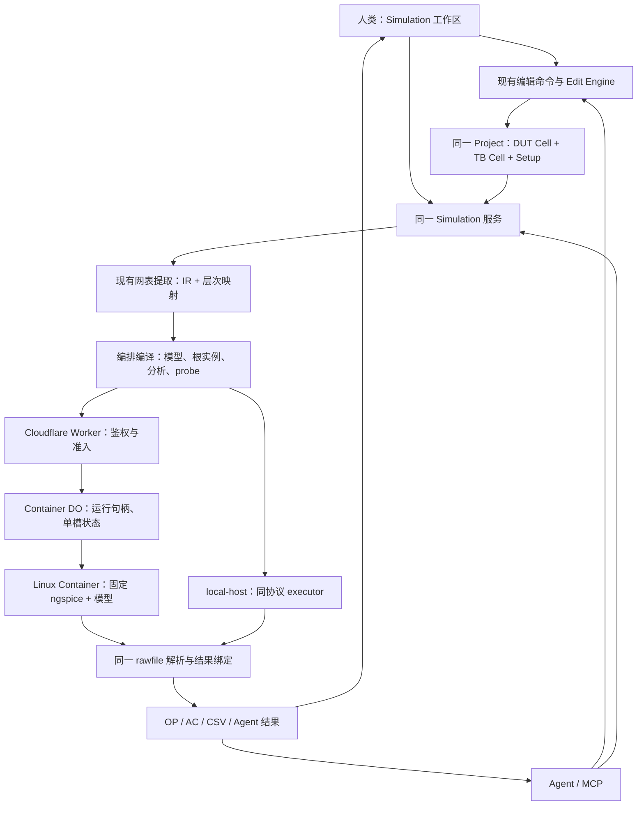

# Analog Canvas 仿真纵向闭环方案 v1

日期：2026-09-03。版本：v1。状态：讨论稿，供 Fable 交接及后续讨论；所列新增工作尚未实现，尚未替换已接受 ADR。

本文是方案的唯一归档入口。后续讨论在此更新版本及决定，不保留并行的 `plan/` 副本；已接受的行为仍以现行 spec 和 ADR 为准。

## 0. 交接范围与基线

目标：用户或 Agent 从已有电路创建 Testbench，选择 OP/AC 与观测量，通过同一编排接口调用 ngspice，得到可定位回电路的真实结果、波形与 CSV。

不做第二套电路协议、第二套 Net、第二个 Editor 实现、通用工作流引擎或大型仿真调度平台。

v1 代码审查基线为 main 的 `85cf2c5d`（#543）；审查时工作树中涉及的仿真、网表、器件、Agent、容器代码与该基线无差异。代码与平台状态均记录编写时的事实。执行前重新读取最新 main，不沿用本方案中的版本号作为分支管理指令。

目标 owner：Fable。代码实施另开 `codex/` 分支；本文件是已归档的 v1 讨论方案，不算已接受产品契约。

### 已有基础，不应重做

| 层 | 已有能力 | 仍欠缺 |
| --- | --- | --- |
| 电路 | Project / Cell / formal terminal / instance / Net / Route / edit-engine | TB 工作区入口与 setup 生命周期 |
| 层次符号 | 根据 Cell 接口生成 symbol，调整 pin side/offset/body，放置子 Cell | Agent 方便调用的 place-cell 包装；不需复制资产 |
| 网表 | 同一 Logical-Net resolver、DesignNetlistIR、确定性 SPICE/Spectre printer、reviewed SKY130 binding | 指定仿真根、根实例化、完整结果映射 |
| 电源 | 原生独立 V/I 的 DC 参数，另有 pulse 电压源 | 正式 AC 幅度/相位字段与打印规则 |
| 编排 | `.include`/`.lib` 区分、deck 拼接、运行输入与环境 hash | typed analysis/probe 编译，而非 raw textarea |
| 执行 | Worker route、Docker harness、local-host、超时、日志分类 | 真正 Cloudflare 配置、隔离/限额、原始数据收集 |
| 结果 UI | OP 标注函数、AC 图形组件、模拟面板原型 | 数值协议、实际挂载、API 调用、stale 防护、CSV |
| Agent | #541 共用编辑 planner/controller；typed schema/client/MCP | 独立 simulation resource 与 parity 闭环 |

当前事实：模拟面板未挂载；OP state 无生产者；`SimulationRequest.analyses` 不驱动 deck；结构打印把每个 Cell 都包成 `.subckt`；运行只返回日志；wrangler 未配置 NGSPICE 容器。不能把“有模块/有测试”记为纵向闭环完成。

## 1. 产品边界：建议冻结

1. DUT 是已有普通 Cell。Testbench 也是同一 Project 中的普通 Cell，内放一个 DUT 层次实例和用户明确选择的源、负载、连线。无需新建 Testbench 电气 schema。
2. Simulation 是工作区/任务模式，不是另一个电路编辑器。DUT/TB 共用当前画布、选择、wire、snap、撤销、层次导航、保存与 Agent transaction。
3. 用户决定激励、负载、分析与观测意图；产品负责将明确意图编译为合法 deck。用户无需手写 SPICE，不猜测其设计目标。
4. 首版 OP + AC，单 Testbench setup、固定发布的 ngspice/SKY130 环境；先 TT。温度使用明确值/明确默认值并写入运行身份。Transient、扫描、PVT 矩阵、Monte Carlo、自动优化后续再做。
5. 首版波形是 AC 频响，不是时间波形。若必须展示时间波形，应明确增加 Transient 工作包，不能把 AC 当作已覆盖。
6. 不启用已有 dev-only Digital Simulation，不为新的入口复用其数字仿真语义。可抽取中立的 Net picking 交互，不能把数字运行状态当模拟协议。
7. 结果只读，绝不改 Net、器件参数或 Project 电气状态。编辑设置/源是显式编辑；执行与查看结果不是编辑事务。
8. hosted 首版只接受正式支持的结构和分析，不公开任意 `.control`、文件路径、shell、自带模型上传。现有 raw 输入若临时保留，仅明确作为过渡内部/debug 边界，不长期成为第二套公开权威。

### ADR 0055 应调整而非机械服从的地方

- “testbench 是作者的”保留，但删除“必须以手写 testbench 文本表达”的实现限定。
- “运行结果不改 Project”保留；“此功能不编辑任何 document / 永不需要 schema 变更”不再覆盖用户明确要求的 TB 编辑与 setup 保存。
- 可仿真判定应为“受支持原生 primitive，或在所选环境中确实可解析的模型/子电路”，不能要求理想电阻、电源等都有 PDK 模型。
- 冷启动、镜像上限、每次请求新磁盘、每次运行价格等说法，应由当前平台资料和实测替代；不把估计写成保证。

## 2. 总体图谱

逻辑分层不要求每个方框新增 package。优先在现有 `spice-run` 内分文件；低层 runner contract 不反向依赖 React、MCP 或完整编辑器。已有 `packages/simulation` 是数字引擎，不拿它承载 ngspice。

## 3. 唯一权威与生命周期

| 信息 | 唯一权威 | 不应存在哪里 |
| --- | --- | --- |
| DUT/TB 拓扑、源连接、负载、源 DC/AC 值 | 当前 Project / Cell / Instance 参数 | Setup 内第二份器件清单、手写 TB 备份文本 |
| formal pin 名称与电气顺序 | 现有 Cell interface | symbol 坐标或肉眼排列顺序 |
| symbol 外形、端口位置 | 现有 Cell symbol presentation | 仿真 profile 私有图形 |
| 分析、频率、probes、TB root、环境选择 | 一个 typed SimulationSetup | React 私有拼接字符串、MCP 私有 DSL |
| 模型磁盘路径、执行文件、容器规格 | 执行环境配置 | 电路工程、用户 stimulus 输入 |
| simulator 向量名与电路对象映射 | 本次编译产物，使用现有 ObjectLocator / HierarchyFrame | 新的永久 Net ID、显示文本推断 |
| 数值、日志、运行身份 | 临时 SimulationResult | Net/Instance 持久化字段 |

### 保存建议

Testbench Cell 自然随现有 Project 保存。建议 Project 加一个可选 `SimulationSetup`，首版一个 setup 即可；仅存 TB root、分析、观测引用、环境 ID/允许的 corner、温度。结果、服务器路径、runId、运行缓存不进入 Project。

这是一个明确的最小持久化扩展，而不是声称完全不改 schema。目前代码 schema 为 36；执行时按最新版本安排，不预先抢占下一版本。与 Cloud Save、project-protocol、Gallery 导入/保存、JSON 导出/重载一起验证；缺失 setup 的工程行为不变。不要为省一次 schema 变更再创造 sidecar 电路文件和第二套保存服务。

Setup 引用采取非阻塞编辑生命周期：删掉 TB、probe 对象或拆 Net 后，该 setup/probe 可成为 unresolved；保存仍允许，prepare/run 明确要求修复，不能阻止正常删除电路对象，也不能自动按同名猜一个新对象。复制、删除、undo/redo 的规则应在这一次扩展中闭环。

持久化 probe 必须明确锚点：优先保存 terminal/route/junction 等现有稳定对象的 locator 加 occurrence；必要时保存明确的 Base Net 对象引用，再在 prepare 中解析当前 Logical Net。只保存 `kind: net` 加当时的 Logical-Net representative 并不能解决 split/merge 后的身份问题。对象删除或拆分后无法唯一确定目标时，要求重选，不复制 probe 到所有新 Net。

ObjectLocator/HierarchyFrame 当前定义在 derived。如果持久化 setup 必须消费它们，只下沉单一定义到合适的已有底层模块并迁移引用；禁止 model 反向依赖 derived，禁止复制另一套地址类型。

## 4. Agent 优先，不等于让 Agent 直接拼字符串

建议分两类 API。

### 4.1 电路编辑：继续现有 transaction

- 创建普通 TB Cell、放置 DUT Cell 实例。
- 放置/连接 V、I、R、C，更新正式参数。
- 调整 symbol body 与 pin side/offset；电气 pin order 不由图形位置改变。
- 选择/连接已有 Net；不通过屏幕坐标猜电气关系。

已有 `structureEdits` 能完成 Cell 接口/符号操作；给 Agent 增加小的 `place-cell` convenience command，内部只调用 `createHierarchyInstance` / `planPlaceCellInstance`。

### 4.2 仿真：小的独立资源，不塞进 transact

建议的语义操作，名称供实现时冻结：

| 操作 | 含义 |
| --- | --- |
| capabilities | 可用环境、原生/模型能力、分析、probe 类型、限额 |
| configure | 通过同一配置编辑命令更新 setup；不另存 UI 私有配置 |
| prepare | 捕获当前 Project 输入，校验、提取、构建 preview 与对象映射；不运行 |
| start | 接受当前输入身份，返回 runId；一个显式运行副作用 |
| read | 读取状态/终态结果，允许有限等待；结果丢失/过期明确返回 |
| cancel | 真正终止执行并释放槽，不只是关闭 UI 或取消 fetch |
| export | 从同一结果数据导出 CSV/原始数据及运行身份 |

这些是同一 shared service 的 typed 操作，可先组织成少量资源方法，不需要七套微服务或独立调度器。复用现有 session/auth/claim/project roster；新增明确 run/read 权限。Agent 的电路编辑授权不等于云上传/花费授权。

`configure` 是持久化 Project 修改，必须落入现有 controller 的 typed setup edit，参与 structure revision 检查、undo/redo 与保存，并要求 edit 权限。simulation resource 即使提供 convenience 方法也只能调用该命令；run/read 权限不能间接授权改配置。

当前 Circuit API 固定四种操作且 service.handle 同步；`/files` 是现成的 sibling resource 先例。可以增加 `/api/agent/sessions/{sessionId}/simulation`，MCP tool 只包装同一个 agent-client 资源调用，不复制 builder 或结果 parser。

Agent relay 与客户端目前默认 30 秒，runner 上限 120 秒。因此采用短 start receipt + read/cancel，而非全面加长编辑 RPC。初版只需短期 run 状态与一个活动执行槽；不引入数据库历史、自动任务重试或持久化队列。requestId/runId 在同一会话中防重复启动；状态重启丢失必须返回明确结果，不能偷偷重跑收费任务。

`start` 必须执行其接受的 digest 对应的不可变 prepared input；若当前操作要求使用最新状态而输入已变，则返回 `INPUT_CHANGED` 重新 prepare，不能在用户/Agent 不知情时换成另一个电路。runId 的 read/cancel/export 绑定授权会话/Project owner；读取所有可达 TB/DUT Cell 都要经过权限检查，不能只检查请求 rootDocumentId。

### Parity 的验收，不止是 API 名称相似

对同一 fixture 通过 GUI action 和 Agent/MCP action 施加同样意图后，检查：

1. 相同的规范化电路/Setup、formal pin order、源参数。
2. 相同环境下生成相同 deck（运输 requestId 不计入电气内容）。
3. 同样无效输入得到相同 error code、字段路径和对象定位。
4. 同样结果解析、单位、极性、stale 判定及导出数据。
5. MCP 实际能完成 create TB → configure → run → read → export，而不是只给未来留一个类型。

## 5. 编排器：当前缺口与最小处理

### 5.1 分析根和实际顶层执行

`analyzeDesignNetlist` 当前以 `project.topDocumentId` 为唯一根。增加明确的只读 `rootDocumentId` 选项，遍历该根可达层次，不修改工程 top，不复制 DUT。

当前 printer 输出所有 `.subckt` 定义，只有定义不会执行 DUT。保留结构 exporter 的这个契约；编排器额外生成且只生成一次 Testbench 根实例。首版建议 TB root 没有外部 formal pins，所有源/负载在 TB 内；如允许外部 pins，必须另有明确根绑定，不能自动接地或悬空后仍声称正确。

顶层 DUT symbol 直接从现有 formal interface 派生并放入 TB。所谓“symbol 导出”首先是内部复用，不必经过文件导出/重导入。单独 symbol 文件格式不是本次前置条件。

### 5.2 激励源

现有 V/I 只有正式 DC 字段。增加 descriptor-backed AC magnitude/phase，使用现有参数编辑、单位处理与 printer 专门打印合法 `DC ... AC ... ...`，不是把 `ac=...` 当作任意参数附在卡片上。

DC 偏置、AC 小信号、将来的 transient 波形是同一个源的不同分析分量，不应该放三个彼此不知情的源或保留 profile override。已有 pulse 源不强删、不改变现有行为；SIN/PWL/电流脉冲不是首版必需。

VDD/GND/Label 是网络与参考节点标记，不提供电源能量。VDD 标记不等于电压源，Ground 不等于电源激励。DUT 内真实偏置元件保留；TB 只包含用户明确添加的外部激励/负载。全局 Net/implicit bulk 继续用当前 resolver，不能在编排器里再写一套“自动补 VDD/B=S”。

### 5.3 编译管线

`Project snapshot + Setup + Environment capabilities`

→ shared prepare/validation

→ 现有 `DesignNetlistIR` + occurrence-aware binding map

→ shared deck assembly（环境库、结构定义、一次根调用、analysis、save、end）

→ runner

编译器输入使用结构化语义而不是用户拼接的指令片段。共用现有 IR/printer，不为仿真重新提取网表。公开能力只承诺 UI/Agent 可以表达且 executor 真正支持的子集。

对线上请求，客户端生成 preview 不构成信任边界。服务端使用同一 schema 与受控编译规则验证/重新生成执行输入；环境库路径由服务端映射。优先复用既有 IR 作为传输的结构产物，避免上传画布几何；需要增加可执行 primitive 白名单及参数表达式校验，不能假设 IR 中 rawValue 来自可信客户端。

`netlist` 仍可以作为用户查看/导出的编译产物；它不是与 Setup 并存的第二个可编辑权威。

### 5.4 Probe 与结果映射

- 电压：Net 相对地或明确另一 Net 的差分电压。
- 首版电流：明确支持的支路，例如电压源电流；保存单位与正方向。
- Net 不是单一电流支路；画布电流辅助箭头是图形注释，不能自动当作 ngspice 电流探针。
- MOS/X 子电路端口电流只有经具体模型绑定验证后才暴露；不能默认所有实例都支持 `i(instance)`。
- 复用 ObjectLocator + HierarchyFrame，区分 X1/DUT/n 与 X2/DUT/n。禁止只用 Cell definition 或显示 Net 名映射。
- 映射在编译时产生，保留 root wrapper 前缀和最终打印名称；不从结果文本猜 ID。
- 旧 Logical-Net representative 不作为跨 revision 永久身份。每次 prepare 重新解析 probe，引用失效要指出具体项。

### 5.5 检查与错误

复用现有 diagnostics envelope/对象定位。仿真侧补足必要的 stage、code、setup 字段定位与 raw log，不复制第三套 ERC。无电路对象的环境/队列错误指向 run/setup，不能伪造成器件故障。

分清三种事：

- 确定无法表达/执行：模型缺失、非法接口映射、层次循环、不支持分析、无效分析参数、被删除的 probe。阻止 run，指出修复对象。
- 工程提示：普通 ERC、无 AC 激励可能全零等。按具体规则提示，不因为任何 warning 就禁止运行；无关 Cell 不影响当前根的准备。
- 执行结果：收敛失败、超时、资源忙、取消、输出缺失、环境未配置。明确不同 code，保留 ngspice 原文。

视觉 overlap、标签位置绝不能作为运行电气门禁。Check and Save 可复用诊断显示，但不承担“看起来正确所以可仿真”的判断。

## 6. 真正的结果协议与可追溯性

沿用现有 SimulationResult 的 outcome/diagnostics/log/duration/metadata，增加正式数值数据，不另造 GUI 私有结果协议。

- OP：每个 probe 的标量与单位。
- AC：frequencyHz 与每个 probe 的 complex real/imag 数组；幅相从同一数据派生。
- 不把电压幅值直接叫增益。选择明确的输入/输出后才计算 Vout/Vin；否则标明电压幅值/dBV。相位单位与 wrap/unwrap 是确定的显示选择。
- 数值数组长度、analysis ID、probe ID、非有限值、空 rawfile、遗漏输出、部分完成都验证。退出码 0 不代表所需结果齐全。
- CSV 从正式结果数据导出，包含单位，AC 保留 real/imag；图表和 CSV 不能走两条解析路径。
- 原始日志用于解释；数值读取 rawfile/正式输出，不从 console 排版抓数。初版固定一种受控 ASCII rawfile 模式并覆盖多 plot、real/complex，再考虑 binary。
- ngspice 官方 batch 路径支持 `-b -r` 与 `.save`；具体参数组合按本地固定版 47 的 reference 测试，不依靠滚动在线手册的偶然变化。

已有 metadata V1 继续复用。输入身份必须覆盖整个参与层次、Setup 与编译内容，不能只看当前 document.revision；修改 DUT 子 Cell 同样使运行输入过期。环境含实际 simulator/model 身份；当前 observed 不是 pinned。不同 OS binary hash 本来就可能不同，不要求 local 与 hosted fingerprint 相同，只要求身份各自真实、同样输入满足已声明的数值容差。

运行时捕获不可变输入。完成后如果当前电路/Setup 已变，保留结果但标注 stale，默认不贴到当前画布；不得静默改绑。同一 Cell 的多个 occurrence 的 OP 值不同，没有选定路径时不能贴一个“通用值”。首版可保守地在参与 document revision 变动时失效，后续再优化纯几何变更误失效，不为此先造 revision 系统。

## 7. 人类界面

建议入口：顶栏与 File / Netlist 并列的 Simulation。进入后使用“设计 / Testbench / 结果”工作区，而不是启动第二个 App 实例。

首次：选择 DUT Cell → 确认现有 formal pins → 显式创建 TB Cell 并放置 DUT → 用户放置源/负载并连接。此过程可提供机械空壳，不自动猜电源电压、输入幅度或负载。

- 中央：现有 canvas/controller，切换当前 TB document，保留所有常用编辑能力。
- 设置区域：OP/AC、频率范围/采样、源参数入口、probe 清单、环境与温度；常用项优先，高级项折叠。
- Pick Net：从现有 hit/resolver 得到对象地址，高亮选中对象，退出 pick 不产生电路选择/编辑副作用。
- 结果区域：OP 表/画布标注、AC 图、CSV、日志；保留当前布局风格，不把所有控制塞进 modal。
- 错误点选：定位 DUT/TB 对象或设置字段。已有波形组件是呈现层，只接受规范结果 adapter。
- 云运行前清楚说明上传电路结构；本地执行是同一接口的 executor 选择，不是另一套功能。

## 8. Cloudflare：建议与真实边界

截至 2026-09-03 的官方资料支持 Docker/Linux 原生计算：Worker 做控制，DO 管容器实例，Container 内运行 ngspice。镜像需 linux/amd64。它不是把 ngspice 二进制放进 V8 isolate。

### 最小部署策略

1. 先一个执行槽，明确 `max_instances: 1`，每槽一个 ngspice。占用时返回 busy/Retry-After；不给用户无限排队。实测后可扩到两个槽，不先建设通用队列。
2. 比较 `basic`（1/4 vCPU、1 GiB、4 GB disk）与 `standard-2`（1 vCPU、6 GiB、12 GB disk）。选择靠 benchmark，不保证按 CPU 比例线性加速。默认 lite 不应未经测试直接发布。
3. 保留30秒默认、120秒上限作为初始测量配置；宿主再验证上限并真正终止进程/必要时销毁容器。CPU、内存、输出、并发是不同限额。
4. start/read/cancel 是短期作业句柄，不需要持久化结果平台。新请求不会自动获得新磁盘；睡眠/重启才重置临时磁盘。繁忙执行必须保护免于 idle sleep，`sleepAfter` 不能充当运行超时。
5. 当前 runnerKey 实际是 shared，并未做到注释声称的 per-author。当前 route 也未鉴权；在接通公网前复用现有账户/授权补上准入。`max_instances` 限制容器，不限制容器内部并行进程，harness 必须自己 busy-guard。
6. 固定一份环境 lock：基础镜像 digest、ngspice 版本/构建身份、PDK/upstream revision 与完整 runtime hash；构建产物 image digest 可追溯。启动核验后才报 pinned。正常安全更新通过显式 lock 更新，不承诺永远不升级。

### 当前部署要补的具体内容

- `NgspiceContainer extends Container` 导出、defaultPort=8080。
- wrangler 中 containers 配置、NGSPICE DO binding、新的 migration；保留现有 DO 与迁移记录。
- 明确 Docker context 与 SKY130 model staging。当前 workflow 没提供 Dockerfile 需要的模型目录。
- 先 staging：health → 固定 OP deck → AC deck → 应用 API → GUI/MCP；成功后才启用 production simulation。
- no binding/启动失败仍是环境不可用，不影响原 Editor/Gallery 使用；模拟入口按实际能力显示状态，Digital 保持关闭。

### 必要隔离，不是“过度保护”

ngspice 控制语言能够执行 shell，原始 deck 是执行输入，不能当普通文本对待。当前 Docker 默认 root，execFile 没有每次运行 cwd，临时 deck 文件夹不构成沙箱。

上线最低限度：非 root、无用户/平台 secret 进入 guest、模型只读、每次独立 cwd/scratch、网络默认关闭、输入/输出/进程/时间有限额，不同不可信 job 间 reset/destroy 环境。若暂不开放 raw script，仍需验证服务端输入，不能仅信 GUI。

### 费用应怎样理解

官方当前计费：CPU 按活跃使用量，RAM/disk 按容器运行期间分配量；睡眠后停止这部分费用。Workers、DO、日志和流量另计。小电路可行，但模型加载、冷启动和空闲保温可能比求解本身更占用资源。不要承诺“每次固定多少钱/每月固定可跑多少次”，先记录 CPU time、awake time、peak RSS、结果字节数。

参考：

- https://developers.cloudflare.com/containers/
- https://developers.cloudflare.com/containers/concepts/architecture/
- https://developers.cloudflare.com/containers/platform/limits/
- https://developers.cloudflare.com/containers/configuration/scaling-and-routing/
- https://developers.cloudflare.com/containers/platform/pricing/
- https://developers.cloudflare.com/containers/guides/outbound-traffic/
- https://developers.cloudflare.com/containers/reference/container-class/
- https://developers.cloudflare.com/containers/guides/image-management/

平台可行性已经查证；账户是否开通、实际延迟/成本/可容纳电路规模，必须通过部署和负载测量确认。本次没有部署或实测云端。

## 9. Fable 的实施工作包

所有项初始状态 pending；退出条件达成才标完成。每包一个主要所有权/验证边界，不因“骨架已经写好”提前关闭。

### F0：冻结最小产品契约与早期部署探针

Owner：编排负责人。范围：ADR0055、simulation spec、现有 architecture/README 的相关段落；不写另一份并行总规范。

冻结 OP+AC、普通 TB Cell、唯一源参数权威、setup 保存、probe 范围、async run receipt、结果不修改电路、Digital 不公开。补清原生 primitive / model 能力判定。

并行准备 Cloudflare staging 的纯阻值分压 OP 探针，验证原生进程能运行；随后验证 pinned model pack 的 SKY130 OP。这个是部署可行性证明，不代替产品闭环。

退出：上述决定明确；有运行的真实数据证据或明确外部部署 blocker；无改变 DUT/Net 的隐含路径。

### F1：可保存的 Testbench 意图与源能力

Owner：model/edit/devices。范围：`packages/model`、`project-protocol`、`edit-engine`、`devices`；必要的 Agent authoring/schema 与 printer。

新增单一 setup 可选保存合同；AC magnitude/phase 正式参数；复用 Cell symbol / create/place helpers。定义 setup/probe 对象删除、clone、undo/redo、保存重载；补协议版本和 Gallery 兼容测试。

退出：普通电路与 TB 使用同一个编辑/保存路径；AC 源不是字符串逃生口；源和 setup 参数没有双存；改 symbol pin 位置不改 pin order。

### F2：prepare/compiler 与映射

Owner：netlist/spice-run。依赖 F1 的最小字段冻结。

只读 rootDocumentId、一次根实例、受支持分析编译、save/probe、occurrence map、完整输入身份；复用 model registry、netlist extraction、resolver、diagnostics。

退出：同一输入产生确定 deck；两次 DUT occurrence 不串线；不用修改 Project top；不存在仅定义 .subckt 而未运行 root 的空成功。

### F3：真实数值与 executor 闭环

Owner：spice-run/local-host/container。依赖 F2。

固定 ASCII rawfile 收集/共享 parser；OP/AC 正式结果、单位与部分失败；沿用 metadata；最小 start/read/cancel 与真实进程生命周期。

退出：固定 ngspice 的直接参考与应用结果在明确容差内一致；缺向量/空输出不会被当完成；取消和超时释放运行槽；local 与 hosted 共用解析代码与结果合同。

### F4：Agent API / MCP parity

Owner：agent-adapter/client/mcp/relay。依赖 F1-F3；transport schema 可早冻结。

新增 simulation named resource，复用 session permissions/roster/request IDs。电路编辑仍 transaction。真正 MCP 流程覆盖创建 TB、配置、prepare、start、read/cancel/export。

退出：不需要浏览器点击或手写网表的 Agent 纵向闭环；30秒编辑 RPC 不被120秒仿真拖死；错误与 shared service 一致；无重复计费重试。

### F5：人类 Simulation 工作区

Owner：apps/editor。依赖 F2-F4 API 稳定；不复制 App.tsx。

Simulation 入口、同 Editor 的 TB 模式、参数表、Net pick、OP/AC/CSV、stale 提示与错误导航。先完成一条人类流程，再美化。

退出：用户无需手写网表即可完成 Agent 同等功能；编辑期间旧结果不误贴；DUT/TB 保存重载；已有绘图/selection shelf/快捷键不受新模式破坏；生产 Digital 仍禁用。

### F6：Cloudflare 发布边界

Owner：worker/containers/deploy workflow。F0 后可独立推进环境 lock/绑定，最终依赖 F3 request/result。

容器类、绑定/migration、模型 staging、显式规格与实例上限、鉴权/busy/资源约束/隔离、真实 cancel、idle lifecycle、health、可观测的失败分类、staging 开关。

退出：同一 F3 fixture 在 staging 真实容器完成；并发不会无限启动 child；不可信请求不能调用任意文件/网络/shell；warm/cold 数据留证；关掉 simulation 不影响 Editor/Gallery。

### F7：垂直验收与上线

Owner：整合负责人。依赖 F4/F5/F6。

至少使用：

1. 电阻分压 OP：节点电压、源电流的符号与单位。
2. RC AC：复数输出、频率轴、幅相及 CSV；差分/比值语义正确。
3. 当前 reviewed SKY130 OTA：同模型、corner、温度、激励/负载，与直接 ngspice deck 的 OP+AC 对照。
4. 同一 DUT X1/X2：结果和 probe 按 occurrence 区分。
5. 缺模型、probe 消失、AC 配置非法、收敛失败、dropped-input、空/截断输出、busy、timeout、cancel、stale。
6. GUI/MCP parity 与保存重载；schema/Gallery、原 Editor 与 dev-only Digital 边界回归。

每个数值验收记录 simulator、模型、corner、analysis、基准值与绝对/相对容差；不能只检查退出码或 snapshot 图。不要用简化模型冒充 foundry 电气正确性。

执行 repo 当前 gate policy：先 focused unit/contract，真实 diff gate plan，preflight，再选定 affected/full；主线遵守 required CI 与 merge 流程。完成度记录在相应提交/PR，不能只在本文件打勾。

### 顺序

F0 → F1 → F2 → F3 → F4 → F5 → F7。

F6 的环境/部署验证在 F0 后并行，最终与 F3/F7 汇合。先得到 Agent 可运行的真实 OP 垂直切片，再扩展 AC 与完整 GUI；不要先堆满所有表单，再发现后端只有日志。

## 10. 不纳入首版

- 新 Net/contact 协议、第二套 Cell 模型、独立 Testbench 文件格式。
- 自定义 arbitrary SPICE 编辑与图形双向同步。
- 通用 simulator 插件平台、Spectre executor、Verilog-A 上传与编译。
- Transient、DC sweep/PVT/Monte Carlo、批量优化与自动电路修改。
- 长期运行历史数据库、队列编排、集群自动扩缩容、自动 fallback 到用户本地。
- 任意器件电流与任意公式语言；没有模型验证的能力不得宣称支持。

这些是明确延后，不通过空接口、过宽 union 或假实现提前“支持”。

## 11. 本地权威资料与重要代码入口

本地 authority pack 已存在：`.reference-src/icm-resources/simulation-authority/`。`manifest.json` 保存下载来源与 hash；有 ngspice46结构基线手册、固定 ngspice47 手册/源码/Windows binary、SkyWater/OpenPDKs/Ciel 模型、参考 benchmark 和 `.lib` 对照。它是本机忽略资产，Fable 在其他机器不会自动获得；按 manifest 重建或另行传递，不悄悄提交模型大包。

- `docs/adr/0055-simulation-is-part-of-the-product.md`
- `docs/specs/simulation.md`
- `packages/spice-run/src/index.ts`
- `packages/netlist/src/extract.ts`、`printers.ts`、`ir.ts`
- `packages/devices/src/descriptors/voltage-source.ts`、`current-source.ts`
- `packages/edit-engine/src/hierarchy-planner.ts`
- `packages/derived/src/object-locator.ts`、`diagnostics/diagnostic.ts`
- `packages/agent-adapter/src/schema.ts`、`service.ts`
- `packages/agent-client/src/session-client.ts`
- `apps/editor/src/features/hierarchy/`、`features/simulation/`
- `apps/editor/src/agent/browser-agent-command.ts`、`browser-agent-host.ts`
- `apps/mcp-server/src/tools.ts`
- `worker/simulation.ts`、`worker/agent-session-runtime.ts`
- `containers/ngspice/Dockerfile`、`entrypoint.mjs`
- `apps/local-host/src/simulate.ts`
- `wrangler.jsonc`、`.github/workflows/cloudflare.yml`

ngspice batch/complex 数据的官方说明：

- https://ngspice.sourceforge.io/ngspice-control-language-tutorial.html
- https://ngspice.sourceforge.io/ngspice-tutorial.html
- https://ngspice.sourceforge.io/docs/ngspice-manual.pdf

v1 编写与归档没有修改代码、执行仿真或部署；仅审查实现、查证官方平台资料并形成这份讨论方案。所列新增实现与云容量验收仍待执行。
