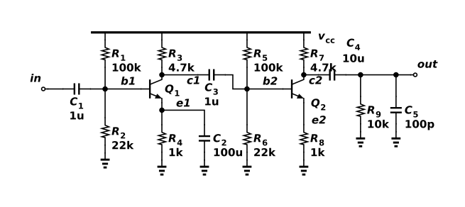

# RC-coupled BJT voltage amplifier

Two RC-coupled common-emitter stages. R1/R2 and R5/R6 set the base biases, while R4 and R8 stabilize the emitter currents. C2 bypasses R4 at signal frequencies, giving Q1 most of the voltage gain. R8 remains unbypassed, so Q2 has local feedback and a more stable, lower gain. C1, C3 and C4 block DC between the input, the stages and the load; they also set the low-frequency roll-off. R9 and C5 represent a 10 kΩ load with 100 pF capacitance. The collector voltages settle near 5.96 V, leaving headroom on a 12 V supply. With the educational ANPN model saved in models.spice, ngspice 46 gives 54.3 dB gain at 1 kHz and 1.04 V peak-to-peak output for a 2 mV peak-to-peak input, drawing 2.77 mA at 27°C. The saved Functional verification experiment reproduces the AC and transient results. The generic model demonstrates the topology; its values are not a vendor-device or process-corner guarantee.



## Reproduce

Run `ngspice -b run.cir` from this directory with ngspice 46. The same source files and generated DUT binding are saved in the project's Functional verification folder for hosted simulation. This run was checked at 27°C. The ANPN/APNP/ANMOS/APMOS/AD definitions in models.spice are explicitly simplified educational models, not vendor or foundry data.

The native export has this explicit interface:

```spice
.subckt astra_001_rc_coupled_bjt_amplifier vcc VSS in out
```

`run.cir` is its only local caller and follows that pin order. `source.icproj.json` is the editable native drawing; `circuit.spice` is the deterministic native export. The simulation writes out.raw and AC/transient data beside the deck; those transient run artifacts are excluded from the fixture.

## Measured acceptance

| Measurement | Measured | Accepted interval |
| --- | --- | --- |
| gain_1khz | 54.2846 dB | 50 to 58 |
| out_pp | 1.03533 V | 0.9 to 1.2 |
| supply_avg | -0.00276843 A | -0.0032 to -0.0023 |

Canonical round-trip, native netlist comparison and schematic diagnostics passed. The drawing contains 16 electrical components and was visually inspected. Hosted ngspice independently passed 3/3 specifications (run `0d2ecb33-8e70-4bd1-ae20-7e2bb73b4628`). See verification.json and simulation.log for the local evidence. Only the named nominal conditions were tested.

[Gallery publication](https://analog-canvas.tokenzhang.com/g/gw6naca4r6) · Author: GPT-6-Astra · AI-generated.
