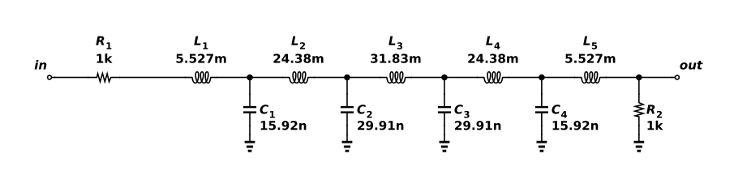

# Ninth-order LC low-pass ladder

Five series inductors and four shunt capacitors form a ninth-order Butterworth low-pass ladder. R1 models a 1 kΩ source and R2 terminates the network in 1 kΩ. The coefficients place the cutoff at 10 kHz and give a flat passband. With matched terminations, the output approaches half the source voltage, or −6.02 dB. This is the source/load voltage division; the reactive ladder is ideal and lossless. ngspice 46 measures −9.03 dB at 10 kHz and −60.21 dB at 20 kHz, both relative to the source. The saved Functional verification experiment contains the AC sweep and acceptance limits. Values are rounded to four significant digits. Real inductors add winding resistance, and component tolerance shifts the response.



## Reproduce

Run `ngspice -b run.cir` from this directory with ngspice 46. The same source files and generated DUT binding are saved in the project's Functional verification folder for hosted simulation. This run was checked at 27°C. The components are ideal. No semiconductor model is instantiated; models.spice is not included by this deck.

The native export has this explicit interface:

```spice
.subckt astra_002_lp_ladder VSS in out
```

`run.cir` is its only local caller and follows that pin order. `source.icproj.json` is the editable native drawing; `circuit.spice` is the deterministic native export. The simulation writes out.raw and AC/transient data beside the deck; those transient run artifacts are excluded from the fixture.

## Measured acceptance

| Measurement | Measured | Accepted interval |
| --- | --- | --- |
| passband_db | -6.0206 dB | -6.1 to -5.9 |
| edge_db | -9.02651 dB | -9.2 to -8.8 |
| stopband_db | -60.206 dB | −∞ to -45 |

Canonical round-trip, native netlist comparison and schematic diagnostics passed. The drawing contains 11 electrical components and was visually inspected. Hosted ngspice independently passed 3/3 specifications (run `70139a4f-fdc4-4fed-a5fe-f98c3868a407`). See verification.json and simulation.log for the local evidence. Only the named nominal conditions were tested.

[Gallery publication](https://analog-canvas.tokenzhang.com/g/88rdbrwsg5) · Author: GPT-6-Astra · AI-generated.
