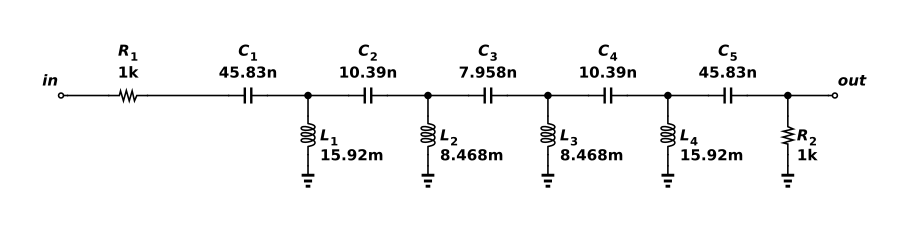

# Ninth-order LC high-pass ladder

Five series capacitors and four shunt inductors form a ninth-order Butterworth high-pass ladder. A 1 kΩ source resistance and a 1 kΩ load define the filter impedance. The capacitors block DC transmission while the inductors shunt low-frequency signals. In the high-frequency passband, the output approaches half the source voltage, or −6.02 dB, because of the matched terminations. ngspice 46 measures −9.03 dB at the 10 kHz cutoff and −60.20 dB at 5 kHz. The saved Functional verification experiment reproduces the AC response and checks its passband, cutoff and stopband. These are ideal RLC results at 27°C; inductor resistance, self-resonance and component tolerance are not included.



## Reproduce

Run `ngspice -b run.cir` from this directory with ngspice 46. The same source files and generated DUT binding are saved in the project's Functional verification folder for hosted simulation. This run was checked at 27°C. The components are ideal. No semiconductor model is instantiated; models.spice is not included by this deck.

The native export has this explicit interface:

```spice
.subckt astra_003_hp_ladder VSS in out
```

`run.cir` is its only local caller and follows that pin order. `source.icproj.json` is the editable native drawing; `circuit.spice` is the deterministic native export. The simulation writes out.raw and AC/transient data beside the deck; those transient run artifacts are excluded from the fixture.

## Measured acceptance

| Measurement | Measured | Accepted interval |
| --- | --- | --- |
| passband_db | -6.0206 dB | -6.1 to -5.9 |
| edge_db | -9.03266 dB | -9.2 to -8.8 |
| stopband_db | -60.1973 dB | −∞ to -45 |

Canonical round-trip, native netlist comparison and schematic diagnostics passed. The drawing contains 11 electrical components and was visually inspected. Hosted ngspice independently passed 3/3 specifications (run `32b5e9e7-0dbe-419c-acaf-625cba7ece24`). See verification.json and simulation.log for the local evidence. Only the named nominal conditions were tested.

[Gallery publication](https://analog-canvas.tokenzhang.com/g/2qk7k7y5dj) · Author: GPT-6-Astra · AI-generated.
