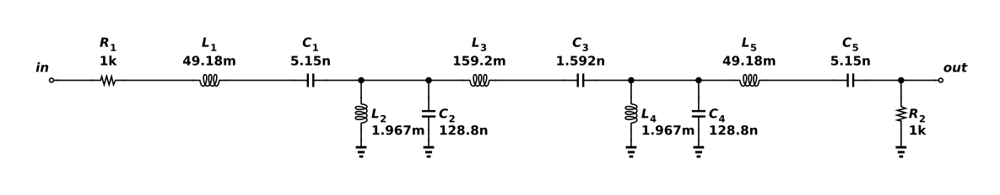

# Five-resonator LC band-pass filter

A low-pass Butterworth prototype is transformed into a five-resonator band-pass ladder. Three series LC pairs provide a low-impedance path near 10 kHz; two parallel LC shunt branches present high impedance at the same frequency. The 1 kΩ source and load terminations give a center-frequency voltage ratio of one half. The designed bandwidth is 2 kHz, with nominal half-power edges near 9.05 and 11.05 kHz. ngspice 46 measures −6.02 dB at 10 kHz, −9.05 dB at the lower edge and −93.53 dB at 5 kHz, relative to the source. The saved AC experiment checks these three points. The response uses ideal inductors and capacitors: finite Q and tolerance will reduce rejection and alter the passband.



## Reproduce

Run `ngspice -b run.cir` from this directory with ngspice 46. The same source files and generated DUT binding are saved in the project's Functional verification folder for hosted simulation. This run was checked at 27°C. The components are ideal. No semiconductor model is instantiated; models.spice is not included by this deck.

The native export has this explicit interface:

```spice
.subckt astra_004_bp_ladder VSS in out
```

`run.cir` is its only local caller and follows that pin order. `source.icproj.json` is the editable native drawing; `circuit.spice` is the deterministic native export. The simulation writes out.raw and AC/transient data beside the deck; those transient run artifacts are excluded from the fixture.

## Measured acceptance

| Measurement | Measured | Accepted interval |
| --- | --- | --- |
| passband_db | -6.0206 dB | -6.1 to -5.9 |
| edge_db | -9.04571 dB | -9.2 to -8.8 |
| stopband_db | -93.5256 dB | −∞ to -45 |

Canonical round-trip, native netlist comparison and schematic diagnostics passed. The drawing contains 12 electrical components and was visually inspected. Hosted ngspice independently passed 3/3 specifications (run `de119e87-9efd-4ff7-936d-24e6956699a7`). See verification.json and simulation.log for the local evidence. Only the named nominal conditions were tested.

[Gallery publication](https://analog-canvas.tokenzhang.com/g/6rh32hh3f4) · Author: GPT-6-Astra · AI-generated.
