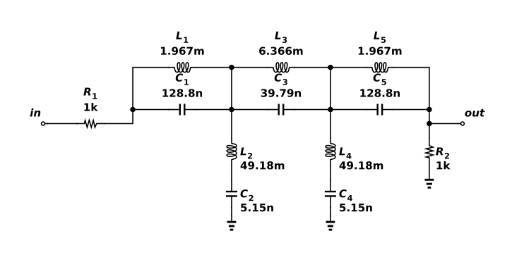

# Five-resonator LC band-stop filter

Three parallel LC resonators sit in the series signal path, and two series LC resonators connect the intermediate nodes to ground. At 10 kHz, the parallel sections impede transmission while the shunt sections pull their nodes toward ground, forming a deep notch. R1 and R2 provide matched 1 kΩ source and load terminations. The low-pass prototype maps to nominal half-power edges near 9.05 and 11.05 kHz. ngspice 46 gives −6.02 dB at 100 Hz and −9.11 dB near the lower edge. The saved AC experiment also verifies more than 45 dB rejection at the notch center. The exceptionally deep ideal-simulation null is not a physical rejection prediction: finite Q, parasitics and tolerance dominate a real implementation.



## Reproduce

Run `ngspice -b run.cir` from this directory with ngspice 46. The same source files and generated DUT binding are saved in the project's Functional verification folder for hosted simulation. This run was checked at 27°C. The components are ideal. No semiconductor model is instantiated; models.spice is not included by this deck.

The native export has this explicit interface:

```spice
.subckt astra_005_bs_ladder VSS in out
```

`run.cir` is its only local caller and follows that pin order. `source.icproj.json` is the editable native drawing; `circuit.spice` is the deterministic native export. The simulation writes out.raw and AC/transient data beside the deck; those transient run artifacts are excluded from the fixture.

## Measured acceptance

| Measurement | Measured | Accepted interval |
| --- | --- | --- |
| passband_db | -6.0206 dB | -6.1 to -5.9 |
| edge_db | -9.10526 dB | -9.2 to -8.8 |
| stopband_db | -368.013 dB | −∞ to -45 |

Canonical round-trip, native netlist comparison and schematic diagnostics passed. The drawing contains 12 electrical components and was visually inspected. Hosted ngspice independently passed 3/3 specifications (run `8b5deec0-e7d9-4552-8d2d-75c7fdd14579`). See verification.json and simulation.log for the local evidence. Only the named nominal conditions were tested.

[Gallery publication](https://analog-canvas.tokenzhang.com/g/fmfr6dmhdz) · Author: GPT-6-Astra · AI-generated.
