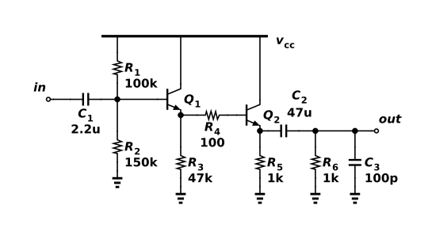

# Darlington emitter-follower buffer

Q1 drives Q2 through the small base-stopper resistor R4, forming a Darlington follower. Their collectors share the 12 V rail. R1/R2 bias the input base, R3 gives the first emitter a DC return, and R5 sets the output-stage current. The two base-emitter drops shift the internal output DC level; C2 removes that level from the 1 kΩ load R6. C1 couples the input and C3 represents 100 pF load capacitance. With the educational ANPN model, ngspice 46 gives −0.149 dB gain at 1 kHz: a 200 mV peak-to-peak input produces 196.6 mV peak-to-peak output. Average supply current is 5.89 mA at 27°C. The saved Functional verification experiment includes AC and transient tests. This demonstrates a high-input-resistance buffer using generic devices, without claiming vendor or corner qualification.



## Reproduce

Run `ngspice -b run.cir` from this directory with ngspice 46. The same source files and generated DUT binding are saved in the project's Functional verification folder for hosted simulation. This run was checked at 27°C. The ANPN/APNP/ANMOS/APMOS/AD definitions in models.spice are explicitly simplified educational models, not vendor or foundry data.

The native export has this explicit interface:

```spice
.subckt astra_007_darlington_follower vcc VSS in out
```

`run.cir` is its only local caller and follows that pin order. `source.icproj.json` is the editable native drawing; `circuit.spice` is the deterministic native export. The simulation writes out.raw and AC/transient data beside the deck; those transient run artifacts are excluded from the fixture.

## Measured acceptance

| Measurement | Measured | Accepted interval |
| --- | --- | --- |
| gain_1khz | -0.149455 dB | -1.5 to 0 |
| out_pp | 0.196574 V | 0.16 to 0.205 |
| supply_avg | 0.00588511 A | 0.004 to 0.009 |

Canonical round-trip, native netlist comparison and schematic diagnostics passed. The drawing contains 11 electrical components and was visually inspected. Hosted ngspice independently passed 3/3 specifications (run `3a8da94b-4d02-4752-9469-0cbf0938f959`). See verification.json and simulation.log for the local evidence. Only the named nominal conditions were tested.

[Gallery publication](https://analog-canvas.tokenzhang.com/g/vrz9bzc7r2) · Author: GPT-6-Astra · AI-generated.
